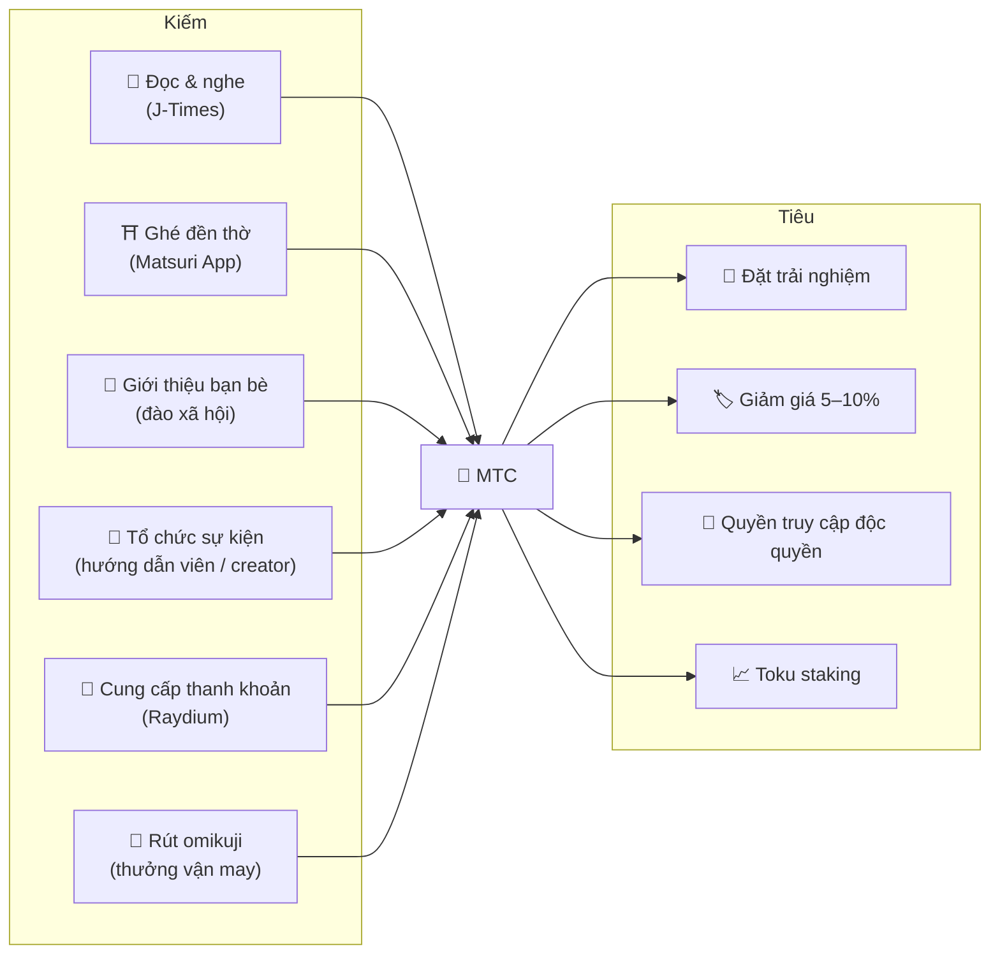
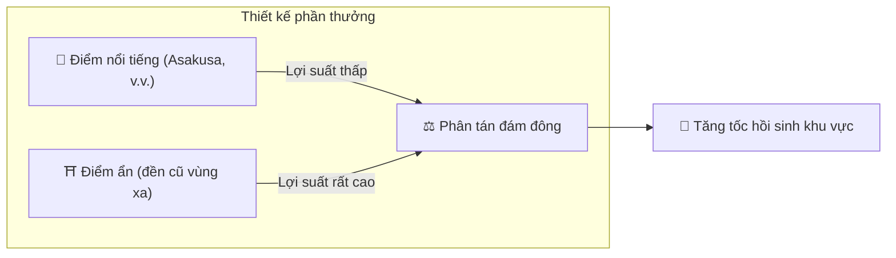
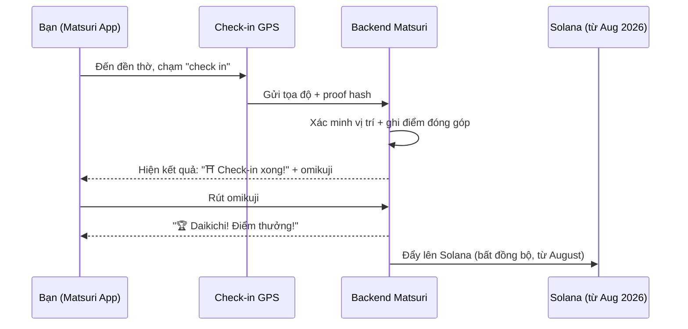
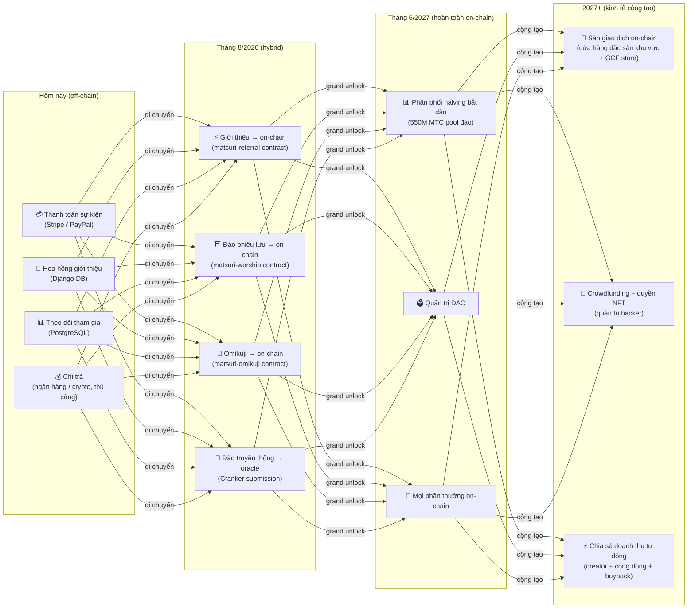

import useBaseUrl from '@docusaurus/useBaseUrl';

# ⛏️ Năm trụ cột của đào và cách kiếm

> **Mọi hình thức "tham gia" văn hóa đều trở thành giá trị.**
> Đọc, đi, kết nối, sáng tạo, hỗ trợ — mỗi hành động của bạn đều sản sinh MTC.

<small>*"Đào" là gì? — Trên Bitcoin và các mạng tương tự, máy tính làm những phép tính khổng lồ và nhận coin mới làm phần thưởng; đó được gọi là "đào". Với MTC, thứ làm việc đào không phải sức mạnh tính toán, mà là **chính hành động của bạn** — đọc một bài viết, ghé thăm một đền thờ, tổ chức một sự kiện. Thay vì đào vàng, sự tham gia với văn hóa sản sinh MTC. Đó là ý nghĩa của "đào" ở đây.*</small>

> Kiếm bằng hành động. Tiêu cho trải nghiệm. Giữ và xem nó tăng trưởng.

MTC không phải là token đầu cơ. Nó lưu thông qua một nền kinh tế thực nơi mọi hành động sản sinh giá trị và nắm giữ nó. Ứng dụng web và bảng điều khiển admin **đã hoạt động**. Điểm đóng góp hiện được ghi off-chain (trong Django) và sẽ di chuyển on-chain theo từng giai đoạn từ tháng 8/2026.

:::tip Bức tranh lớn
MTC có **một nền kinh tế hoàn toàn khép kín**: bạn kiếm qua hoạt động thực, bạn tiêu cho trải nghiệm thực, và giá trị tăng khi hệ sinh thái tăng. Trang này giải thích cơ chế chi tiết.
:::

---

## Vòng đời MTC

---

## Năm trụ cột đào

### 1. 📖 Đào truyền thông (đọc, nghe, trả lời — và kiếm)

**Gắn với nền tảng truyền thông chính thức "J-Times"**

Tri thức nâng cao đáng kể chất lượng của một chuyến đi. Mở **ứng dụng J-Times** và thưởng thức nội dung về văn hóa Nhật Bản. Ngoài văn bản và âm thanh, chúng tôi tưởng thưởng **kiểm tra hiểu (quiz)**. Mỗi hành động hoàn thành tự động ghi MTC vào tài khoản bạn.

| Hành động | Điều kiện hoàn thành | Phần thưởng điển hình |
| :--- | :--- | :---: |
| **📰 Đọc bài viết** | Cuộn đến 75% | 2–30 MTC |
| **🎧 Nghe podcast** | Phát đến hết | 2–30 MTC |
| **🎬 Xem video** | Đóng màn hình chi tiết sau khi xem | 2–30 MTC |
| **📤 Chia sẻ nội dung** | Mở khay chia sẻ | 2–30 MTC |
| **✅ Trả lời quiz** | Vượt qua bài kiểm tra hiểu | 2–30 MTC |

<small>*Số tiền thưởng thay đổi theo loại nội dung, độ dài và cân bằng cung tổng thể của hệ sinh thái.*</small>

:::tip Khoảnh khắc rảnh trở thành đào
Đi lại và giờ nghỉ trở thành thời gian sản sinh phần thưởng.
:::

:::info Hỗ trợ ngoại tuyến
Không có internet ở một đền thờ xa? Không sao. J-Times ghi hoạt động cục bộ và **tự đồng bộ khi bạn online trở lại** (giữ hàng đợi ngoại tuyến 7 ngày). Bạn sẽ không mất MTC đã kiếm.
:::

**Điều gì xảy ra dưới mui xe:**
1. Ứng dụng J-Times phát hiện hành động của bạn (đọc, hoàn thành xem, chia sẻ, v.v.)
2. Ghi nó cục bộ ngay cả khi ngoại tuyến (giữ trong 7 ngày)
3. Gửi đến server để xác minh khi mạng quay lại
4. Phản ánh vào số dư của bạn dưới dạng điểm đóng góp
5. Từ tháng 8/2026: điểm đã xác minh được ghi on-chain qua oracle và có thể kiểm chứng trên blockchain

---

### 2. ⛩️ Đào phiêu lưu (đi và kiếm)

**Dự án "Junrei" — smart contract hoàn thành, deploy mainnet tháng 8/2026**

Một tính năng thế hệ tiếp theo dùng GPS và ưu đãi token để định hình "dòng người" vật lý. Bản đồ thánh địa **đã hoạt động** trong ứng dụng Matsuri web. Điểm đóng góp hiện được ghi off-chain; phân phối phần thưởng on-chain bắt đầu sau khi deploy smart contract tháng 8/2026.

>**Vì kiếm được nhiều hơn, bạn đi về vùng nông thôn.**
> Logic kinh tế đơn giản này hòa tan overtourism và tăng tốc hồi sinh khu vực.

**Cách check-in hoạt động:**

  
  

    
<strong>Worship Mining</strong> — check in gần một đền thờ, phát hiện năng lượng bằng camera AR, rút omikuji để nhận MTC thưởng. Hệ số tier dao động từ 1,0× (Major) đến 10,0× (Hidden Gem).

  

**Nguyên tắc cốt lõi — càng ít khách, bạn càng kiếm được nhiều:**

| Loại điểm | Ví dụ | Phần thưởng điển hình (mỗi check-in) |
| :--- | :--- | :---: |
| 🏙️ **Major** | Sensōji, Kiyomizudera, Fushimi Inari | 30–50 MTC |
| 🌆 **Trung tâm khu vực** | Ichinomiya của mỗi tỉnh, đại đền vùng | 50–100 MTC |
| 🏞️ **Khu vực** | Đền thờ khu vực có lịch sử | 100–150 MTC |
| ⛰️ **Frontier** | Chùa núi, thánh địa trên đảo | 150–200 MTC |

<small>*Các giá trị trên là ước lượng phần thưởng cơ bản. Hệ số omikuji có thể nâng chúng lên gấp nhiều lần.*</small>

**Yếu tố chấm điểm bổ sung:**
- **Hệ số omikuji** — thưởng ngẫu nhiên trên mỗi check-in. Daikichi nhân phần thưởng lên gấp nhiều lần
- **Tần suất ghé thăm** — khách thường xuyên tích lũy nhiều hơn theo thời gian
- **Điểm được tài trợ** — chính quyền địa phương có thể boost các điểm cụ thể

:::info Điểm đóng góp → MTC
Hoạt động của bạn tích lũy thành **điểm đóng góp**. Tại mỗi epoch halving (bắt đầu tháng 6/2027), điểm được chuyển thành MTC từ pool đào 550 triệu. Đóng góp của bạn cho cộng đồng càng lớn, bạn càng nhận được nhiều MTC. Hệ số boost chính xác được hoàn thiện theo từng giai đoạn và triển khai trong smart contracts — điều này đảm bảo phân phối công bằng phù hợp với kích thước pool thực tế.
:::

---

### 3. 🤝 Đào xã hội (kết nối và kiếm)

Bạn kiếm MTC chỉ bằng cách giới thiệu bạn bè.

#### Phần thưởng giới thiệu cho người dùng thường

Đơn giản. Khi một người bạn đăng ký qua link giới thiệu của bạn, bạn nhận **300 MTC mỗi lượt giới thiệu trực tiếp.**

| Điều kiện | Phần thưởng |
| :--- | :--- |
| Một bạn được bạn giới thiệu đăng ký | **300 MTC** |

Vậy thôi. Không có phần thưởng nhiều tầng.

#### Phần thưởng giới thiệu của agent GCF

[Thành viên GCF](/docs/gcf) là **agent chính thức** chịu trách nhiệm mở rộng hệ sinh thái và có cấu trúc phần thưởng sâu hơn.

| Lớp | Quan hệ | Hoa hồng |
| :---: | :--- | :---: |
| **L1** | Giới thiệu trực tiếp | **20%** |
| **L2** | Giới thiệu của họ | **5%** |
| **L3** | Tầng thứ ba | **5%** |
| **L4** | Tầng thứ tư | **5%** |

:::note Về chương trình agent GCF
Phần thưởng nhiều tầng này chỉ áp dụng cho agent chính thức nắm tư cách thành viên GCF (chỉ qua thư mời). Người dùng thường chỉ nhận giới thiệu trực tiếp (300 MTC).
Hoa hồng agent GCF được tính dựa trên **hoạt động kinh tế thực** (mua trải nghiệm, tham dự sự kiện, v.v.) của những người được họ giới thiệu. Chỉ tập hợp người không sinh ra phần thưởng.
:::

**Cách điểm En-Mining hoạt động (cho agent GCF):**

Điểm đóng góp được tính từ hai thành phần:
- **Bề rộng mạng** (30%) — bạn đưa vào bao nhiêu người
- **Hoạt động kinh tế** (70%) — mua sắm thực từ mạng giới thiệu của bạn

Điểm tích lũy theo thời gian và được chuyển thành MTC tại mỗi epoch halving.

#### Bảng điều khiển admin GCF — phiên bản web hoạt động

Thành viên GCF nhận quyền truy cập vào bảng điều khiển admin chuyên dụng.

| Tính năng | Bạn có thể làm gì |
| :--- | :--- |
| **🎪 Tạo sự kiện** | Lên kế hoạch và đăng tải sự kiện và tour của riêng bạn |
| **📢 Phân phối nội dung** | Đăng và lan tỏa bài viết và nội dung J-Times |
| **📊 Theo dõi giới thiệu** | Theo dõi hoạt động và doanh thu của người dùng được giới thiệu theo thời gian thực |

:::warning Hiện off-chain → di chuyển on-chain tháng 8/2026
Hoa hồng giới thiệu hiện được theo dõi trong Django (PostgreSQL) và trả qua chuyển khoản ngân hàng hoặc crypto. Từ **tháng 8/2026**, chúng di chuyển sang **smart contract Matsuri Referral** trên Solana, mang đến chi trả on-chain, có thể kiểm toán.
:::

  

*Buổi gặp cộng đồng tại Golden Gai — kết nối trở thành sức mạnh đào.*

---

### 4. 🎓 Đào creator & hướng dẫn viên (sáng tạo và kiếm)

Bạn không chỉ tiêu thụ nội dung — trên Matsuri, **bất kỳ ai** đều có thể tạo và kiếm tiền từ nó. Nếu bạn là thành viên GCF, hướng dẫn viên hoặc creator nội dung, đây là cách bạn kiếm.

| Hoạt động | Cách bạn kiếm |
| :--- | :--- |
| **🗺️ Tổ chức tour** | Hoa hồng hướng dẫn viên (đặt theo từng sự kiện) + tiền tip |
| **🎫 Bán vé sự kiện** | Chia doanh thu qua EventPurchase |
| **📚 Đăng khóa học** | Phí mỗi lần đăng ký (chia sẻ doanh thu cho creator) |
| **🎙️ Sản xuất tập podcast** | Doanh thu đăng ký |
| **🤝 Khởi động chiến dịch crowdfunding** | Theo dõi đóng góp on-chain dựa trên Solana |
| **🛍️ Mở cửa hàng người dùng** | Bán hàng thủ công và hàng hóa trực tiếp |

**Hệ thống tip:** sau một sự kiện, khách có thể tip cho hướng dẫn viên (kiểu Uber). Tip được xử lý qua Stripe và theo dõi trên bảng xếp hạng công khai.

:::tip Hỗ trợ sản xuất bằng AI
Người tổ chức sự kiện có thể dùng **trợ lý AI tích hợp (GPT-4 Turbo)** trong bảng điều khiển admin để viết mô tả sự kiện, tự dịch sang 5 ngôn ngữ và tạo metadata tối ưu hóa SEO.
:::

---

### 5. 🏦 Đào thanh khoản (gửi và kiếm)

>**Trở thành ngân hàng.**

Cung cấp thanh khoản MTC/SOL trên Raydium DEX và hỗ trợ hạ tầng giao dịch giai đoạn đầu của hệ sinh thái. Người cung cấp thanh khoản sớm được đối xử như "đối tác sáng lập" trong một chương trình thưởng đặc biệt.

| Mục | Chi tiết |
| :--- | :--- |
| **Đủ điều kiện** | Bất kỳ ai nắm giữ MTC và SOL |
| **APY mục tiêu** | **20%** (ưu đãi thanh khoản ban đầu, đặt làm phần bù rủi ro) |
| **DEX** | Raydium (Solana) |
| **Mục đích** | Đảm bảo thanh khoản giai đoạn đầu và xây dựng môi trường giao dịch ổn định |

---

## 🎲 Thưởng Omikuji

Mỗi check-in đào phiêu lưu đi kèm một lần rút Omikuji (lá vận may) miễn phí. Đó là một smart contract kiểu omikuji chạy **miễn phí (chỉ phí gas)** khi hoàn thành check-in.

| Vận may | Hệ số phần thưởng | Thưởng thêm |
| :--- | :---: | :--- |
| 🏆 **Daikichi (đại cát)** | Cơ bản × hệ số cao nhất | NFT Goshuin |
| ✨ **Kichi (cát)** | Cơ bản × hệ số cao | — |
| 🌸 **Shōkichi (tiểu cát)** | Cơ bản × hệ số nhỏ | — |
| 🍃 **Suekichi (mạt cát)** | Cơ bản × 1,0 | — |
| 💀 **Kyō (hung)** | Cơ bản × 1,0 | — |

Xác suất và hệ số có thể được điều chỉnh từ bảng điều khiển admin GCF và được nhà điều hành quản lý theo cân bằng cung MTC toàn hệ sinh thái. Kết quả được xác định bởi **giao thức commit-reveal chống giả mạo** trên Solana — không ai có thể thay đổi kết quả sau giai đoạn commit.

<small>*Ngay cả với kết quả kyō bạn vẫn nhận được phần thưởng cơ bản. Thiết kế tưởng thưởng chính hành động check-in.*</small>

:::note Đây không phải cờ bạc
Không có tiền nào được đặt cược. Đó đơn giản là thưởng ngẫu nhiên trên đầu **hành động "đã ghé thăm".** Sưu tập một số bộ NFT có thể mở khóa quyền tham gia các sự kiện đặc biệt.
:::

---

## MTC dùng để làm gì

| Trường hợp dùng | Lợi ích | Tình trạng |
| :--- | :--- | :---: |
| **🎫 Đặt trải nghiệm** | Trả cho tour, sự kiện và hoạt động văn hóa bằng MTC | ✅ Có sẵn |
| **🏷️ Giảm giá** | Giảm 5–10% giá quy đổi yên khi trả bằng MTC | ✅ Có sẵn |
| **🔑 Quyền truy cập độc quyền** | Sự kiện gated bằng NFT, nghi lễ chỉ cho VIP, tour riêng | ✅ Có sẵn |
| **📈 Toku staking** | Khóa MTC để boost điểm đóng góp (boost lên đến ~50%) | 🔜 Tháng 8/2026 |
| **🗳️ Quản trị DAO** | Bỏ phiếu về treasury, nâng cấp giao thức và công nhận điểm | 🔜 2027 |
| **🛍️ Cửa hàng đối tác** | Trả tại các cửa hàng và nhà hàng đối tác | 🔜 Đang mở rộng |

:::info MTC như phương thức thanh toán
Bên trong Matsuri App, MTC là phương thức thanh toán hạng nhất cùng với thẻ tín dụng và Solana Pay. Không có bước chuyển đổi — chọn "Trả bằng MTC" tại thanh toán và số dư của bạn được trừ ngay lập tức.
:::

### Về việc chuyển đổi MTC

:::warning Quan trọng: chúng tôi không cung cấp dịch vụ chuyển đổi / trao đổi MTC
Matsuri không được đăng ký là sàn giao dịch crypto, vì vậy **chúng tôi không trao đổi MTC sang tiền pháp định (yên, đô, v.v.) trực tiếp, trong bất kỳ hoàn cảnh nào.**

Nếu bạn muốn chuyển đổi MTC sang crypto khác hoặc tiền pháp định, bạn có thể tự làm:
1. Giữ MTC trong ví tương thích Solana như **Phantom Wallet**
2. Swap MTC → SOL trên **Raydium (DEX)**
3. Chuyển SOL sang tiền pháp định trên sàn giao dịch tập trung (CEX)

Chúng tôi cũng đang xem xét list lên CEX trong tương lai, lúc đó các con đường chuyển đổi dễ hơn sẽ có sẵn.
:::

---

## Ví dụ: một ngày trong nền kinh tế MTC

> **Buổi sáng:** bạn đọc ba bài J-Times trên tàu → kiếm MTC.
> **Buổi chiều:** bạn ghé một đền thờ khu vực qua Matsuri App → check in, rút kichi (×1,5) → kiếm thêm MTC.
> **Buổi tối:** với MTC, bạn đặt một tour văn hóa Shinjuku Golden Gai ¥9.000 (~63 $) giảm 10% (trả tương đương ¥8.100 / ~57 $).
> **Kết quả:** sự tò mò của bạn biến thành trải nghiệm thực, và hướng dẫn viên, đền thờ và cộng đồng nhận thanh toán trực tiếp. Không OTA nào lấy 20% phần trăm.

---

## Tính bền vững kinh tế

:::warning Điều gì xảy ra khi pool đào cạn?
Pool halving 550M MTC được thiết kế để kéo dài **hàng thập kỷ**. Vì tỷ lệ giải phóng giảm một nửa mỗi hai năm, về toán học nó không bao giờ đạt 100%, và phần thưởng tiếp tục trên một chân trời rất dài (xem [Tokenomics](/docs/tokenomics)). Ngay cả khi giải phóng trở nên cực nhỏ:

- **Phí giao dịch** tiếp tục thưởng cho người tham gia mạng từ hoạt động on-chain
- **Giao thức buyback** (20–25% doanh thu kinh doanh) tạo ra áp lực mua đều đặn
- **Toku staking** khóa cung lưu thông và giảm áp lực bán
- **Doanh thu kinh doanh thực** (sự kiện, tư cách thành viên, khóa học) duy trì hệ sinh thái độc lập với phân phối token

MTC được hỗ trợ bởi một **nền kinh tế thực** — không chỉ phát hành token.
:::

---

## Lộ trình di chuyển on-chain

Nền kinh tế Matsuri đang di chuyển theo từng giai đoạn từ off-chain (Django/PostgreSQL) sang on-chain (smart contracts Solana). Qua quá trình di chuyển này, mọi vận hành trở nên **trustless, có thể kiểm toán và permissionless**.

| Giai đoạn | Lịch trình | Cái gì lên on-chain |
| :--- | :--- | :--- |
| **Giai đoạn 1 (hiện tại)** | Đang hoạt động | Token MTC (SPL), Raydium LP, xác minh Solana Pay |
| **Giai đoạn 2 (tháng 8/2026)** | Deploy mainnet smart contract | Hoa hồng giới thiệu, phần thưởng đào phiêu lưu, rút Omikuji, đào truyền thông dựa trên oracle |
| **Giai đoạn 3 (tháng 6/2027)** | Grand unlock | Phân phối halving 550M MTC, quản trị DAO, phi tập trung hoàn toàn |
| **Giai đoạn 4 (2027+)** | Kinh tế cộng tạo | Sàn giao dịch on-chain (cửa hàng đặc sản khu vực + GCF store), crowdfunding với quyền NFT, chia sẻ doanh thu tự động cho creator + cộng đồng + buyback |

:::warning Vì sao chúng tôi không đưa mọi thứ on-chain ngay bây giờ?
**Chúng tôi không bật bất kỳ tính năng on-chain nào di chuyển tiền của người dùng cho đến khi audit bảo mật hoàn thành.** Đó là nguyên tắc của chúng tôi.

Tình trạng hiện tại:
- **Rủi ro với tiền người dùng: không có** — mọi phần thưởng và điểm hiện được quản lý off-chain (Django). Không tính năng smart contract nào di chuyển tiền người dùng đang hoạt động
- **Lịch audit: Q2–Q3 2026** — contract sẽ được deploy lên mainnet từng cái một, chỉ sau khi vượt qua audit bảo mật chuyên nghiệp
- **Hoàn thành audit là điều kiện tiên quyết để deploy** — chúng tôi sẽ không bao giờ kích hoạt smart contract chưa audit trên mainnet

Phần thưởng kiếm được trong giai đoạn off-chain vẫn có thể kiểm chứng — mỗi giao dịch bao gồm `solana_signature` làm bằng chứng thanh toán.
:::

---

**[▶ Tiếp: Tokenomics](/docs/tokenomics)** | **[◀ Trước: Hệ sinh thái](/docs/ecosystem)**
