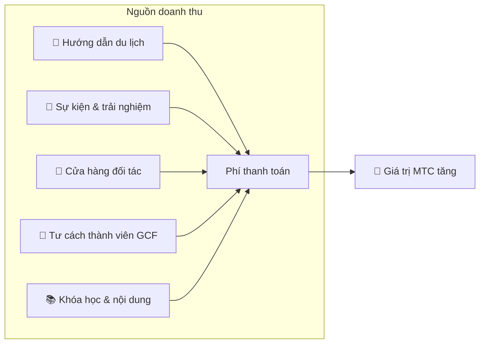

# 💰 Tokenomics — thiết kế kinh tế của MTC

> **Niềm tin được khắc vào code.**
> Thiết kế kinh tế của MTC không được bảo đảm bởi lời hứa của ai đó, mà bởi toán học và blockchain.


> **"Một nền kinh tế trong đó hiện trạng không thể bị thay đổi bằng vũ lực" — đó là tokenomics của MTC.**

Thiết kế kinh tế của Matsuri Coin (MTC) dựa trên một niềm tin duy nhất:
**một quy tắc mà ngay cả nhà điều hành cũng không thể can thiệp là sự yên tâm mạnh nhất có thể có cho nhà đầu tư.**

Cung được cố định vĩnh viễn. Phát hành thêm và đóng băng quỹ là không thể. Tăng trưởng kinh doanh được phản ánh trong giá ở mức của một phương trình —
không phải "lời hứa," mà là một **sự thật** khắc vào blockchain.

Trang này công khai tiết lộ mọi cơ chế kinh tế của MTC.

---

## Đặc tả token

Để đảm bảo an toàn cho nhà đầu tư, chúng tôi đã vĩnh viễn **từ bỏ** cả "mint authority" và "freeze authority" trên Solana.
Phát hành thêm là vĩnh viễn không thể. Quỹ không thể bị đóng băng. Đó là một **thiết kế hoàn toàn trustless.**

| Mục | Chi tiết |
| :--- | :--- |
| **Tên token** | Matsuri Coin |
| **Ticker** | MTC |
| **Chain** | Solana |
| **Địa chỉ mint** | `DRENpzmRWM4TwECrCPCfS1k5VBPmanhQg9bcCWP8EZXF` [Solscan →](https://solscan.io/token/DRENpzmRWM4TwECrCPCfS1k5VBPmanhQg9bcCWP8EZXF) |
| **Tổng cung** | **900 triệu** (900.000.000 MTC), cố định |
| **Mint authority** | 🚫 Đã từ bỏ ([có thể xác minh on-chain](https://solscan.io/token/DRENpzmRWM4TwECrCPCfS1k5VBPmanhQg9bcCWP8EZXF)) |
| **Freeze authority** | 🚫 Đã từ bỏ ([có thể xác minh on-chain](https://solscan.io/token/DRENpzmRWM4TwECrCPCfS1k5VBPmanhQg9bcCWP8EZXF)) |
| **Quản lý lock** | Streamflow Finance (đã xác minh) |

:::info Vì sao điều này quan trọng
Từ bỏ mint authority có nghĩa "nhà điều hành không thể mint thêm token và làm loãng phần của bạn." Từ bỏ freeze authority có nghĩa "không ai có thể đóng băng ví của bạn." Đây là nền tảng của trustlessness.
:::

---

## Phân bổ token

900M MTC được phân bổ như sau.

<div className="mtc-alloc">
  <div className="mtc-alloc__donut" role="img" aria-label="Phân bổ MTC: 61% Pool đào, 39% Vận hành hệ sinh thái">
    <div className="mtc-alloc__hole">
      <span className="mtc-alloc__total">900M</span>
      <span className="mtc-alloc__unit">MTC</span>
    </div>
  </div>
  <div className="mtc-alloc__legend">
    <div className="mtc-alloc__row mtc-alloc__row--mining">
      <span className="mtc-alloc__dot"></span>
      <span className="mtc-alloc__pct">61%</span>
      <span className="mtc-alloc__amount">⛏️ 550M MTC</span>
    </div>
    <div className="mtc-alloc__row mtc-alloc__row--ecosystem">
      <span className="mtc-alloc__dot"></span>
      <span className="mtc-alloc__pct">39%</span>
      <span className="mtc-alloc__amount">🌐 350M MTC</span>
    </div>
  </div>
</div>

| Loại | Tỷ lệ | Số lượng | Mục đích |
| :--- | :---: | :--- | :--- |
| **⛏️ Pool đào** | **61%** | 550 triệu | Pool phần thưởng cho người đóng góp. Mở khóa tháng 6/2027, giải phóng theo chu kỳ halving hai năm. Phân phối theo điểm đóng góp |
| **🌐 Vận hành hệ sinh thái** | **39%** | 350 triệu | Marketing, phân phối GCF, chi phí vận hành, tài trợ liquidity pool (LP), chi phí phát triển, quảng cáo, tổ chức sự kiện và hơn thế |

:::note Cách pool đào được giải phóng
550M MTC không được giải phóng cùng một lúc. Nó tuân theo lịch halving hai năm và được **phân phối theo từng giai đoạn theo điểm đóng góp.** Quy tắc giải phóng và phân phối sẽ được triển khai dưới dạng smart contract theo từng giai đoạn từ cuối 2026, và trở nên có thể kiểm chứng on-chain.
:::

:::note Về phân bổ vận hành hệ sinh thái
Phân bổ vận hành 39% là một quỹ đa mục đích cần thiết để phát triển hệ sinh thái. Các sử dụng cụ thể bao gồm hoạt động marketing, phân phối ban đầu cho thành viên GCF, cung cấp thanh khoản cho pool Raydium, lương cho đội phát triển, quảng cáo và tài trợ sự kiện trải nghiệm văn hóa. Tính minh bạch của việc sử dụng sẽ chịu sự quản trị của cộng đồng sau khi chuyển sang DAO.
:::

---

## Cấu trúc doanh thu

Cái hỗ trợ giá trị MTC là **doanh thu từ hoạt động kinh doanh thực.** Không phải đầu cơ — hoạt động kinh tế thực hậu thuẫn giá trị token.



| Nguồn doanh thu | Chi tiết |
| :--- | :--- |
| **🏯 Trải nghiệm & hướng dẫn** | Phí thanh toán từ tour guide và sự kiện trải nghiệm văn hóa |
| **🤝 Tư cách thành viên GCF** | Phí thành viên |
| **📚 Nội dung** | Phí đăng ký khóa học, đăng ký truyền thông |
| **🏪 Sàn giao dịch** | Phí giao dịch từ cửa hàng đối tác (mở rộng theo từng giai đoạn) |

:::tip Tăng trưởng được hậu thuẫn bởi nhu cầu thực
Càng nhiều khách inbound đến, càng nhiều ngoại tệ chảy vào và hệ sinh thái càng lớn. Giá trị MTC được đặt không bởi đầu cơ mà bởi **số người trải nghiệm văn hóa.**
:::

---

## Thực trạng kinh doanh hiện tại

Nền kinh tế MTC còn non trẻ, nhưng hoạt động thực đã bắt đầu.

| Chỉ số | Trạng thái |
| :--- | :--- |
| **Sự kiện đã tổ chức** | 50+ (vận hành thử nghiệm) |
| **Thành viên GCF Platinum** | 20 trong 50 ghế đã đầy |
| **Thành viên GCF Gold** | Tuyển dụng sẽ mở sớm |
| **Nền tảng web** | Đang hoạt động, hiện đang thu hút và phục vụ người dùng thử nghiệm |
| **Ứng dụng iOS** | Phát triển hoàn thành, dự kiến phát hành tháng 4/2026 |

:::note Lời tuyên bố trung thực
Chúng tôi chưa có thành tích "thành công lớn." 50 sự kiện và vận hành thử nghiệm — đó là thực tế hôm nay. Nhưng sản phẩm đang chạy, cộng đồng tồn tại, và chúng tôi đang ở giai đoạn mở rộng quy mô từ đây một cách nghiêm túc.
:::

---

## Giao thức buyback

Chúng tôi không chỉ đơn giản bỏ túi lợi nhuận.
Một tỷ lệ phần trăm cố định của doanh thu kinh doanh được dành để **mua lại MTC từ thị trường.**

| Nguồn doanh thu | Phân bổ | Hành động |
| :--- | :---: | :--- |
| **Doanh thu Matsuri HQ** (hướng dẫn, sự kiện) | **20%** | **Buyback** từ thị trường + bổ sung liquidity pool |
| **Tư cách thành viên GCF** (phí thành viên) | **25%** | **Buyback** từ thị trường |

:::info Tình trạng buyback hiện tại
Giao thức buyback sẽ **bắt đầu vận hành** khi doanh thu kinh doanh tăng tốc. Ban đầu nó chạy off-chain (thủ công); nó di chuyển theo từng giai đoạn sang thực thi tự động bằng smart contract từ cuối 2026. Khi đã on-chain, lịch sử thực thi đầy đủ của các buyback sẽ có thể kiểm chứng trên blockchain bởi bất kỳ ai.
:::

Buyback không phải lời hứa "vào lúc nào đó." Đó là quy tắc được lập trình thành giao thức. Mỗi khi doanh thu kinh doanh tăng, MTC tự động được hấp thụ từ thị trường — **sự yên tâm có cấu trúc** cho nhà đầu tư.

---

## Logic hình thành giá

Cơ chế đẩy giá lên của MTC dựa không phải trên hy vọng, mà trên **phương trình của một AMM (automated market maker).**

```
Giá = Thanh khoản (SOL) ÷ Cung (MTC)
```

| Bước | Điều gì xảy ra | Kết quả |
| :---: | :--- | :--- |
| **①** | Doanh thu kinh doanh (SOL) được bơm vào pool | **Tử số tăng** |
| **②** | Các quỹ đó mua lại MTC từ thị trường và đốt | **Mẫu số giảm** |
| **③** | Tử số ↑ × mẫu số ↓ | **Điều kiện cho khan hiếm tăng được đáp ứng** |

:::info Mô tả về cơ chế, không phải bảo đảm giá
Phương trình này mô tả một thiết kế cấu trúc: nếu doanh thu kinh doanh tiếp tục và buyback được thực thi, cân bằng cung-cầu di chuyển theo hướng khan hiếm. Giá thực tế phụ thuộc vào nhu cầu thị trường, điều kiện bên ngoài, thanh khoản và nhiều yếu tố khác.
:::

---

## Lịch halving

**550 triệu MTC (khoảng 61% tổng cung)** mở khóa vào ngày 1 tháng 6 năm 2027 sẽ không bị đổ ra thị trường. Chúng được dành làm **pool phần thưởng cho người đóng góp.**

Chúng tôi đã chọn **chu kỳ halving hai năm**, nhanh hơn chu kỳ bốn năm của Bitcoin.
Tỷ lệ giải phóng giảm một nửa mỗi hai năm, giữ phần thưởng chảy về lý thuyết trong nhiều thập kỷ.

| Giai đoạn | Tỷ lệ giải phóng | Số lượng giải phóng | Tích lũy |
| :--- | :---: | :--- | :---: |
| **Giai đoạn 1** 2027–2029 | **50%** | ~275M | 50% |
| **Giai đoạn 2** 2029–2031 | **25%** | ~137M | 75% |
| **Giai đoạn 3** 2031–2033 | **12,5%** | ~68M | 87,5% |
| **Giai đoạn 4** 2033–2035 | **6,25%** | ~34M | 93,75% |
| **Từ Giai đoạn 5 trở đi** | Tiếp tục halving | Giảm dần | → tiệm cận 100% |

<small>*Về toán học, nó không bao giờ đạt 100%, và giải phóng tiệm cận về không. Cùng nguyên tắc với Bitcoin.*</small>

:::tip Đóng góp càng sớm, bạn nhận được càng nhiều MTC
Vì halving, giai đoạn 1 (2027–2029) có lượng giải phóng lớn nhất, và mỗi epoch tiếp theo giải phóng ít hơn mỗi sự kiện. Nói cách khác, **những ai xây dựng điểm đóng góp sớm nhận được nhiều MTC hơn.**

Ví dụ về hoạt động đóng góp vào điểm:
- Thành tích tạo và tham dự sự kiện
- Vận hành các khóa hướng dẫn được yêu thích
- Giới thiệu và phát triển các hướng dẫn viên xuất sắc
- Lượt xem và chia sẻ nội dung J-Times
- Check-in hành hương thánh địa

Phần thưởng được xác định không phải bởi "thứ tự gia nhập" mà bởi **"số lượng và chất lượng đóng góp".**
:::

---

:::note Trang tiếp theo
Giờ bạn đã hiểu thiết kế kinh tế của MTC, hãy xem **cách tham gia với tư cách đối tác.**
**[Tư cách thành viên GCF →](/docs/gcf)**
:::
