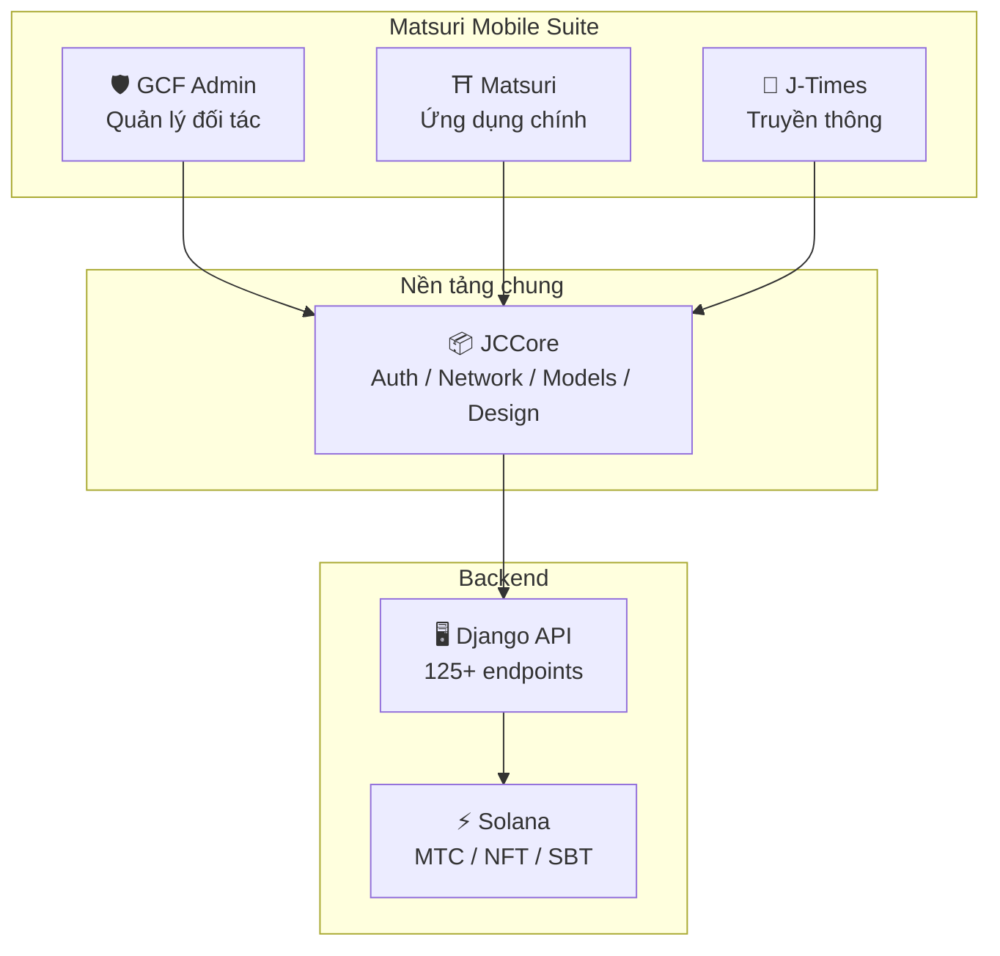
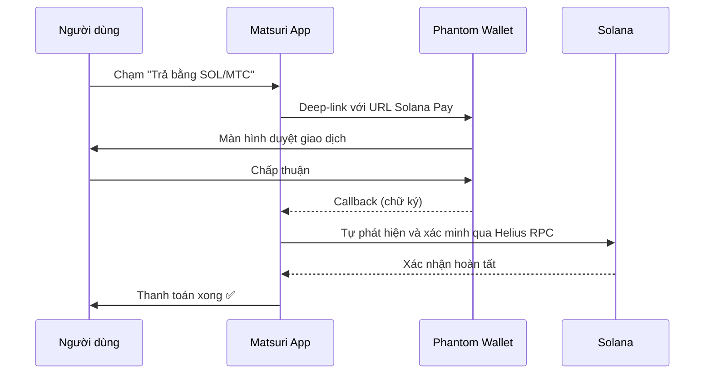
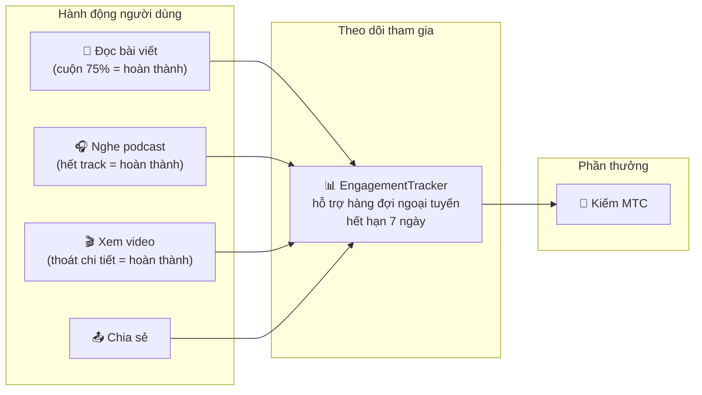
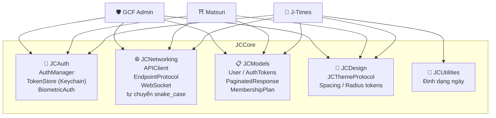
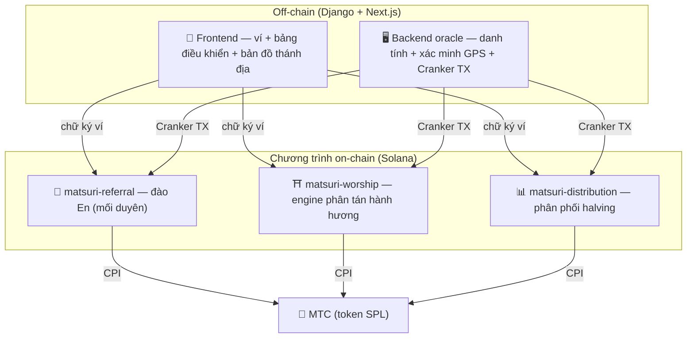
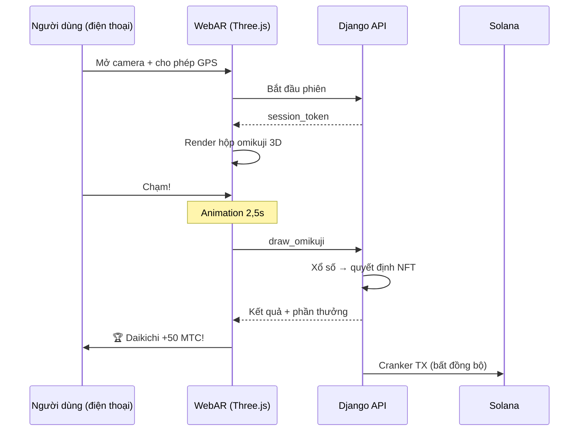

import useBaseUrl from '@docusaurus/useBaseUrl';

# 🔧 Sản phẩm & công nghệ — cái đang chạy chứng minh tất cả

> **Cái đang chạy chứng minh tất cả.**
> Sứ mệnh của chúng tôi không chỉ là lời nói. Nền tảng web đã hoạt động, và các ứng dụng iOS đang ở giai đoạn cuối.

Ứng dụng web và bảng điều khiển admin **đang trong sản xuất**. Ba ứng dụng iOS native đã hoàn thành và được phát hành trong tháng 4–5/2026 (Matsuri đầu tháng 5). Smart contracts trên Solana là mã nguồn mở — chúng tôi nói không bằng khái niệm, mà bằng **mã đang chạy và một sản phẩm sắp ra mắt.**

---

## Tổng quan ứng dụng

| Ứng dụng | Mục đích | Trạng thái | Ngôn ngữ hỗ trợ |
| :--- | :--- | :---: | :--- |
| **GCF Admin** | Quản lý đối tác và công cụ vận hành | ✅ Đã phát hành | 🇯🇵🇬🇧🇨🇳🇹🇭🇳🇴 |
| **Matsuri** | Ứng dụng tiêu dùng chính | ✅ Đã phát hành | 🇯🇵🇬🇧🇨🇳🇹🇭🇳🇴 |
| **J-Times** | Truyền thông văn hóa và học tập | ✅ Đã phát hành | 🇯🇵🇬🇧 |

---

## 1. 🛡️ GCF Admin — ứng dụng quản lý đối tác

:::info Trạng thái: đã phát hành trên App Store (v1.0)
Ứng dụng quản lý vận hành cho thành viên GCF (Global Community Friends). Toàn bộ chức năng của màn hình admin web, gói gọn trên di động.
:::

  

  
  
  

### Ứng dụng làm được gì

| Mục | Tính năng |
| :--- | :--- |
| **📊 Bảng điều khiển** | Thẻ KPI, biểu đồ doanh thu, hành động nhanh |
| **👥 Quản lý thành viên** | Danh sách, chi tiết, chỉnh sửa, quản lý hạng |
| **💰 Quản lý doanh thu** | Theo dõi hoa hồng, quản lý rút MTC, quản lý chi trả |
| **📝 Quản lý nội dung** | Tạo, chỉnh sửa và đăng sự kiện, bài viết, podcast và video |
| **🎫 Slot hướng dẫn** | Quản lý slot hướng dẫn và theo dõi doanh thu |
| **🖼️ Bảng NFT** | Founder's Collection, xác minh on-chain, chuyển NFT |
| **⛩️ Quản lý thánh địa** | CRUD điểm, cấu hình beacon |
| **🎲 Cấu hình đào AR** | Bảng xác suất Omikuji, quản lý tham số phần thưởng |
| **📊 Phân tích** | Báo cáo lỗi, phân tích sử dụng |
| **🔗 Giới thiệu** | Tạo mã QR tùy chỉnh, quản lý chương trình giới thiệu |

### Đặc tả kỹ thuật

| Mục | Chi tiết |
| :--- | :--- |
| **Kiến trúc** | Clean Architecture + MVVM + `@Observable` (iOS 17) |
| **Ngôn ngữ / SDK** | Swift 6.0 / Xcode 16+ / iOS 17.0+ |
| **Tích hợp API** | 125+ endpoints |
| **Tests** | 226 tests / 45 lớp test |
| **Bản địa hóa** | 5 ngôn ngữ (JP/EN/CN/TH/NO) / 957+ khóa dịch |
| **Swift Concurrency** | Tuân thủ Strict Concurrency / không cảnh báo build |

### Tích hợp mã QR

GCF Admin có thể tạo mã QR tùy chỉnh thương hiệu Matsuri. Trường hợp dùng đa dạng — lời mời sự kiện, link giới thiệu, yêu cầu thanh toán, v.v.

---

## 2. ⛩️ Matsuri — ứng dụng chính

:::info Trạng thái: đã phát hành trên App Store (v3.0)
Ứng dụng chính cho người dùng thường. Đặt sự kiện, thanh toán, ví Web3, đào AR — tất cả hoàn thành trong một ứng dụng. **Hiện đang hoạt động trên App Store.**
:::

  

  
  
  

### Ứng dụng làm được gì

| Mục | Tính năng |
| :--- | :--- |
| **🎪 Đặt sự kiện** | Tìm kiếm, đặt chỗ, thanh toán Stripe, quản lý QR vé |
| **💳 Bốn phương thức thanh toán** | Thẻ tín dụng / thẻ đã lưu / số dư MTC / crypto (SOL/MTC) |
| **👛 Ví Web3** | Xem số dư MTC, gửi/nhận, lịch sử giao dịch |
| **🖼️ Bộ sưu tập NFT** | Danh sách NFT/SBT đang giữ, xác minh on-chain |
| **🗺️ Bản đồ thánh địa** | Xem bản đồ đền chùa, check-in |
| **🎲 Đào AR** | Trải nghiệm omikuji WebAR, kiếm MTC |
| **💬 Chat** | Nhắn tin với menu ngữ cảnh |
| **⭐ Wishlist** | Lưu sự kiện và trải nghiệm yêu thích |
| **🔍 Tìm kiếm nâng cao** | Hỗ trợ tìm kiếm bằng giọng nói |
| **🤝 Giới thiệu** | Tham gia chương trình giới thiệu, theo dõi phần thưởng |
| **📊 Bảng điều khiển GCF** | Xem admin nhẹ cho thành viên GCF |

### Tích hợp Phantom Wallet — thanh toán crypto không cần nhập

>**Không cần copy-paste địa chỉ.** Phantom Wallet tự khởi chạy và thanh toán hoàn thành chỉ với một lần chấp thuận. Chữ ký giao dịch được tự phát hiện qua Helius RPC.

### Đặc tả kỹ thuật

| Mục | Chi tiết |
| :--- | :--- |
| **Kiến trúc** | Clean Architecture + MVVM + Swift Concurrency |
| **Ngôn ngữ / SDK** | Swift 6.0 / Xcode 16+ / iOS 17.0+ |
| **Thanh toán** | Stripe PaymentSheet + MTC Balance + Phantom (Solana Pay) |
| **Tích hợp API** | 72 endpoints / 16 mục |
| **Tests** | 230+ (Model, ViewModel, Network, Security, DeepLink, E2E) |
| **Bản địa hóa** | 5 ngôn ngữ (JP/EN/CN/TH/NO) / 406 khóa dịch |
| **ViewModels** | 25 (hoàn toàn MVVM — không có lệnh API trực tiếp từ Views) |
| **Xác thực** | Apple Sign In / Google Sign In (PKCE) |

---

## 3. 📰 J-Times — ứng dụng truyền thông văn hóa

:::info Trạng thái: đã phát hành — hoạt động trên App Store
Một nền tảng truyền thông truyền tải chiều sâu văn hóa Nhật Bản. Đọc bài viết, nghe podcast, xem video — mỗi hành động kiếm MTC.
:::

  

  
  

### Ứng dụng làm được gì

| Mục | Tính năng |
| :--- | :--- |
| **📖 Bài viết** | Hero parallax, chữ cái lớn, thanh tiến trình đọc, nội dung phong phú (Markdown, bảng, trích dẫn) |
| **🎧 Podcast** | Duyệt series, trình phát sóng âm, hẹn giờ ngủ, AirPlay, điều khiển màn hình khóa |
| **🎬 Video** | Lưới/danh sách thích ứng, video ngắn (kiểu TikTok, chạm hai lần) |
| **🔍 Tìm kiếm** | Đa bộ lọc, tag thịnh hành, tìm kiếm bằng giọng nói |
| **🧭 Khám phá** | Carousel nổi bật, lựa chọn của staff, top tuần |
| **📚 Thư viện** | Yêu thích, lịch sử (theo ngày), tải xuống, playlist |
| **🎵 Trình phát âm thanh** | Mini player (điều khiển bằng vuốt), trình phát đầy đủ (sóng âm, lời, lặp) |
| **👤 Tư cách thành viên** | So sánh tính năng qua 3 hạng (Free / Premium / Pro), khôi phục mua |

### Media Mining — đọc, nghe, và xem như đào

>**Ghi cả khi ngoại tuyến.** Đọc một bài viết tại một đền núi nơi không có sóng — khi mạng quay lại, tham gia được tự gửi lên và MTC được ghi có.

### Hệ thống thiết kế — "bốn trụ cột" của thẩm mỹ Nhật Bản

J-Times sử dụng một hệ thống thiết kế nguyên bản đưa thẩm mỹ Nhật Bản truyền thống vào UI hiện đại.

| Trụ | Khái niệm | Áp dụng UI |
| :--- | :--- | :--- |
| **墨 (sumi — mực)** | Xám trung tính ấm | Nền, hệ thống cấp text |
| **朱 (shu — son)** | Đỏ Nhật (#C53030) | Màu nhấn, hành động quan trọng |
| **間 (ma — khoảng)** | Khoảng trống trên lưới 4pt | Khoảng cách, không gian thở |
| **紙 (kami — giấy)** | Kết cấu tinh tế, glassmorphism | Bề mặt thẻ, độ sâu |

### Đặc tả kỹ thuật

| Mục | Chi tiết |
| :--- | :--- |
| **Kiến trúc** | Clean Architecture + MVVM + Swift Concurrency |
| **Ngôn ngữ / SDK** | Swift 6.0 / Xcode 16+ / iOS 17.0+ |
| **Phụ thuộc bên ngoài** | **Không** — chỉ framework first-party của Apple |
| **Tích hợp API** | 40+ endpoints |
| **Tests** | 371 tests / 20 file |
| **Bản địa hóa** | 2 ngôn ngữ (JP/EN) / 310+ khóa dịch |
| **Hỗ trợ ngoại tuyến** | ContentCache (50MB) + ImageDiskCache (200MB) + trình quản lý tải xuống |
| **Xác thực** | Apple Sign In / Google Sign In (PKCE) |

---

## Nền tảng chung: thư viện JCCore

Một thư viện Swift Package được chia sẻ qua cả ba ứng dụng.

| Module | Vai trò |
| :--- | :--- |
| **JCAuth** | Quản lý token dựa trên Keychain, xác thực sinh trắc (Face ID / Touch ID) |
| **JCNetworking** | Client API an toàn về kiểu, WebSocket, tự chuyển JSON snake_case |
| **JCModels** | Data model chung qua các app (User, AuthTokens, v.v.) |
| **JCDesign** | Giao thức theme, design token (spacing, corner radius) |
| **JCUtilities** | Tiện ích ngày tháng và chuỗi |

---

## Bảo mật và quyền riêng tư

| Mục | Triển khai |
| :--- | :--- |
| **Auth token** | Mã hóa và lưu trong iOS Keychain (TokenStore) |
| **Xác thực sinh trắc** | Hai nhân tố qua Face ID / Touch ID |
| **Giao tiếp API** | HTTPS + ghim chứng chỉ |
| **Khóa riêng ví** | Không bao giờ lưu trong app — ủy quyền cho Phantom Wallet |
| **Đào AR** | Hình ảnh camera không được gửi lên server (VisionProof) |
| **Dữ liệu ngoại tuyến** | Mã hóa SwiftData + tự hết hạn |
| **Swift Concurrency** | Cô lập actor ngăn race condition |

---

## Chất lượng phát triển

### Ứng dụng di động: **827+ test tự động** qua ba ứng dụng.

| Ứng dụng | Tests | Khu vực bao phủ |
| :--- | :---: | :--- |
| **GCF Admin** | 226 | Model, ViewModel, Repository, API, Bản địa hóa, Điều hướng |
| **Matsuri** | 230+ | Model, ViewModel, Network, Security, DeepLink, Regression, Performance, E2E |
| **J-Times** | 371 | Model, ViewModel, API, Repository, Điều hướng, Bản địa hóa, Security, Performance |

### Smart contracts: test mở rộng theo từng giai đoạn

Đối với các chương trình Rust trên Solana, chúng tôi đã bắt đầu với unit test cho logic lõi (các module math), và đang mở rộng độ bao phủ test theo từng giai đoạn để chuẩn bị cho audit bảo mật (Q2–Q3 2026).

---

## Smart contracts — thiết kế nguồn mở

>**Triết lý thiết kế trustless.**
> Tính toán phần thưởng, cây giới thiệu, lịch halving — mọi mảnh logic chạy **on-chain** và có thể audit bởi bất kỳ ai.
> Nguồn: [GitHub](https://github.com/Cootakahashi/matsuri-contracts)

---

### Người đóng góp

| Thành viên | Vai trò |
| :--- | :--- |
| **Ko Takahashi** | Founder / Lead Developer — kiến trúc, smart contract, phát triển full-stack |

> 🌏**Trong tương lai, thành viên GCF và một cộng đồng nhà phát triển toàn cầu cũng sẽ tham gia nỗ lực đồng phát triển.**
> Là "hạ tầng văn hóa" được xây để bền vững, Matsuri Protocol được xây trên sự minh bạch và đồng sở hữu.

---

### Cấu trúc tổng thể

Matsuri triển khai **ba chương trình Anchor (Rust)** trên Solana, mỗi chương trình mang một trong các trụ cột của hệ sinh thái.

---

### 1. 📣 En-Mining (縁 — mối duyên / kết nối)

**Mục đích:** Một engine tăng trưởng hybrid tưởng thưởng cả "bề rộng" (mạng giới thiệu) và "chiều sâu" (tác động kinh tế). Không phải affiliate marketing đơn giản, mà là một giao thức đào đầy đủ nơi hoạt động kinh tế thực thế giới sản sinh giá trị on-chain.

#### Thiết kế chấm điểm

Điểm đóng góp dựa trên hai thành phần có trọng số:

| Thành phần | Trọng số | Mục đích |
| :--- | :---: | :--- |
| **Bề rộng** (số giới thiệu) | 30% | Phạm vi mạng — bạn đưa vào bao nhiêu người |
| **Chiều sâu** (khối lượng thanh toán) | 70% | Tác động kinh tế — mua sắm thực, không chỉ đăng ký |

Điểm tích lũy theo thời gian và được chuyển thành MTC tại mỗi epoch halving. Các cơ chế boost bổ sung được lên kế hoạch:

| Boost | Mô tả | Trạng thái |
| :--- | :--- | :---: |
| **Toku (徳 — đức) staking** | Khóa MTC để boost điểm đóng góp (boost lên đến ~50%). Hạng và hệ số chính xác được hiệu chỉnh theo lịch giải phóng pool halving | ⬜ Hệ số TBD |
| **Xếp hạng mùa** | Người xuất sắc nhất mỗi epoch nhận danh hiệu **Evangelist** (SBT vĩnh viễn) và boost điểm. Tỷ lệ chính xác do quản trị quyết định | ⬜ Hệ số TBD |

:::info Thiết kế tham số tiến triển
Hệ số boost (hạng staking, thưởng xếp hạng) được cố ý có thể điều chỉnh. Chúng sẽ được hoàn thiện và khóa vào smart contract dựa trên dữ liệu hệ sinh thái thực — tổng số người dùng tích cực, tỷ lệ giải phóng pool halving, mục tiêu ổn định giá. Cách tiếp cận này đảm bảo **phân phối công bằng** mà không hứa hẹn thái quá lợi nhuận cố định.
:::

#### Phòng vệ chống sybil (ba lớp)

| Lớp | Cơ chế | Vị trí |
| :--- | :--- | :--- |
| **Cổng danh tính** | OAuth X/Twitter + SMS | Off-chain (Django) |
| **Cổng on-chain** | Chỉ profile có `is_verified = true` mới kiếm phần thưởng | Smart contract |
| **Trọng số chiều sâu** | 70% điểm = thanh toán thực → bot không kiếm được gì | Engine chấm điểm |

---

### 2. ⛩️ Engine phân tán hành hương (Worship Routing Engine)

**Mục đích:** **Giao thức ReFi** đầu tiên trên thế giới giải quyết overtourism bằng kinh tế token. Ghé thánh địa để kiếm MTC. Cú twist quan trọng: *càng ít khách tại một điểm, bạn càng nhận được phần thưởng tăng theo cấp số nhân.*

:::tip Hiểu biết cốt lõi
"Định giá surge ngược của Uber" — điểm đông đúc bị phạt, điểm frontier được boost. Du khách tự nguyện di chuyển đến những nơi ít được ghé hơn **bởi vì chúng có lợi nhuận hơn.**
:::

#### Nguyên tắc thiết kế phần thưởng

Điểm đóng góp cho mỗi lượt ghé được xác định bởi nhiều yếu tố:

| Yếu tố | Nguyên tắc | Hiệu ứng |
| :--- | :--- | :--- |
| **Mức độ phổ biến của điểm** | Càng ít khách = điểm cao hơn | Phân tán du khách khỏi khu đông |
| **Thời điểm ghé** | Khách đến sớm hơn trong ngày kiếm nhiều hơn | Khuyến khích ghé ngoài cao điểm |
| **Hạng khu vực** | Điểm khu vực và frontier xếp cao nhất | Thúc đẩy hồi sinh khu vực |
| **Tần suất ghé** | Khách thường xuyên tích lũy điểm thưởng | Tưởng thưởng tham gia liên tục |
| **Vận may omikuji** | Rút thưởng ngẫu nhiên mỗi check-in | Yếu tố gamification vui vẻ |
| **Boost được tài trợ** | Chính quyền có thể boost điểm cụ thể | Mô hình doanh thu B2B/B2G |

:::info Hệ số có thể điều chỉnh
Hệ số chính xác cho mỗi yếu tố (ví dụ: điểm khu vực kiếm hơn điểm major bao nhiêu) được điều chỉnh dựa trên **lịch pool halving** và dữ liệu sử dụng thực, và được khóa vào smart contract theo từng giai đoạn. Nguyên tắc thiết kế cố định — hệ số phát triển cùng hệ sinh thái.
:::

---

### 3. 📊 Phân phối halving

**Mục đích:** Lấy cảm hứng từ lịch halving của Bitcoin, phân phối MTC tự động halving mỗi epoch. Khan hiếm được đảm bảo về toán học.

| Instruction | Mô tả |
| :--- | :--- |
| `initialize` | Khởi tạo pool phân phối |
| `register_miner` | Đăng ký miner |
| `update_score` | Cập nhật điểm |
| `advance_epoch` | Tiến epoch (thực thi halving) |
| `claim_distribution` | Yêu cầu phần thưởng phân phối |

---

### 4. 🎴 Đào AR — trải nghiệm omikuji WebAR

**Mục đích:** Làm cho omikuji AR xuất hiện trong không gian thực, chỉ dùng trình duyệt điện thoại, và đào MTC qua đó. **Không cần tải ứng dụng.** Hạ tầng WebAR × blockchain đầu tiên trên thế giới, hòa quyện tâm linh Shintō với công nghệ tiên tiến.

#### Kiến trúc

#### Cấu hình xác suất Omikuji (GCF admin)

Basis Points (10000 = 100%) với độ chính xác 0,01%. Có thể điều chỉnh từ màn hình admin GCF.

| Hạng | Độ hiếm | Thưởng | NFT |
|------|-----------|---------|-----|
| 🏆 Daikichi | Hiếm | Thưởng tối đa | ✅ |
| ✨ Kichi | Không phổ biến | Thưởng cao | Tùy chọn |
| 🌸 Shōkichi | Phổ biến | Thưởng nhỏ | — |
| 🍃 Suekichi | Phổ biến | Ghi nhận tham gia | — |
| 💀 Kyō | Không phổ biến | Ghi nhận tham gia | — |

Xác suất và hệ số phần thưởng sẽ được hoàn thiện theo từng giai đoạn dựa trên kích thước hệ sinh thái và lượng giải phóng halving, và được triển khai trong smart contract.

#### ZK-Proof of Vision (bảo mật 5 lớp)

Loại bỏ giả mạo GPS và tấn công replay trong nhiều lớp. **Để bảo vệ quyền riêng tư, hình ảnh camera không bao giờ được gửi lên server.**

| Lớp | Cái gì được xác minh | Trọng số |
| :--- | :--- | :--- |
| Temporal | Thời gian phiên 5–120s | /20 |
| Motion | Tính tự nhiên của con quay (phát hiện rung tay cầm) | /20 |
| Light | Tính nhất quán ánh sáng môi trường × thời gian trong ngày | /20 |
| HMAC | Xác minh chữ ký proof_hash | /20 |
| Fingerprint | Tính độc nhất của thiết bị | /20 |
| **Tổng** | **60/100 trở lên = PASS** | |

#### Thiết kế phần thưởng

Phần thưởng được ghi dưới dạng **điểm đóng góp** dựa trên nhiều yếu tố bao gồm loại điểm, kết quả omikuji và hạng khu vực. Hệ số cụ thể được hoàn thiện theo từng giai đoạn phù hợp với lịch giải phóng halving và tăng trưởng hệ sinh thái, và được triển khai trong smart contract.

---

### Module math thuần (logic lõi có thể audit)

Mỗi chương trình cô lập tính toán điểm và phần thưởng vào một **module `math.rs` thuần, có thể audit:**

- **Không tác dụng phụ** — không I/O, không cấp phát bộ nhớ, không gọi bên ngoài
- **Công thức được tài liệu hóa** — ký hiệu kiểu LaTeX bên trong rustdoc
- **Phân tích overflow** — trung gian u128 với phạm vi đã được chứng minh
- **Test toàn diện** — edge case, điều kiện biên, xác minh tỷ lệ
- **Hệ số có thể điều chỉnh** — tham số phần thưởng được thiết kế để có thể cập nhật qua quản trị, cho phép hiệu chỉnh theo từng giai đoạn khi hệ sinh thái phát triển

---

### Mô hình bảo mật

Các contract này **hoàn toàn nguồn mở.** Bảo mật dựa trên các đảm bảo toán học, không phải sự mờ ám.

| Nguyên tắc | Triển khai |
| :--- | :--- |
| **Vault chỉ PDA** | Vault token được kiểm soát bởi PDA (program-derived address) — không khóa con người nào có thể rút |
| **Số học có kiểm tra** | Mọi tính toán dùng số học `checked_*` — không thể tràn |
| **Tách quyền** | Admin (multisig) ≠ Cranker (hành động giới hạn) ≠ Người dùng (tự lưu giữ) |
| **Tạm dừng khẩn cấp** | Admin chỉ có thể tạm dừng chương trình để phản ứng với mối đe dọa bảo mật. Nhưng **không thể di chuyển hoặc tịch thu quỹ** — tạm dừng là "lá chắn để bảo vệ," không phải cách thay đổi quy tắc |
| **Tokenomics bất biến** | Tỷ lệ halving, tổng pool và độ dài epoch không thể thay đổi sau cấu hình ban đầu |
| **Module math thuần** | Logic phần thưởng/chấm điểm sống trong thư viện math riêng, có thể test |
| **Vision Proof** | Phát hiện giả mạo 5 lớp không bao giờ truyền dữ liệu camera (giữ quyền riêng tư) |

---

**[▶ Tiếp: Lộ trình & đội ngũ](/docs/roadmap)** | **[◀ Trước: Tokenomics](/docs/tokenomics)**
