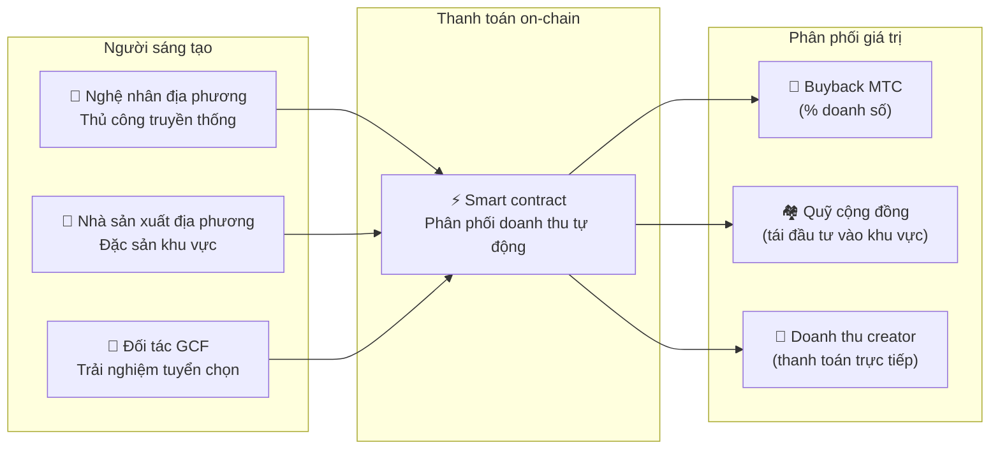

import useBaseUrl from '@docusaurus/useBaseUrl';

# 🗓️ Lộ trình & đội ngũ

>**Gửi đến những ai đã đọc đến đây — tầm nhìn, thiết kế kinh tế và nền tảng kỹ thuật đều đã sẵn sàng.**
> Chúng tôi không phải là dự án đầu cơ ngắn hạn.
>**Phát triển nền tảng chính đã hoàn thành,** và chúng tôi đang bước vào giai đoạn mở rộng quy mô.

---

## Cột mốc chiến lược

### 🔥 Giai đoạn 1: Tỉnh thức (nửa đầu 2026 — hiện tại)

**Chủ đề: nền tảng và dòng tiền**

Nền tảng web đang hoạt động, và cả ba ứng dụng iOS (GCF Admin, J-Times, Matsuri) hiện đang hoạt động trên App Store kể từ tháng 4/2026. Chúng tôi tập trung vào kiếm tiền qua hệ thống tài chính do CEO dẫn dắt và đảm bảo thanh khoản sớm.

| Trạng thái | Cột mốc | Chi tiết |
| :---: | :--- | :--- |
| ✅ | **Nền tảng web hoạt động** | Ứng dụng web Matsuri và bảng điều khiển admin GCF (web) đang chạy |
| ✅ | **Thanh toán và tăng trưởng** | Triển khai chức năng thanh toán MTC và chức năng airdrop giới thiệu |
| ✅ | **Khởi chạy truyền thông** | Cơ sở phân phối J-Times (web & podcast) đã được xây |
| ✅ | **Genesis** | Token MTC phát hành trên chain Solana |
| ✅ | **Thanh khoản đã đảm bảo** | Liquidity pool ban đầu trên Raydium đã được tạo |
| ⬜ | **Ưu đãi bắt đầu** | Khởi chạy đào thanh khoản với APY mục tiêu 20% |
| ⬜ | **Thanh toán on-chain** | Xác minh Solana Pay đi vào sản xuất |
| ⬜ | **Tuyển VIP** | Hoàn thành lựa chọn 20 thành viên VIP GCF ban đầu |

### 🚀 Giai đoạn 2: Mở rộng (nửa cuối 2026)

**Chủ đề: tài sản thực và đào phiêu lưu**

Chúng tôi tận dụng đầy đủ ứng dụng web đã hoàn thành, mở rộng cơ sở vật lý và tính năng "hành hương".

| Trạng thái | Cột mốc | Chi tiết |
| :---: | :--- | :--- |
| ⬜ | **Phát hành tính năng mới** | Triển khai và phát hành đào phiêu lưu (hành hương) |
| ⬜ | **Mở rộng ra nước ngoài** | Phát triển cơ sở đối tác tại châu Á (Thái Lan, Đài Loan, v.v.) & sự kiện VIP |
| ⬜ | **Quản lý tài sản** | Xây dựng portfolio bất động sản, cổ phiếu và crypto |
| ⬜ | **Mục tiêu** | Quy mô tài sản toàn hệ sinh thái đạt **1 tỷ ¥ (~6,5 triệu $)** |

### 🌊 Giai đoạn 3: Lưu thông (từ 2027)

**Chủ đề: áp dụng đại chúng, kinh tế cộng tạo, phi tập trung**

Mở cho công chúng, sàn giao dịch on-chain và vận hành đầy đủ hệ sinh thái.

| Trạng thái | Cột mốc | Chi tiết |
| :---: | :--- | :--- |
| ⬜ | **Khai trương lớn** | Phát hành chính thức Matsuri App toàn cầu |
| ⬜ | **Mở khóa lớn (1/6/2027)** | Lockup founder mở khóa + pool đào (550M) kích hoạt + chu kỳ halving bắt đầu |
| ⬜ | **Sàn cộng tạo** | Cửa hàng đặc sản khu vực + cửa hàng đối tác GCF — thanh toán on-chain với buyback MTC tự động |
| ⬜ | **Crowdfunding (quyền NFT)** | Người dùng tài trợ dự án văn hóa trên Solana. Backer nhận NFT đại diện cho quyền sở hữu, chia sẻ doanh thu và quyền quản trị |
| ⬜ | **Thanh toán on-chain** | Mọi giao dịch trên sàn được thanh toán bằng smart contract — một tỷ lệ phần trăm cố định doanh số tự động được chuyển vào pool buyback MTC |
| ⬜ | **Mục tiêu** | Quy mô tài sản toàn hệ sinh thái đạt **10 tỷ ¥ (~65 triệu $)** |
| ⬜ | **Chuyển sang DAO** | Dần chuyển quyền quyết định cho cộng đồng GCF |

#### 🏪 Khái niệm sàn giao dịch cộng tạo

Biểu hiện tối thượng của "OS văn hóa" — một sàn giao dịch phi tập trung nơi **người sáng tạo văn hóa và người yêu văn hóa giao dịch trực tiếp**, không có trung gian khai thác.

| Tính năng | Mô tả | Trạng thái |
| :--- | :--- | :---: |
| **🏺 Cửa hàng đặc sản khu vực** | Nghệ nhân và nhà sản xuất địa phương bán trực tiếp cho khách hàng toàn cầu. Giảm 5–10% khi trả bằng MTC | ⬜ Khái niệm |
| **🎫 Crowdfunding + quyền NFT** | Tài trợ dự án văn hóa (phục dựng đền thờ, hồi sinh lễ hội, xưởng nghệ nhân). Nhận NFT chứng minh đóng góp của bạn và có thể trao chia sẻ doanh thu hoặc quyền quản trị | ⬜ Khái niệm |
| **⚡ Thanh toán on-chain** | Mọi giao dịch sàn được thanh toán qua smart contract Solana. Doanh thu tự động chia: thanh toán cho creator + quỹ cộng đồng + buyback MTC — không cần kế toán thủ công | ⬜ Khái niệm |
| **🗳️ Quản trị backer** | Người nắm NFT bỏ phiếu về cách dự án họ tài trợ phân bổ tài nguyên — không chỉ là quyên góp đơn thuần, mà là cộng tạo thực sự | ⬜ Khái niệm |

:::info Vì sao điều này quan trọng
Hôm nay, du khách mua quà lưu niệm từ những cửa hàng trả "tiền thuê" cho chủ nhà — nền tảng. Ngày mai, **một nghệ nhân nông thôn ở Kyoto sẽ bán trực tiếp cho một fan ở Copenhagen**, và một phần của doanh số đó sẽ tự động củng cố nền kinh tế MTC. Đây là bánh đà ở dạng hoàn chỉnh nhất.
:::

---

## 👤 Đội ngũ

  

### Ko Takahashi — founder / CEO & lead architect

| Mục | Chi tiết |
| :--- | :--- |
| **Vai trò** | Lãnh đạo tổng thể dự án. Thiết kế nền tảng, smart contract, phát triển full-stack |
| **Tầm nhìn** | Người đề xướng "OS văn hóa" rằng "xuất khẩu văn hóa và nhập khẩu sự giàu có" |
| **Lập trường** | Tự viết code và tự đứng trên thực địa (Golden Gai) — một người thực hành "skin in the game" |

  

### Jon Anders Jensen — director / vận hành GCF & sự kiện

| Mục | Chi tiết |
| :--- | :--- |
| **Vai trò** | Vận hành GCF. Thiết kế vận hành sự kiện và tour, làm việc trên thực địa |
| **Điểm mạnh** | Hỗ trợ dòng "con người" của hệ sinh thái qua góc nhìn quốc tế và quan hệ tin cậy với thành viên GCF |

  

### Ryunosuke Honda — director / đại sứ văn hóa khu vực

| Mục | Chi tiết |
| :--- | :--- |
| **Vai trò** | Cây cầu giữa các nền văn hóa và cộng đồng khu vực trên khắp Nhật Bản và hệ sinh thái Matsuri |
| **Điểm mạnh** | Khám phá tài sản văn hóa khu vực và đưa chúng lên nền tảng Matsuri để mang đến trải nghiệm "Deep Japan" |

### 🌏 Cộng đồng GCF — thành viên phát triển rải rác trên khắp thế giới

Matsuri Protocol không được xây bởi đội sáng lập một mình.
**Thành viên GCF trên khắp thế giới** đóng góp cho sự tiến hóa của giao thức qua thử nghiệm, phản hồi, dịch thuật và triển khai khu vực.

| Khu vực | Cấu trúc |
| :--- | :--- |
| **💼 Tài chính toàn cầu** | Đối tác với mạng nhà đầu tư tư nhân khắp châu Á |
| **⚙️ Kỹ thuật** | Đội kỹ thuật phân tán qua phát triển blockchain và ứng dụng di động |
| **🏮 Vận hành** | Pipeline mạnh với cộng đồng địa phương ở Shinjuku Golden Gai và các điểm du lịch lớn |
| **🌐 Cộng đồng** | Cơ sở thành viên GCF đa quốc gia bao gồm Nhật Bản, Na Uy, Thái Lan và Đài Loan |

:::tip Hạ tầng văn hóa chúng ta cùng xây
Nếu bạn tham gia GCF, bạn cũng trở thành đồng phát triển Matsuri Protocol.
Viết code không phải là hình thức đóng góp duy nhất. Giới thiệu thánh địa ở khu vực của bạn, dịch tài liệu, lên kế hoạch sự kiện —
tất cả đều là sức mạnh đưa giao thức này đến với thế giới.
:::

---

## 🏛️ Quản trị (DAO)

Matsuri Protocol di chuyển dần từ tập trung sang **DAO (tổ chức tự trị phi tập trung)**.
Thành viên GCF (Platinum / Gold) cuối cùng sẽ nắm **quyền bỏ phiếu** đối với các vấn đề chính sau.

| Mục bỏ phiếu | Nội dung |
| :--- | :--- |
| **💰 Phân bổ quỹ** | Đầu tư doanh thu kinh doanh vào kinh doanh mới và marketing nào |
| **⚙️ Cập nhật giao thức** | Tinh chỉnh tỷ lệ phí app và tỷ lệ phần thưởng đào |
| **⛩️ Công nhận văn hóa** | Lễ hội và đền thờ nào được công nhận là "điểm hành hương chính thức" và hỗ trợ tài chính |

:::info Tham gia cuộc cách mạng
Chúng tôi không chỉ đang xây một ứng dụng.
Chúng tôi đang xây một **nền kinh tế văn hóa không biên giới.**
:::

---

**[◀ Trước: Sản phẩm & công nghệ](/docs/product-tech)** | **[⛩️ Trở lại trang đầu whitepaper](/docs/intro)**
