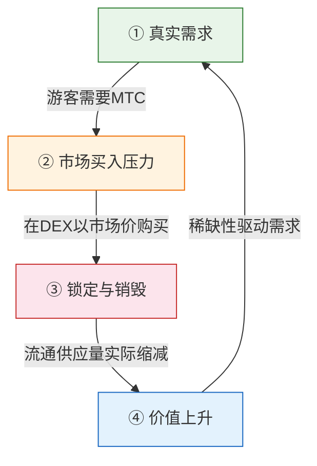
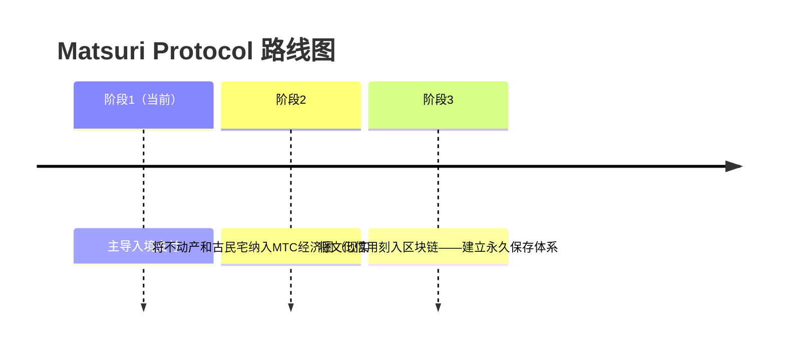

# 🎯 愿景：「入境优先」战略

> **从依赖补贴到自力更生。**
> 靠财政补贴维系地方经济的时代终结了。我们将外资直接注入文化。

绝大多数地方振兴项目都以失败告终——因为它们只是在不断缩小的国内预算中互相倒腾。

**Matsuri Protocol采取截然相反的路径。**

---

## 1. 战略：文化出口引擎

我们将日本的旅游资产重新定义——不是"消耗品"，而是**"可出口的金融资产"**。

| 问题 | 现实 | 影响 |
| :--- | :--- | :--- |
| 💸 **收入外流** | 对海外OTA（Booking.com、Expedia等）的佣金 | **15%~20%的收入**流向海外——国家级损失 |
| 🚧 **隐形之墙** | 语言与支付壁垒 | 高净值旅行者无法获得"深度日本"体验 |

:::tip MTC的角色
MTC是阻止"外流"、打破"围墙"的**唯一万能钥匙**。
:::

---

## 2. 经济飞轮（增长循环）

Matsuri Protocol的核心特征：**游客的热情在数学上直接推动MTC价格上涨。**
这不是情怀——而是**供需机制**。

### 为什么MTC会涨？

一个**4步自动循环**驱动价格：

| 步骤 | 名称 | 机制 |
| :---: | :--- | :--- |
| **①** | **真实需求** | 游客需要MTC来预订导游和购买门票NFT |
| **②** | **市场买入压力** | MTC在DEX上以市场价被购买——消费驱动，非投机性 |
| **③** | **锁定与销毁** | 支付中使用的部分MTC被智能合约即时锁定或销毁——供应量实际缩减 |
| **④** | **价值上升** | 买入需求持续增长，卖出供应持续减少——稀缺性价值在数学上螺旋上升 |

:::info 核心真理
**"游客越享受日本，MTC持有者的资产就越增值。"**
这个简单等式就是项目的心跳。
:::

---

## 3. 终极目标：文化OS

我们的最终目的不是一个支付应用。
而是**将文化本身变成操作系统**。

> 我们用**尖端区块链技术**守护**传承千年的文化**。
> 这就是Matsuri Protocol正在构建的未来。

---

**[▶ 下一页：具体如何盈利？（经济系统）](/docs/economy)**
