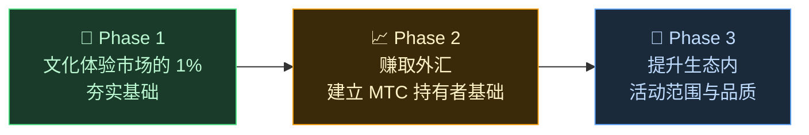

# 🌏 问题与解决——残酷真相与希望之光

> **志向是美好的,但现实正在阻挡它。**

---

## 然而,有一些残酷真相正在阻挡这份志向

:::info 10 万亿日元的市场能量,未能抵达文化的承载者
日本入境旅游市场正朝着年 **10 万亿日元**的规模成长。
然而,这份红利的大部分并未抵达现场。
:::

### MTC 瞄准的市场

我们并非要去攫取这 10 万亿日元的全部。

我们首先锁定的,是其中的**文化体验、向导、地方游览市场**。将这一领域的 **1%（约 1,000 亿日元规模）**作为最初的目标,小处着手、逐步做强。

| 阶段 | 策略 | 目标 |
| :--- | :--- | :--- |
| **从小处着手** | 聚焦文化体验与向导游。积累业绩、靠口碑扩散 | 确立收益基础 |
| **把它做强** | 获取外汇（入境旅游收益）、验证面向 MTC 持有者的收益分配机制 | 建立 MTC 经济圈的信任 |
| **提升品质** | 达到一定规模后,不再单纯追求扩张,而是提升生态内体验的品质、活动范围与社区的深度 | 可持续的文化经济圈 |

> **不追数量,而以参与者的品质与体验的深度去增长。** 这就是 MTC 的扩张战略。

Web2 平台曾将旅行的美好带给了世界各地的人们,这份功绩值得感谢。
然而,中央集权式结构有着难以避免的副作用。

算法决定"让你看到什么",商家为了排名而被迫相互厮杀。一条评论就能让销售额剧烈震荡,手续费率也全凭平台一声令下——商家始终被置于"被选中还是被淘汰"的焦虑之中。

这种结构造成的,是同业之间的分裂和对那些看不见的规则的恐惧。
邻店成了竞争对手,"圈地自保"比"合作共赢"更划算。旅行者收到的也只是被"星数"和"排行榜"格式化的千篇一律的选项,真正有价值的体验被淹没。

:::danger 现场正在承受的三大课题
💸 **收益外流** — 大部分收益以手续费形式流向海外 OTA 和中介,流出国门

😤 **地方疲惫** — 只剩下过度旅游的负担,关键的收益却未能回馈地方

🚧 **体验之墙** — 展示的都是算法选出的同质化行程,无法遇见"真正的日本"
:::

> **日本人辛苦劳作,旅行者无缘真实面貌,财富却流向了平台。**

---

## 那么,如何才能改变?

好消息是,今天我们已经具备了从根本上改变这种结构的技术。

:::tip 智能合约——无法被改写的共同规则
手续费与条件被刻进代码,任何人都无法擅自更改。对所有人公平的规则,自动得到执行。
:::

:::tip 区块链——一切可见的透明性
所有交易都记录在公开账本上,任何人都能验证。数据被关在企业内部的时代已经结束。
:::

:::tip Solana——0.4 秒结算、手续费约 0.04 日元
不再需要层层中介抽成,也不再需要等待数日的结算。人与人可以直接相连。
:::

:::tip AI——让管理成本本身消失
爆炸式的生产力提升,正让维持庞大平台所需的成本结构成为过去。
:::

我们不再需要依赖中间管理者,人与人可以直接相连——这样的时代已经到来。

我们将用这些技术把入境旅游经济从垄断中解放,把收益还给日本和各国的现场。
不仅限于日本,更将构筑起一套**守护世界文化、连接世界文化的机制**。

---

**[◀ 上一页:愿景与志向](/docs/vision)**｜**[▶ 下一页:MTC 描绘的未来](/docs/future)**
