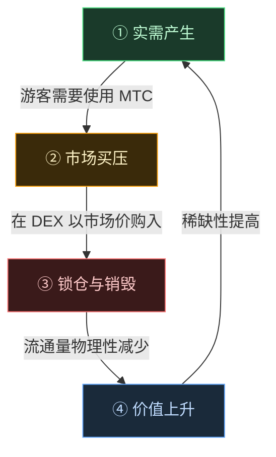

# 🔄 经济飞轮——增长的循环与文化 OS

> **游客越乐在日本,生态系统的需求就越旺盛。**
> 这套供需机制,正是项目的心脏。

---

## MTC 的供需机制

按照 Matsuri Protocol 的设计,**实需的增长带来买压,加上供给的减少,共同孕育出价值提升的条件**。
这不是情绪论,而是**供需的数学**。

以下**四步循环**支撑起整套机制。

| 步骤 | 名称 | 机制 |
| :---: | :--- | :--- |
| **①** | **实需产生** | 游客在预订向导、购买门票 NFT 时需要使用 MTC |
| **②** | **市场买压** | DEX（去中心化交易所）上以市场价购入 MTC。不是投机,而是基于消费的强力买盘 |
| **③** | **锁仓与销毁** | 支付所用 MTC 的一部分,由智能合约即时锁仓或销毁。流通量被物理性减少 |
| **④** | **稀缺性提升** | 买盘增加、卖盘减少。供需平衡的变化让每一枚代币的稀缺性随之提升 |

---

---

:::note 支撑这一数学的愿景
飞轮之后的"文化 OS"全貌,将在下一页 [MTC 描绘的未来](/docs/future) 中详细讲述。
:::

---

**[◀ 上一页:问题与解决](/docs/challenges)**｜**[▶ 下一页:MTC 描绘的未来](/docs/future)**
