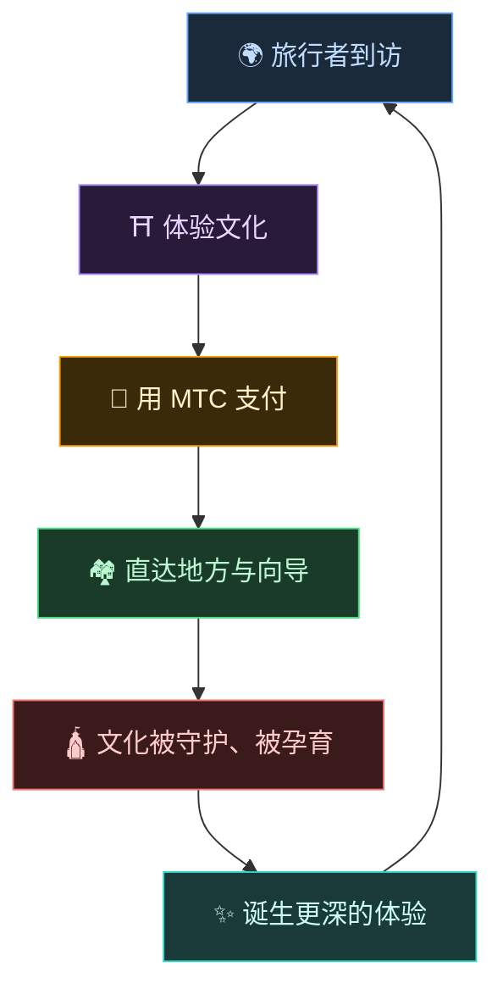
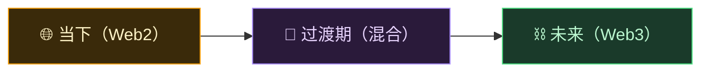
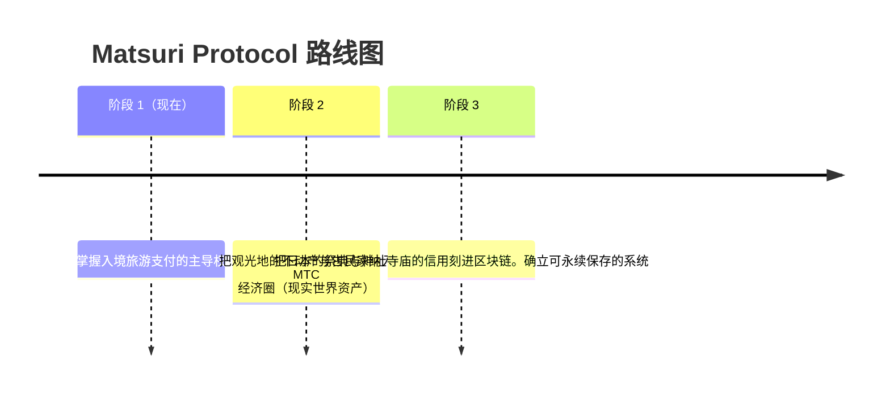

# 🌀 MTC 描绘的未来——一切"参与"皆能循环的经济

> **体验的人、传递的人、守护的人。所有心意化作经济而循环,把文化交给下一代。**

---

## 我们想要实现的循环

MTC 不是投机用的代币。

旅行者接触日本文化,心生感动。
向导传递这份感动,并因此获得回报。
地方变得富足,能够继续守护文化。
这份文化,又会吸引新的旅行者前来。

这一循环,正是 MTC 存在的理由。

---

## 三方共赢的经济

在传统观光中,旅行者付钱、平台拿走利润,现场几乎什么也留不下。
而在 MTC 的经济圈里,所有参与者都能获得回报。

| 参与者 | 会发生什么 | 如何得到回报 |
| :--- | :--- | :--- |
| **🌍 体验的人** | 接触日本文化,用 MTC 支付 | 比日元更划算地享受真正的体验。回国后也能通过 MTC 继续相连 |
| **⛩️ 传递的人** | 作为向导开办活动,在 J-Times 上发布内容 | 无中间抽成的直接报酬。越活跃,MTC 的回报越多 |
| **🏘️ 守护的人** | 作为地方社区,维持与传承文化 | 收益直达地方。不是过度旅游,而是以可持续的方式获得滋养 |

---

## 经济圈越大,文化越强

MTC 的经济圈从体验预订开始,终将扩展到生活的方方面面。

- **体验** — 本真的文化体验、参拜挖矿
- **衣食住** — 民宿、店铺、餐饮、时尚
- **共创项目** — 以众筹守护文化的投资
- **异文化国际理解** — 跨越国境的交流与相互理解之场

经济圈越大,通过 MTC 的循环就越粗壮,支撑文化的力量就越强。
这不只是一种商业模式,而是**文化的生命维持装置**。

---

## 从 Web2 到 Web3——循序渐进,不勉强

我们并不主张"一下子把一切都搬上区块链"。

今天,大多数人还不熟悉 Web3。正因如此,我们的设计思路是**先从熟悉的形式入手,再让人们逐步感受到 Web3 的好处**。

| 阶段 | 用户体验 | 背后机制 |
| :--- | :--- | :--- |
| **当下** | 像普通 Web 应用一样预订体验、完成支付。用信用卡即可 | Django + Stripe。无需钱包即可开始 |
| **过渡期** | 在应用中赚取并使用 MTC。钱包连接只需一次轻触 | 链下分数逐步迁移到链上 |
| **未来** | 所有交易与权利都透明地记录在区块链上,你的贡献被永久证明 | 由智能合约驱动的、完全自动且不可篡改的经济 |

:::tip Web3 并不难
钱包的设置与助记词的管理,一开始都不需要操心。在使用中自然而然地接触 Web3 的世界——**等你回过神,已经是 Web3 的居民。** 这正是我们所设计的体验。
:::

---

## 不以权力,而以共鸣驱动的经济

并且,这一经济圈由智能合约驱动。
没有谁能凭权力或私利单方面改变规则——**这是一套"力量无法单方面改变现状"的经济机制**。

在此之上,我们向古老的智慧学习,同时不断创造新的价值。温故知新,继而"创新"。

> **即使没有日元,没有美元,也能以文化为轴心过日子的世界。**
>
> 不把货币的价值托付给某人,而是靠自己的"参与"去创造、去使用价值。
> 那就是 MTC 想要带来的自由。

---

## 🏁 最终到达点:"文化 OS"

我们的终极目标,不是一款普通的支付应用,
而是要**把文化本身变成 OS(基础系统)**。

> 我们以最新的区块链守护古老的智慧。
> 这,就是 Matsuri Protocol 描绘的未来图景。

---

:::note 故事篇到此结束
读到这里的您,想必已经理解了 MTC 为何存在。
接下来进入**【实践篇】**——一起看看 MTC 究竟能做什么。
:::

**[◀ 上一页:经济飞轮](/docs/flywheel)**｜**[▶ 下一页:生态系统](/docs/ecosystem)**
