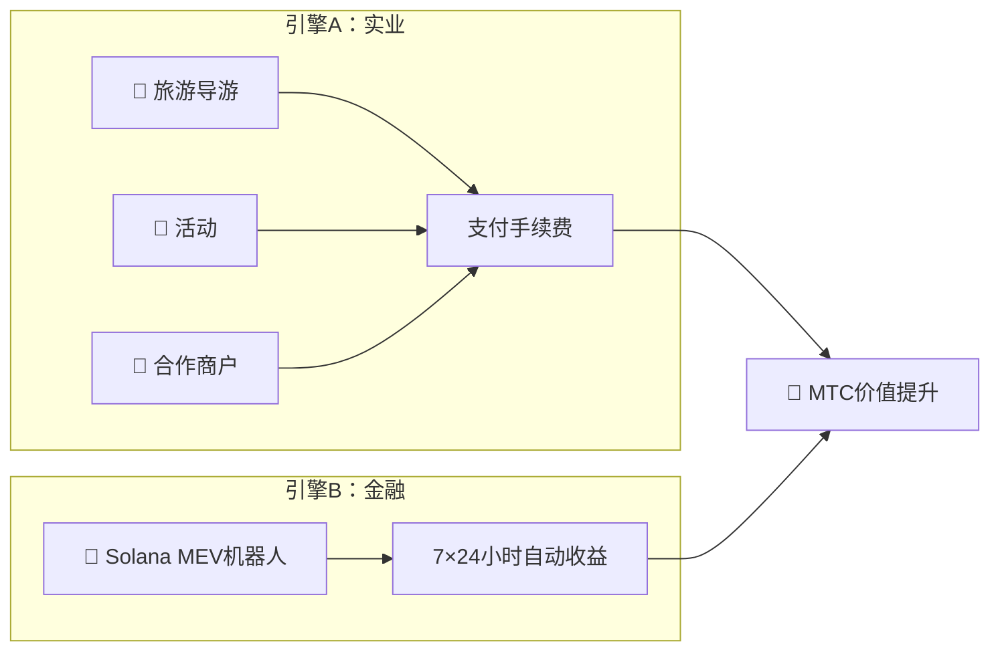

# 💰 经济系统

> Matsuri Coin（MTC）经济体简洁而稳健。
> **实业与金融算法双引擎驱动盈利，并按程序化规则将利润回馈给持有者。**


---

## 1. 双收入引擎



| 引擎 | 收入来源 | 运作方式 |
| :--- | :--- | :--- |
| **🏯 引擎A（实业）** | 旅游导游、活动、合作商户的支付手续费 | 入境游客越多→外资流入越多→生态系统扩张 |
| **🤖 引擎B（金融）** | Solana MEV机器人自动交易 | CEO直属的高频交易程序从链上市场低效中7×24小时获取收益 |

---

## 2. 回购协议（价值提升机制）

我们不会把利润装进自己口袋。
智能合约规则将收入直接引导至**MTC价值提升**。

| 收入来源 | 分配比例 | 操作 |
| :--- | :---: | :--- |
| **Matsuri总部销售**（导游与活动） | **20%** | 市场**回购** + 注入流动性池 |
| **GCF会员费** | **25%** | 市场**回购** |

:::info 核心逻辑
**"业务增长 = MTC在公开市场被持续买入"**
这个等式支撑着你的资产价值。
:::

---

## 3. 价格决定逻辑

我们的价格机制运行在**AMM（自动做市商）公式**上——不是画饼。

```
价格 = 流动性(SOL) ÷ 供应量(MTC)
```

| 步骤 | 发生什么 | 结果 |
| :---: | :--- | :--- |
| **①** | 业务收入(SOL)注入流动性池 | **分子 ↑** |
| **②** | MTC从市场回购并销毁 | **分母 ↓** |
| **③** | 分子↑ × 分母↓ | **价格在数学上持续走高** |

---

## 4. GCF（全球社区之友）

GCF是负责扩展Matsuri生态系统的**纯邀请制**合作伙伴组织（DAO）。
不是普通会员俱乐部——而是**共享收益的商业联合体**。


### 会员层级

| 层级 | 角色 | 特权 |
| :---: | :--- | :--- |
| **👑 铂金** | 持有者 / VIP | 顶级权益。首批仅**50个席位**。有商业决策权＋丰厚分红 |
| **🥇 黄金** | 大使 | 执行团队。通过活动**无上限获利**的权利。挖矿和推荐回报率最大化 |

### 权益①：实工挖矿（挖矿权）

2027年6月1日解锁的**5.5亿枚MTC（约总供应量的61%）**将作为**贡献者奖励池**保留——不会抛售到市场。

:::tip 完全绩效制
MTC根据你的产出（销售额、引客数、导游次数）从池中自动分配。
:::

**减半时间表（2年周期）：**

| 时期 | 释放比例 | 数量 |
| :--- | :---: | :--- |
| **第1期** 2027 – 2029 | **50%** | 约2.75亿枚 |
| **第2期** 2029 – 2031 | **25%** | 约1.37亿枚 |
| **第3期** 2031 – 2033 | **12.5%** | 约6,800万枚 |

:::caution 先发优势窗口
比比特币的4年减半更快——我们采用**2年周期**。
2027年起**头两年**全力投入的成员将锁定压倒性的先发优势。
:::

### 权益②：高额推荐佣金

推荐高客单价产品（会员资格、VIP旅游、合作不动产等），赚取远超普通联盟营销的**高额佣金（USDC + MTC）**。通过智能合约**即时到账**。

---

## 5. 代币规格

为保障投资者安全，我们已永久**放弃**Solana上的铸造权限和冻结权限。
永远无法增发，永远无法冻结资金。**完全无需信任的设计。**

| 项目 | 详情 |
| :--- | :--- |
| **代币名称** | Matsuri Coin |
| **代码** | MTC |
| **公链** | Solana |
| **总供应量** | **9亿枚**（900,000,000 MTC）固定 |
| **铸造权限** | 🚫 已放弃 |
| **冻结权限** | 🚫 已放弃 |
| **锁仓合约** | Streamflow Finance（已验证） |

:::warning 仅限邀请——名额有限
GCF将在有限名额（铂金50名 / 黄金调整中）满员的瞬间停止招募。
持有此权利意味着进入Matsuri经济体的**核心圈层**。
:::

---

**[▶ 下一页：生态系统与挖矿](/docs/ecosystem)** ｜ **[加入Discord](#)**
