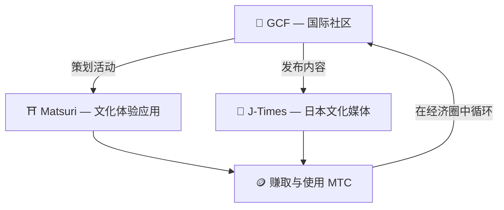

# 🏗️ MTC 生态系统——体验、媒体、社区共同流动的经济圈

> **为实现志向,设立三个"场"。**
> 体验之场、知晓之场、相连之场——彼此独立,却通过 MTC 共同构成一个循环的经济圈。

MTC 不仅仅是一枚代币。三款产品与国际社区互相协作,建立起一个守护文化的经济。

:::tip 🤝 GCF — 推动生态的国际社区
热爱日本文化的人们跨越国境彼此相连的场所。GCF 负责招募向导,这些 GCF 向导在 Matsuri 上运营体验。他们还会在 J-Times 上发布有吸引力的内容——社区的活动,是推动整个生态运转的引擎。
:::

:::tip ⛩️ Matsuri — 文化体验应用
从文化体验预订起步,逐步扩展到**民宿**、**店铺**、**众筹**。从体验延展到衣、食、住与共创投资,经济圈持续扩张。

**参拜挖矿（圣地巡礼）** — 通过亲自前往神社寺庙与文化地标获得 MTC。将人流从热门景点自然分散到地方上的小众去处,同步实现过度旅游的缓解与地方振兴。
:::

:::tip 📰 J-Times — 日本文化媒体
把日本文化的魅力传向世界的媒体平台。通过阅读文章、分享等互动就能获得 MTC。
:::

---

## 🤝 社交挖矿(靠连接赚取)

**与 GCF 管理仪表盘联动 ── Web 版已上线(iOS 应用计划 2026 年 4 月发布)**

GCF 会员将获得访问专属 **GCF 管理 Web** 的权限。

| 功能 | 能做什么 |
| :--- | :--- |
| **🎪 活动创建** | 策划并上架自己的活动或游览 |
| **📢 内容发布** | 发布与传播 J-Times 的文章和内容 |
| **📊 推荐追踪** | 实时追踪所推荐用户的行为与收益 |

:::info 自动发放奖励
每当你推荐的朋友完成支付,系统就会**自动**把奖励(销售分成)打入你的钱包。
:::

---

## 🎓 创作者经济(靠创造赚取)

在 Matsuri 平台上,你不仅是内容的消费者——**任何人都能**创作内容并将其变现。

| 平台 | 创作者可以做什么 | 收益模式 |
| :--- | :--- | :--- |
| **📚 课程市场** | 发布关于日本文化、语言、工艺的视频/文字课程 | 按学习次数收取手续费(创作者分成) |
| **🎙️ 播客工作室** | 制作面向 Spotify、Apple Podcasts、RSS 分发的音频系列 | 面向订阅者的独家剧集 |
| **🤝 众筹** | 基于 Solana 发起支持文化项目的筹款活动 | 链上贡献追踪 |
| **🛍️ 用户店铺** | 在平台内开设个人店铺(手工艺、周边) | 配套商品/评价系统的直接销售 |

:::tip AI 加持的创作辅助
活动主办方可以在管理仪表盘中使用**内置 AI 助手(GPT-4 Turbo)**,完成活动说明撰写、自动翻译为 5 种语言、生成 SEO 最优化的元数据。
:::

---

  

*黄金街社区聚会 ── 人与人的连接,化作挖矿的能量。*

---

:::note 下一页
想了解具体的挖矿机制与赚取方式,请前往 **[挖矿与赚取方式 →](/docs/mining)**。
:::
