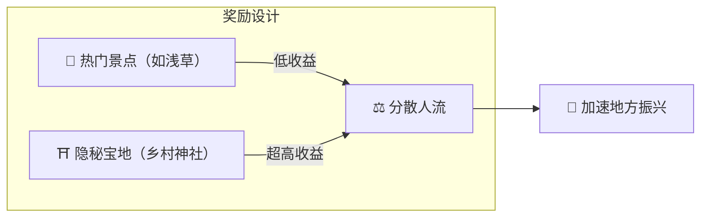

# ⛏️ 挖矿的三大支柱

> **行动证明（Proof of Action）**
> Matsuri Coin不靠GPU算力挖矿，而是靠**"人类的行动"**来挖矿。

Web应用和管理仪表板**已经上线**——通过以下活动**立刻**开始赚取收益。

---

## 1. 📖 媒体挖矿（读、听、答题赚币）

**由官方媒体"J-Times"驱动**

知识能极大提升旅行质量。
我们奖励学习——阅读、收听，**以及**通过测验证明理解力。

| 操作 | 你做什么 | 奖励 |
| :--- | :--- | :--- |
| **📰 阅读赚币** | 阅读J-Times文章（历史、神道、禅） | 获得MTC |
| **🎧 收听赚币** | 收听专属播客，学习深层日本文化 | 获得MTC |
| **✅ 答题赚币** | 答对测验，证明知识掌握 | 获得MTC（即时） |

:::tip 碎片时间 → 挖矿时间
通勤、午休、飞行——每一段空闲都变成创造收益的机会。
:::

---

## 2. 🤝 社交挖矿（连接赚币）

**由GCF管理仪表板驱动——已上线运行**

GCF成员获得专属**"GCF管理后台"**的访问权限。

| 功能 | 你能做什么 |
| :--- | :--- |
| **🎪 创建活动** | 策划并发布你自己的活动和旅游团 |
| **📢 内容分发** | 在你的社交网络中传播J-Times文章和内容 |
| **📊 推荐追踪** | 实时追踪被推荐用户的活动和收入 |

:::info 自动到账
每当被推荐的朋友完成交易，系统**自动**将你的收益分成直接打入你的钱包。
:::

---

## 3. 🗺️ 探险挖矿（走路赚币）

**项目"巡礼"——下一阶段（开发中）**

利用GPS和代币激励重新引导游客的物理流向的下一代功能。

> **"因为能赚得更多，所以去乡村"**
> 这种经济逻辑解决过度旅游问题，加速地方复兴。

### 🎲 "御神签"协议

签到时**免费（仅Gas费）**触发的御神签式智能合约。

| 结果 | 你获得什么 |
| :--- | :--- |
| **🎊 大吉** | 奖励MTC空投 |
| **📜 NFT掉落** | 该地点专属**"御朱印NFT"** |
| **🏆 集齐全套** | 收齐特定NFT解锁特别活动参与权 |

:::note 这不是赌博
无需任何金钱投入。只是对**"到访"这一行为**的随机奖励。
:::

---

## 4. 🏦 流动性挖矿（提供流动性赚币）

> **成为银行。**

我们为在Raydium上提供MTC/SOL流动性的用户准备了特别奖励计划。

| 项目 | 详情 |
| :--- | :--- |
| **对象** | 早期流动性提供者（"创始合伙人"） |
| **目标APY** | **50%**（作为风险溢价设定） |
| **意义** | 保障生态系统初期流动性，构建稳定交易环境 |

---

**[▶ 下一页：路线图与团队](/docs/roadmap)** ｜ **[◀ 上一页：经济系统](/docs/economy)**
