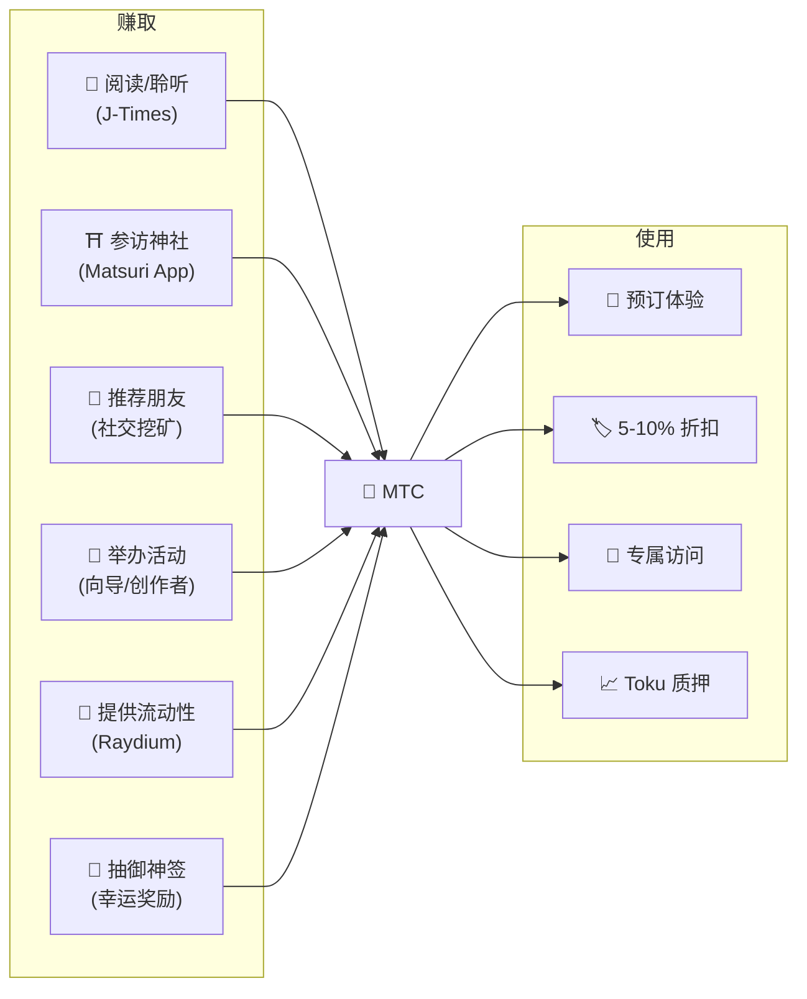
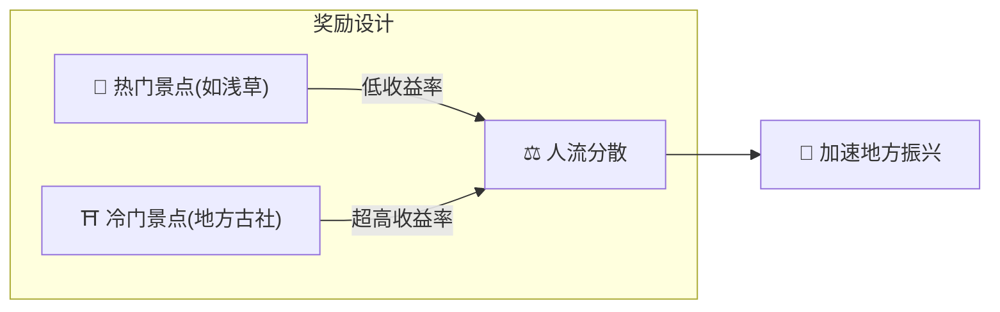
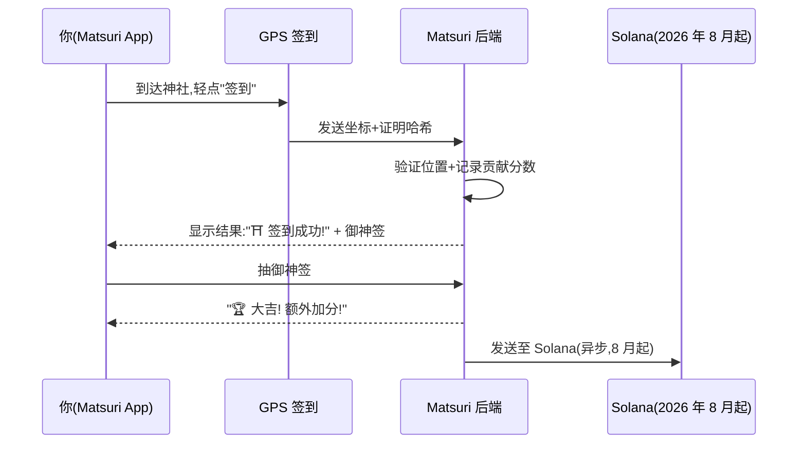
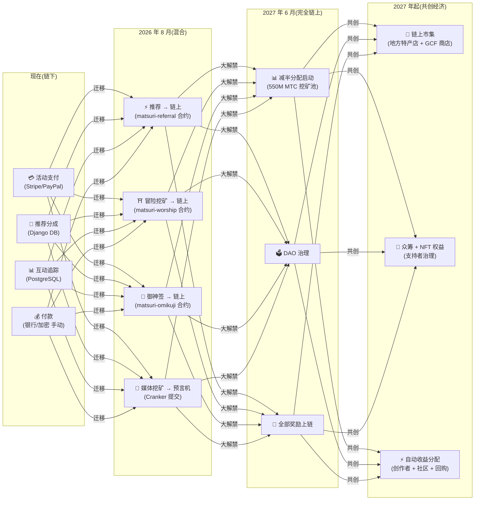

# ⛏️ 挖矿的五大支柱与赚取方式

> **与文化的每一次"参与",都直接变成价值。**
> 阅读、步行、相连、创作、支持——你的每一次行动,都在生成 MTC。

<small>*※ 什么是"挖矿"?——在比特币等项目中,计算机通过海量运算换取新币,这个过程称为"挖矿"。而在 MTC 中,进行"开采"的不是计算机,而是**你的行动本身**——阅读文章、参访神社、举办活动。不是去挖金矿,而是通过对文化的参与去生成 MTC。这就是我们定义的"挖矿"。*</small>

> 靠行动赚取。用于体验。持有以见证成长。

MTC 不是一枚投机代币。所有行为都会创造价值、获取价值,形成一个真实经济的循环。Web 应用与管理仪表盘**已在运行中**。当前贡献分数在链下(Django)记录,将于 2026 年 8 月之后陆续迁移到链上。

:::tip 全貌速览
MTC 拥有**完整的循环型经济**:通过真实活动赚取、在真实体验中消费、随着生态扩张而价值增长。本页将详细讲解这套机制。
:::

---

## MTC 生命周期

---

## 五大挖矿支柱

### 1. 📖 媒体挖矿(读、听、答题赚取)

**与官方媒体"J-Times"联动**

知识能极大提升旅途的品质。打开 **J-Times 应用**,享受与日本文化有关的内容。除了文字与音频学习,**理解度测验(测验题)**也会带来奖励。每完成一项行为,MTC 都会自动发放。

| 行为 | 完成条件 | 奖励区间 |
| :--- | :--- | :---: |
| **📰 阅读文章** | 滚动至 75% | 2〜30 MTC |
| **🎧 收听播客** | 播放到结尾 | 2〜30 MTC |
| **🎬 观看视频** | 观看后关闭详情页 | 2〜30 MTC |
| **📤 分享内容** | 调出分享菜单 | 2〜30 MTC |
| **✅ 完成测验** | 通过理解度测试 | 2〜30 MTC |

<small>*※ 奖励量会根据内容类型、时长以及整个生态的供给平衡而浮动*</small>

:::tip 碎片时间也能挖矿
通勤途中、休息片刻,都能直接转化为产生奖励的时间。
:::

:::info 离线支持
地方的神社没有网络?没问题。J-Times 会把活动本地记录下来,**联网后自动同步**(本地队列保留 7 天)。你获得的 MTC 不会丢失。
:::

**背后的流程:**
1. J-Times 应用检测你的行为(阅读完成、观看完成、分享等)
2. 即使离线也在本地记录(保留 7 天)
3. 网络恢复后发送至服务器进行校验
4. 作为贡献分数计入余额
5. 2026 年 8 月起:通过预言机将已核验的分数上链,可在区块链上查验

---

### 2. ⛩️ 冒险挖矿(靠行走赚取)

**"巡礼"项目 ── 智能合约已完成,主网部署定于 2026 年 8 月**

这是借助 GPS 与代币激励,对物理"人流"进行调控的新一代功能。圣地地图在 Matsuri Web 应用中**已上线**。当前贡献分数在链下记录,2026 年 8 月智能合约部署后将启动链上奖励发放。

>**因为能赚,所以去地方**
> 这种经济合理性,将缓解过度旅游并加速地方振兴。

**签到机制:**

**基本原则 — 访客越少的地方,赚得越多:**

| 景点类型 | 举例 | 奖励区间(每次签到) |
| :--- | :--- | :---: |
| 🏙️ **主要** | 浅草寺、清水寺、伏见稻荷 | 30〜50 MTC |
| 🌆 **地方核心** | 各县一之宫、地方大社 | 50〜100 MTC |
| 🏞️ **地方** | 历史悠久的地方神社 | 100〜150 MTC |
| ⛰️ **边远** | 山岳寺院、离岛圣地 | 150〜200 MTC |

<small>*※ 以上为基础奖励区间。根据御神签倍率,最高可数倍于此*</small>

**额外加分因素:**
- **御神签倍率** — 每次签到的随机奖励。抽到大吉,奖励将翻数倍
- **访问频率** — 定期访客会随时间累积更多收益
- **赞助景点** — 地方政府可对特定景点进行加成

:::info 贡献分数 → MTC
你的活动将作为**贡献分数**累积。在每个减半周期(2027 年 6 月开启)中,分数会从 550M 的挖矿池中兑换为 MTC。对社区的贡献越多,获得的 MTC 就越多。精确的加成系数会逐步确定并写入智能合约——以保证与实际池子规模匹配的公平分配。
:::

---

### 3. 🤝 社交挖矿(靠相连赚取)

只要把朋友介绍来,你就能获得 MTC。

#### 普通用户的推荐奖励

机制很简单。只要朋友通过你的推荐链接注册,**每成功直接推荐 1 人,发放 300 MTC**。

| 条件 | 奖励 |
| :--- | :--- |
| 你推荐的朋友完成注册 | **300 MTC** |

仅此而已,没有多级奖励。

#### GCF 代理的推荐奖励

[GCF 会员](/docs/gcf) 作为推动生态扩张的**官方代理**,拥有更深层的奖励结构。

| 层级 | 关系 | 分成比例 |
| :---: | :--- | :---: |
| **L1** | 直接推荐 | **20%** |
| **L2** | 被推荐人的推荐 | **5%** |
| **L3** | 第三层 | **5%** |
| **L4** | 第四层 | **5%** |

:::note 关于 GCF 代理制度
该多级奖励仅适用于持有 GCF 会员资格(邀请制)的官方代理。普通用户只享受直接推荐(300 MTC)。
GCF 代理的分成基于被推荐人的**实际经济活动(购买体验、参加活动等)**计算。仅仅拉人头不会产生奖励。
:::

**En-Mining 分数机制(面向 GCF 代理):**

贡献分数由两个要素构成:
- **网络广度**(30%)— 你带来了多少人
- **经济活动**(70%)— 来自推荐网络的真实购买

分数随时间累积,并在每个减半周期兑换为 MTC。

#### GCF 管理仪表盘 ── Web 版已上线

GCF 会员可访问专属的管理仪表盘。

| 功能 | 能做什么 |
| :--- | :--- |
| **🎪 活动创建** | 策划并上架自己的活动或游览 |
| **📢 内容发布** | 发布与传播 J-Times 的文章和内容 |
| **📊 推荐追踪** | 实时追踪所推荐用户的行为与收益 |

:::warning 目前在链下 → 2026 年 8 月迁移至链上
推荐分成目前由 Django(PostgreSQL)追踪,通过银行转账或加密货币支付。**2026 年 8 月**起将迁移到 Solana 上的 **Matsuri Referral 智能合约**,实现可审计的链上支付。
:::

  

*黄金街社区聚会 ── 人与人的连接,化作挖矿的能量。*

---

### 4. 🎓 创作者与向导挖矿(靠创造赚取)

在 Matsuri 平台上,**任何人**都能创作内容并将其变现。GCF 会员、向导或内容创作者可通过以下方式赚取:

| 活动 | 收益方式 |
| :--- | :--- |
| **🗺️ 举办游览** | 向导分成(每次活动自定)+ 小费 |
| **🎫 售卖活动门票** | 通过 EventPurchase 的分成 |
| **📚 发布课程** | 按学习次数的手续费(创作者分成) |
| **🎙️ 制作播客剧集** | 订阅收益 |
| **🤝 发起众筹** | 基于 Solana 的链上贡献追踪 |
| **🛍️ 开设用户店铺** | 手工艺、周边的直接销售 |

**小费系统:** 活动结束后,客人可以给向导打赏(类似 Uber)。小费由 Stripe 处理,并在公开排行榜上展示。

:::tip AI 加持的创作辅助
活动主办方可以在管理仪表盘中使用**内置 AI 助手(GPT-4 Turbo)**,完成活动说明撰写、自动翻译为 5 种语言、生成 SEO 最优化的元数据。
:::

---

### 5. 🏦 流动性挖矿(靠存入赚取)

>**成为一家"银行"。**

在 Raydium DEX 上为 MTC/SOL 提供流动性,支撑生态早期的交易基础。早期流动性提供者将作为"创始合作伙伴",享有特别奖励计划。

| 项目 | 详情 |
| :--- | :--- |
| **适用对象** | 所有持有 MTC 与 SOL 的用户 |
| **目标年化** | **20%**(早期流动性激励,作为风险溢价设定) |
| **DEX** | Raydium (Solana) |
| **意义** | 确保生态早期的流动性,构建稳定的交易环境 |

---

## 🎲 御神签奖励

所有冒险挖矿签到都包含一次免费的御神签(Omikuji)。签到完成时可**免费(仅支付 Gas)**触发,是一款签运抽取形式的智能合约。

| 运势 | 奖励倍率 | 附加奖励 |
| :--- | :---: | :--- |
| 🏆 **大吉** | 基础奖励 × 最高倍率 | 御朱印 NFT |
| ✨ **吉** | 基础奖励 × 高倍率 | — |
| 🌸 **小吉** | 基础奖励 × 小倍率 | — |
| 🍃 **末吉** | 基础奖励 × 1.0 | — |
| 💀 **凶** | 基础奖励 × 1.0 | — |

概率与倍率可在 GCF 管理仪表盘中调整,由运营方根据整个生态的 MTC 供给平衡进行管理。结果由 Solana 上的**防篡改 commit-reveal 协议**决定,在 commit 阶段后任何人都无法更改结果。

<small>*※ 即便抽中"凶",基础奖励照发。"已前往参拜"这一行为本身就值得被回报*</small>

:::note 这不是赌博
不需要任何金钱赌注。这只是对"已到访"这一**行动**附带的随机奖励。集齐特定 NFT 可解锁参加特别活动的资格。
:::

---

## MTC 的用途

| 用途场景 | 优势 | 可用性 |
| :--- | :--- | :---: |
| **🎫 预订体验** | 用 MTC 支付游览、活动、文化项目 | ✅ 已可用 |
| **🏷️ 折扣** | 用 MTC 支付可享日元价格的 5-10% 折扣 | ✅ 已可用 |
| **🔑 专属访问** | NFT 门禁活动、VIP 专属仪式、私人游览 | ✅ 已可用 |
| **📈 Toku 质押** | 锁定 MTC 以加成贡献分数(最多约 50% 加成) | 🔜 2026 年 8 月 |
| **🗳️ DAO 治理** | 对国库、协议升级、景点认证进行投票 | 🔜 2027 年 |
| **🛍️ 合作商户** | 在合作店铺与餐厅支付 | 🔜 持续扩展中 |

:::info 作为支付手段的 MTC
在 Matsuri App 中,MTC 是与信用卡、Solana Pay 同级的一等支付方式。不需要任何兑换——在结算页选择"用 MTC 支付",余额就会即时扣除。
:::

### 关于 MTC 的兑换

:::warning 重要:我司不提供 MTC 的兑换/交换服务
Matsuri 运营方未取得加密资产交换业务的注册许可,因此**绝不直接进行 MTC 与法币(日元、美元等)的兑换**。

如需将 MTC 换为其他加密资产或法币,请您自行完成以下操作:
1. 使用 **Phantom Wallet** 等支持 Solana 的钱包管理 MTC
2. 在 **Raydium(DEX)** 上将 MTC 兑换为 SOL
3. 在加密资产交易所(CEX)将 SOL 兑换为法币

未来我们也会考虑在 CEX(中心化交易所)上架,届时可提供更便捷的兑换方式。
:::

---

## 示例:MTC 经济的一天

> **早晨:** 在电车上读了 3 篇 J-Times 文章 → 获得 MTC。
> **下午:** 通过 Matsuri App 造访地方神社 → 签到、抽到"吉"(×1.5) → 再获得 MTC。
> **夜晚:** 用赚到的 MTC 以 9 折预订了 9,000 日元的新宿黄金街文化游(相当于支付 8,100 日元)。
> **结果:** 你的文化好奇心变成了真实体验,向导、神社、社区都直接收到了款项。OTA 没有拿走 20% 的手续费。

---

## 经济的可持续性

:::warning 挖矿池枯竭怎么办?
550M MTC 的减半池被设计为**可持续数十年**。每两年放出量减半,数学上永远无法达到 100%,奖励将在很长时间内持续下去(详见 [代币经济](/docs/tokenomics))。即便放出量极度稀少后:

- **交易手续费**会通过链上活动持续奖励网络参与者
- **回购协议**(业务收入的 20-25%)将形成持续的买压
- **Toku 质押**会锁定流通供给,缓解卖压
- **真实的业务收入**(活动、会员、课程)独立于代币发放,为生态提供支撑

MTC 背后有**真实经济**作为支撑——而不只是代币发行。
:::

---

## 链上迁移路线图

Matsuri 经济正从链下(Django/PostgreSQL)逐步迁移到链上(Solana 智能合约)。完成迁移后,所有运作都将是**免信任、可审计、无需许可**的。

| 阶段 | 时间线 | 上链内容 |
| :--- | :--- | :--- |
| **阶段 1(现在)** | 已运行 | MTC 代币(SPL)、Raydium LP、Solana Pay 验证 |
| **阶段 2(2026 年 8 月)** | 智能合约主网部署 | 推荐分成、冒险挖矿奖励、御神签抽奖、通过预言机的媒体挖矿 |
| **阶段 3(2027 年 6 月)** | 大解禁 | 550M MTC 减半分配、DAO 治理、完全去中心化 |
| **阶段 4(2027 年起)** | 共创经济 | 链上市集(地方特产店 + GCF 商店)、带 NFT 权益的众筹、面向创作者 + 社区 + 回购的自动收益分配 |

:::warning 为什么不现在就全部上链?
**在安全审计完成前,我们不会启用任何涉及用户资金的链上功能。** 这是我们的原则。

当前状态:
- **用户资金风险:无** — 目前所有奖励/分数都在链下(Django)管理,尚未启用任何通过智能合约转移用户资金的功能
- **审计时间表:2026 年 Q2~Q3** — 经专业安全审计后,对已确认安全的合约依次部署上主网
- **审计完成是部署的前提** — 我们绝不会把未审计的智能合约放到主网上启用

链下阶段的奖励同样可以被核验——所有交易都包含作为支付证明的 `solana_signature`。
:::

---

**[▶ 下一页:代币经济](/docs/tokenomics)** ｜ **[◀ 上一页:生态系统](/docs/ecosystem)**
