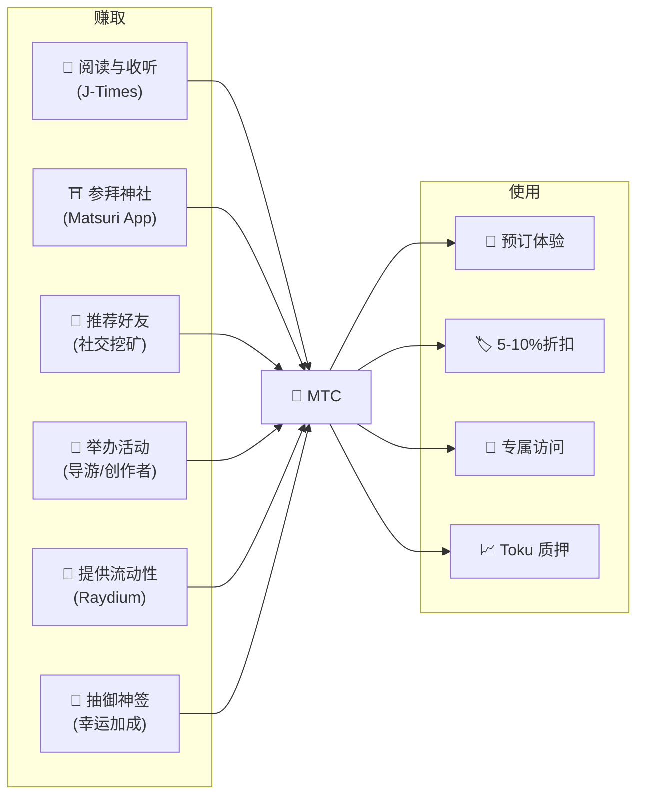
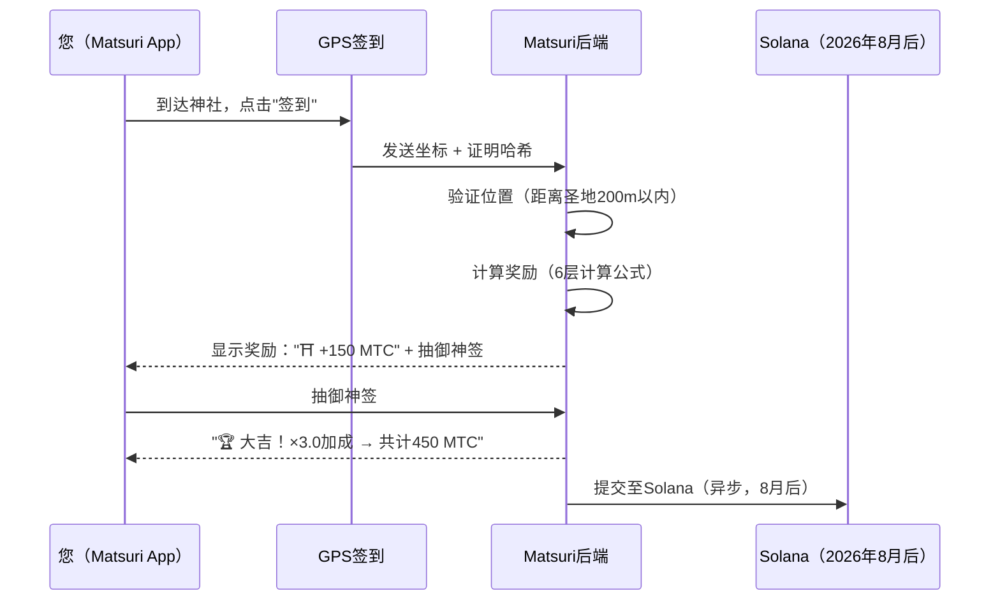
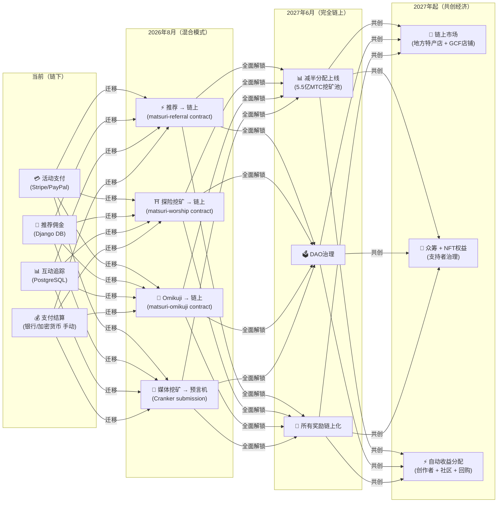

# 💎 如何赚取和使用 MTC

> **通过行动赚取，用于体验，持有以增长。**
> MTC不仅仅是一个投机代币——它在一个真实经济中流通，每个行动都在创造和捕获价值。

:::tip 全局视角
MTC拥有一个**完整的循环经济**：通过真实活动赚取，用于真实体验，随着生态系统扩展而增值。本页将为您详细说明具体运作方式。
:::

---

## MTC 的生命周期



---

## 如何赚取 MTC

### 1. 📖 媒体挖矿 — 在 J-Times 上阅读、收听和观看

打开 **J-Times 应用**，浏览关于日本文化的内容。每完成一个操作即可自动获得 MTC。

| 操作 | 完成条件 | 奖励 |
| :--- | :--- | :---: |
| **阅读文章** | 滚动至75%深度 | MTC |
| **收听播客** | 播放至结束 | MTC |
| **观看视频** | 观看后退出详情页 | MTC |
| **分享内容** | 显示分享面板 | MTC |
| **完成测验** | 通过理解测试 | MTC（即时） |

:::info 离线支持
在偏远神社没有网络？没问题。J-Times 会在本地记录您的活动，并在**重新上线后自动同步**（离线队列保留7天）。您永远不会丢失已赚取的 MTC。
:::

**底层工作原理：**
1. 应用内的 `EngagementTracker` 检测完成事件
2. 操作在本地排队（即使离线也可以）
3. 网络恢复后，操作被批量发送至 Django API
4. API 验证后将 MTC 记入您的余额
5. 2026年8月之后：操作将通过 Cranker 预言机提交至链上

---

### 2. ⛩️ 探险挖矿 — 使用 Matsuri App 参拜圣地

打开 **Matsuri App**，在圣地地图上找到神社或寺庙，前往现场签到。访客越少的圣地，您赚取的越多。

**分步流程：**



**奖励倍率 — 为何偏远地区回报更高：**

| 圣地类型 | 示例 | 倍率 |
| :--- | :--- | :---: |
| 🏙️ **主要** | 浅草寺、清水寺、伏见稻荷 | ×1 |
| 🌆 **地区级** | 各县一之宫、地方大社 | ×2 |
| 🏞️ **乡村** | 有历史的乡村神社 | ×5 |
| ⛰️ **前沿** | 山岳寺院、偏远岛屿圣地 | ×10 |

**额外加成：**
- **先驱者加成** — 当日第一位访客获得最多奖励（谐波衰减）
- **连续签到加成** — 连续访问可获最高+50%
- **Omikuji** — 随机御神签：大吉 = ×3.0、吉 = ×1.5、小吉 = ×1.2
- **赞助信标** — 地方政府存入MTC以提升特定圣地的奖励

> **示例：** 作为当日第2位访客参拜偏远山岳神社（×10），拥有5天连续签到（+10%），抽到吉（×1.5）= 基础奖励放大**16.5倍**。

---

### 3. 🤝 社交挖矿 — 推荐好友，构建网络

分享您的推荐码。当您的网络中产生交易时，您将自动获得收益。

| 层级 | 关系 | 佣金 |
| :---: | :--- | :---: |
| **L1** | 您 → 好友（直接） | **20%** |
| **L2** | 好友 → 他们的好友 | **5%** |
| **L3** | 三度关系 | **5%** |
| **L4** | 四度关系 | **5%** |

**En-Mining 评分的运作方式：**

```
您的评分 = (直接推荐 × 30%) + (网络交易量 × 70%)
          × Toku 质押倍率 (1.0× – 10.0×)
          × 头衔加成 (每个赛季+5%，最高+50%)
```

> **关键洞察：** 评分的70%来自网络中的**真实经济活动**，而非简单的注册量。邀请1,000个从不消费的人，收益远不如邀请10个活跃用户。

:::warning 当前为链下 → 2026年8月迁移至链上
推荐佣金目前在 Django（PostgreSQL）中追踪，通过银行转账或加密货币支付。从**2026年8月**起，整个推荐佣金系统将迁移至 Solana 上的 **Matsuri Referral 智能合约**——使支付实现去信任、即时且链上可审计。
:::

---

### 4. 🎪 创作者与导游挖矿 — 举办活动，创作内容

如果您是GCF成员、导游或内容创作者：

| 活动 | 收益方式 |
| :--- | :--- |
| **举办旅行团** | 导游佣金（按活动设定）+ 小费 |
| **销售活动门票** | 通过 EventPurchase 的收入分成 |
| **发布课程** | 按注册人数收费 |
| **制作播客节目** | 订阅收入 |
| **发起众筹活动** | 基于 Solana 的贡献 |

**小费系统：** 每次活动结束后，客人可以给导游打赏（Uber式）。小费通过 Stripe 处理，并在公开排行榜上追踪。

---

### 5. 🏦 流动性挖矿 — 在 Raydium 提供流动性

在 Raydium DEX 上提供 MTC/SOL 流动性并赚取奖励。

| 项目 | 详情 |
| :--- | :--- |
| **目标APY** | 50%（早期流动性激励） |
| **DEX** | Raydium (Solana) |
| **参与者** | 持有MTC和SOL的任何人 |

---

### 6. 🎲 Omikuji 加成 — 幸运倍率

每次探险挖矿签到都包含一次免费的Omikuji（御神签）抽取。此倍率叠加在所有其他加成之上。

| 运势 | 概率 | 倍率 |
| :--- | :---: | :---: |
| 🏆 **大吉**（Great Blessing） | 5% | ×3.0 |
| ✨ **吉**（Blessing） | 15% | ×1.5 |
| 🌸 **小吉**（Small Blessing） | 30% | ×1.2 |
| 🍃 **末吉**（Future Blessing） | 35% | ×1.0 |
| 💀 **凶**（Misfortune） | 15% | ×1.0 |

结果由 Solana 上的**防篡改承诺-揭示协议**决定。在承诺阶段之后，即使服务器也无法更改您的结果。

---

## MTC 的用途

| 使用场景 | 收益 | 可用性 |
| :--- | :--- | :---: |
| **🎫 预订体验** | 使用MTC支付旅行团、活动和文化体验 | ✅ 现已可用 |
| **🏷️ 折扣** | 使用MTC支付可享受相比日元定价5–10%的折扣 | ✅ 现已可用 |
| **🔑 专属访问** | NFT门控活动、VIP专属仪式、私人旅行团 | ✅ 现已可用 |
| **📈 Toku 质押** | 锁定MTC以提升挖矿倍率（1.0× → 10.0×） | 🔜 2026年8月 |
| **🗳️ DAO治理** | 对国库、协议升级和圣地认证进行投票 | 🔜 2027年 |
| **🛍️ 合作商户** | 在合作商店和餐厅使用MTC付款 | 🔜 扩展中 |

:::info MTC 作为支付方式
在 Matsuri App 中，MTC 是与信用卡和 Solana Pay 并列的一等支付方式。无需转换——在结账时选择"使用MTC支付"，余额将即时扣除。
:::

### 示例：MTC经济中的一天

> **早晨：** 在电车上阅读3篇J-Times文章 → 赚取MTC。
> **下午：** 使用Matsuri App参拜乡村神社 → 签到，抽到吉（×1.5）→ 赚取更多MTC。
> **晚上：** 使用赚取的MTC预订¥9,000的新宿黄金街文化之旅，享受10%折扣（支付¥8,100等值）。
> **结果：** 您的文化好奇心资助了一次真实体验——导游、神社和社区都直接获得了报酬。没有OTA抽取20%的佣金。

### 经济可持续性

:::warning 当挖矿池耗尽时会怎样？
5.5亿MTC的减半池设计可持续**数十年**（20个纪元 × 2年 = 理论上40年）。但即使在矿池耗尽后：

- **交易手续费**将持续从链上活动中奖励网络参与者
- **回购协议**（业务收入的20-25%）创造持续的买入压力
- **Toku质押**锁定流通供应量，减少抛售压力
- **真实业务收入**（活动、会员、课程）独立于代币分发维持生态系统运转

MTC由**真实经济**支撑——不仅仅是代币排放。
:::

---

## 链上迁移路线图

Matsuri经济正从链下（Django/PostgreSQL）逐步迁移至链上（Solana智能合约）。这一过渡使所有操作实现**去信任、可审计、无需许可**。



| 阶段 | 时间线 | 链上化内容 |
| :--- | :--- | :--- |
| **第一阶段（当前）** | 已上线 | MTC代币（SPL）、Raydium LP、Solana Pay验证 |
| **第二阶段（2026年8月）** | 智能合约主网部署 | 推荐佣金、探险挖矿奖励、Omikuji抽签、预言机媒体挖矿 |
| **第三阶段（2027年6月）** | 全面解锁 | 5.5亿MTC减半分配、DAO治理、完全去中心化 |
| **第四阶段（2027年起）** | 共创经济 | 链上市场（地方特产店 + GCF店铺）、NFT权益众筹、创作者 + 社区 + 回购自动收益分配 |

:::warning 为何不在今天就全部链上化？
在**专业安全审计**（计划于2026年第二季度）之前将一切搬上链是不负责任的。当前的混合方案允许我们安全地迭代，同时为去信任的链上运营做好准备。链下奖励同样可验证——每笔交易都有 `solana_signature` 作为结算证明。
:::

---

**[▶ 下一页：移动应用](/docs/mobile-apps)** ｜ **[◀ 上一页：生态系统与挖矿](/docs/ecosystem)**
