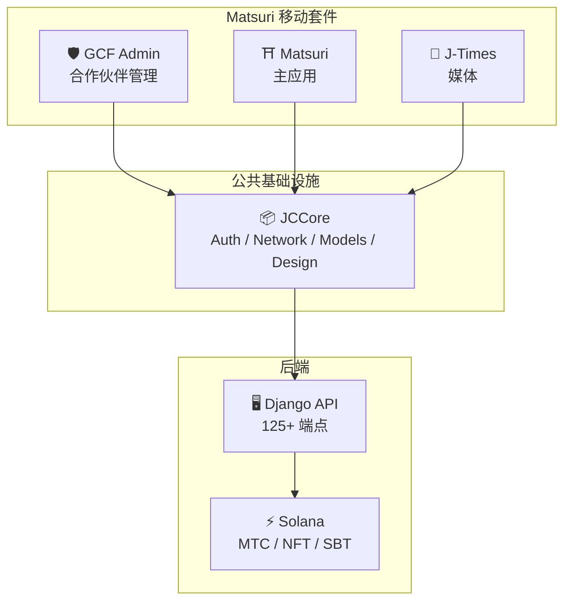
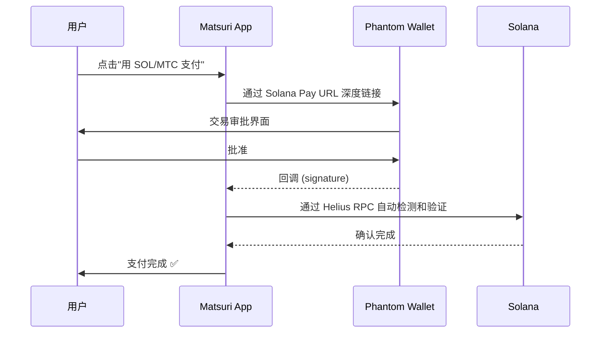
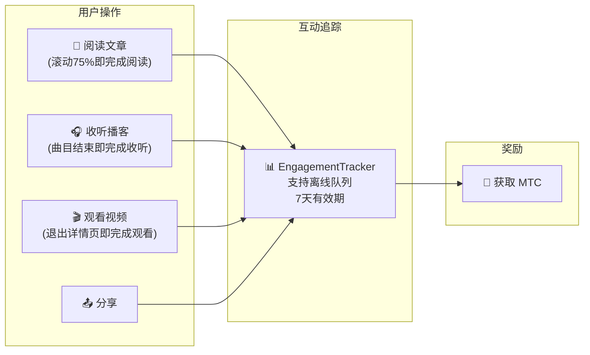
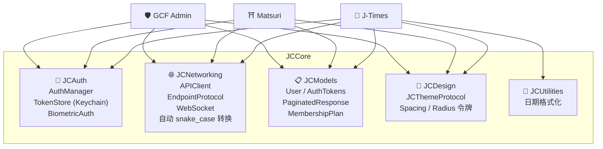

# 📱 移动应用套件

> **三款原生 iOS 应用，覆盖 Matsuri 生态系统的每一层。**
> 完全使用 Swift 6 / iOS 17+ 构建。通过共享 **JCCore** 库实现统一的认证、网络和设计。

:::tip 为什么这对投资者很重要
大多数 Web3 项目只有一个网站和一份白皮书。Matsuri 拥有 **3 款生产级 iOS 应用和 827+ 自动化测试**、共享基础设施以及原生 Solana 集成。这在代币领域是罕见的执行深度。
:::

---

## 应用概览

| 应用 | 用途 | 状态 | 语言 |
| :--- | :--- | :---: | :--- |
| **GCF Admin** | 合作伙伴管理与运营 | ✅ 已发布 | 🇯🇵🇬🇧🇨🇳🇹🇭🇳🇴 |
| **Matsuri** | 面向消费者的主应用 | 🔜 2026年4月下旬 | 🇯🇵🇬🇧🇨🇳🇹🇭🇳🇴 |
| **J-Times** | 文化媒体与学习 | 🔜 2026年4月下旬 | 🇯🇵🇬🇧 |

---

## 1. 🛡️ GCF Admin — 合作伙伴管理应用

:::info 状态：已在 App Store 发布 (v1.0)
GCF (Global Community Friends) 成员的业务管理应用。将网页管理界面的所有功能集成到移动端。
:::

  
  
  

### 此应用的功能

| 类别 | 功能 |
| :--- | :--- |
| **📊 仪表板** | KPI 卡片、销售图表、快捷操作 |
| **👥 成员管理** | 列表・详情・编辑・等级管理 |
| **💰 收入管理** | 佣金追踪、MTC 提现管理、支付管理 |
| **📝 内容管理** | 活动・文章・播客・视频的创建・编辑・发布 |
| **🎫 导游时段** | 导游名额管理、收入追踪 |
| **🖼️ NFT 仪表板** | Founder's Collection、链上确认、NFT 转账 |
| **⛩️ 圣地管理** | 站点 CRUD、信标设置 |
| **🎲 AR 挖矿设置** | 御神签概率表、奖励参数管理 |
| **📊 分析** | 错误报告、使用情况分析 |
| **🔗 推荐** | 自定义二维码生成、推荐计划管理 |

### 技术规格

| 项目 | 详情 |
| :--- | :--- |
| **架构** | Clean Architecture + MVVM + `@Observable` (iOS 17) |
| **语言 / SDK** | Swift 6.0 / Xcode 16+ / iOS 17.0+ |
| **API 集成** | 125 个以上端点 |
| **测试** | 226 个测试 / 45 个测试类 |
| **本地化** | 5 种语言（日英中泰挪）/ 957+ 翻译键 |
| **Swift Concurrency** | 严格并发合规 / 零构建警告 |

### 二维码集成

GCF Admin 可以生成带有 Matsuri 标志的自定义二维码。支持活动邀请、推荐链接、支付请求等多种用途。

---

## 2. ⛩️ Matsuri — 主应用

:::info 状态：计划于 2026 年 4 月下旬发布 (v3.0)
面向普通用户的主应用。活动预订、支付、Web3 钱包、AR 挖矿 — 一切尽在一个应用中。
:::

  
  
  

### 此应用的功能

| 类别 | 功能 |
| :--- | :--- |
| **🎪 活动预订** | 搜索・预订・Stripe 支付・票务二维码管理 |
| **💳 4 种支付方式** | 信用卡 / 已保存卡片 / MTC 余额 / 加密货币 (SOL/MTC) |
| **👛 Web3 钱包** | MTC 余额显示、收发、交易历史 |
| **🖼️ NFT 画廊** | 持有的 NFT/SBT 列表、链上确认 |
| **🗺️ 圣地地图** | 神社寺庙地图显示、签到 |
| **🎲 AR 挖矿** | WebAR 御神签体验、获取 MTC |
| **💬 聊天** | 带上下文菜单的消息功能 |
| **⭐ 心愿单** | 收藏活动和体验 |
| **🔍 高级搜索** | 支持语音搜索 |
| **🤝 推荐** | 参加推荐计划、追踪奖励 |
| **📊 GCF 仪表板** | GCF 成员的简易管理界面 |

### Phantom Wallet 集成 — 零输入的加密货币支付

> **零地址复制粘贴。** Phantom Wallet 自动打开，用户批准，支付即完成。交易签名通过 Helius RPC 自动检测 — 市场上最流畅的加密货币支付体验。

:::tip 为什么这很重要
大多数 Web3 应用要求用户复制钱包地址、手动输入金额并等待确认。Matsuri 的 Solana Pay 集成将这一切简化为**一次点击** — 在链上结算的同时匹配 Apple Pay 的用户体验。
:::

### 技术规格

| 项目 | 详情 |
| :--- | :--- |
| **架构** | Clean Architecture + MVVM + Swift Concurrency |
| **语言 / SDK** | Swift 6.0 / Xcode 16+ / iOS 17.0+ |
| **支付** | Stripe PaymentSheet + MTC Balance + Phantom (Solana Pay) |
| **API 集成** | 72 个端点 / 16 个类别 |
| **测试** | 230+ (Model, ViewModel, Network, Security, DeepLink, E2E) |
| **本地化** | 5 种语言（日英中泰挪）/ 406 个翻译键 |
| **ViewModel 数量** | 25（完全 MVVM — View 零直接 API 调用）|
| **认证** | Apple Sign In / Google Sign In (PKCE) |

---

## 3. 📰 J-Times — 文化媒体应用

:::info 状态：计划于 2026 年 4 月下旬发布
传递日本文化深层内涵的媒体平台。阅读文章、收听播客、观看视频 — 每一个操作都能获取 MTC。
:::

  

### 此应用的功能

| 类别 | 功能 |
| :--- | :--- |
| **📖 文章** | 视差英雄图、首字下沉、阅读进度条、富内容（Markdown、表格、引用）|
| **🎧 播客** | 系列浏览、波形播放器、睡眠定时器、AirPlay、锁屏控制 |
| **🎬 视频** | 自适应网格/列表显示、短视频（TikTok 风格、双击）|
| **🔍 搜索** | 多重筛选、热门标签、语音搜索 |
| **🧭 发现** | 精选轮播、编辑推荐、本周热门 |
| **📚 媒体库** | 收藏、历史（按日期）、下载、播放列表 |
| **🎵 音频播放器** | 迷你播放器（滑动操作）、全屏播放器（波形、歌词、重复）|
| **👤 会员** | 3 个等级（Free / Premium / Pro）功能对比、恢复购买 |

### Media Mining — 阅读、收听、观看即是挖矿

> **离线也能记录。** 即使在信号不通的深山神社阅读文章，恢复网络时也会自动发送互动数据并获得 MTC。

### 设计系统 — 日本美学"四柱"

J-Times 采用独特的设计系统，将日本传统美学融入现代 UI。

| 柱 | 概念 | UI 应用 |
| :--- | :--- | :--- |
| **墨 (Sumi)** | 温暖的中性灰 | 背景色、文字层次 |
| **朱 (Shu)** | 日本红 (#C53030) | 强调色、重要操作 |
| **间 (Ma)** | 4pt 网格间距 | 间距、呼吸感 |
| **纸 (Kami)** | 微妙纹理、玻璃拟态 | 卡片表面、深度表现 |

### 技术规格

| 项目 | 详情 |
| :--- | :--- |
| **架构** | Clean Architecture + MVVM + Swift Concurrency |
| **语言 / SDK** | Swift 6.0 / Xcode 16+ / iOS 17.0+ |
| **外部依赖** | **零** — 仅使用 Apple 原生框架 |
| **API 集成** | 40 个以上端点 |
| **测试** | 371 个测试 / 20 个文件 |
| **本地化** | 2 种语言（日英）/ 310+ 翻译键 |
| **离线支持** | ContentCache (50MB) + ImageDiskCache (200MB) + 下载管理器 |
| **认证** | Apple Sign In / Google Sign In (PKCE) |

---

## 公共基础设施：JCCore 库

三款应用共享的 Swift Package 库。

| 模块 | 职责 |
| :--- | :--- |
| **JCAuth** | 基于 Keychain 的令牌管理、生物识别认证 (Face ID / Touch ID) |
| **JCNetworking** | 类型安全的 API 客户端、WebSocket、自动 JSON snake_case 转换 |
| **JCModels** | 跨应用共享数据模型 (User, AuthTokens 等) |
| **JCDesign** | 主题协议、设计令牌（间距、圆角）|
| **JCUtilities** | 日期和字符串工具 |

---

## 安全与隐私

| 项目 | 实现 |
| :--- | :--- |
| **认证令牌** | 加密存储在 iOS Keychain (TokenStore) |
| **生物识别认证** | 通过 Face ID / Touch ID 进行双因素认证 |
| **API 通信** | HTTPS + Certificate Pinning |
| **钱包私钥** | 应用内不存储私钥 — 委托给 Phantom Wallet |
| **AR 挖矿** | 不向服务器发送摄像头图像 (VisionProof) |
| **离线数据** | SwiftData 加密 + 自动过期 |
| **Swift Concurrency** | 通过 Actor 隔离防止竞态条件 |

---

## 开发质量

三款应用共计实现 **827+ 自动化测试**。

| 应用 | 测试数 | 覆盖领域 |
| :--- | :---: | :--- |
| **GCF Admin** | 226 | Model, ViewModel, Repository, API, Localization, Navigation |
| **Matsuri** | 230+ | Model, ViewModel, Network, Security, DeepLink, Regression, Performance, E2E |
| **J-Times** | 371 | Model, ViewModel, API, Repository, Navigation, Localization, Security, Performance |

---

**[▶ 下一篇：路线图与团队](/docs/roadmap)** ｜ **[◀ 上一篇：生态系统与挖矿](/docs/ecosystem)**
