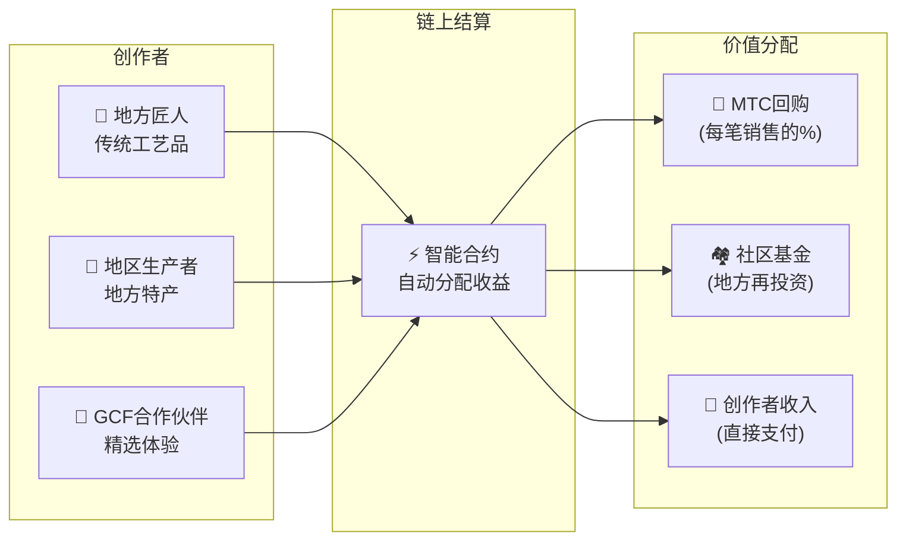

# 🗓️ 路线图与治理

> **通往确定性的道路。**
> 这不是短期投机项目。
> **核心平台开发已完成**——我们已进入扩张阶段。

---

## 战略里程碑

### 🔥 阶段1：觉醒（2026上半年——当前）

**主题：基础建设与现金流生成**

产品已完成。当前聚焦CEO直属金融系统的盈利化和初始流动性保障。

| 状态 | 里程碑 | 详情 |
| :---: | :--- | :--- |
| ✅ | **产品上线** | Matsuri Webapp及GCF管理仪表板已运行 |
| ✅ | **支付与增长** | MTC支付 + 推荐空投功能已交付 |
| ✅ | **媒体启动** | J-Times（网站与播客）分发基础设施就绪 |
| ✅ | **创世** | Solana链上MTC代币生成事件 |
| ✅ | **流动性** | Raydium上初始LP池已创建 |
| ⬜ | **激励计划** | 目标APY 20%流动性挖矿启动 |
| ⬜ | **系统上线** | Solana MEV/套利机器人投产 |
| ⬜ | **VIP招募** | 首批20名GCF VIP成员选拔 |

### 🚀 阶段2：扩张（2026下半年）

**主题：实物资产与探险挖矿**

充分利用已完成的Webapp，扩展实体据点和"巡礼"功能。

| 状态 | 里程碑 | 详情 |
| :---: | :--- | :--- |
| ⬜ | **功能发布** | 探险挖矿（巡礼）上线 |
| ⬜ | **全球拓展** | 亚洲（泰国、台湾等）合作据点与VIP活动 |
| ⬜ | **资产管理** | 以业务收入构建不动产、股票、加密资产组合 |
| ⬜ | **目标** | 生态系统总AUM达**10亿日元（~$6.5M）** |

### 🌊 阶段3：循环（2027年起）

**主题：大规模普及、共创经济与去中心化**

面向公众开放，链上市场，全面启动生态系统运行。

| 状态 | 里程碑 | 详情 |
| :---: | :--- | :--- |
| ⬜ | **盛大开放** | Matsuri App全球正式发布 |
| ⬜ | **大解禁（2027/6/1）** | 创始人锁仓解除 + 挖矿池（5.5亿枚）启动 + 减半周期开始 |
| ⬜ | **共创市场** | 地方特产店 + GCF合作伙伴店铺——带MTC自动回购的链上结算 |
| ⬜ | **众筹+NFT权益** | 用户在Solana上资助文化项目。支持者获得代表所有权、收益分成或治理权的NFT |
| ⬜ | **链上店铺结算** | 所有市场交易通过智能合约结算——每笔销售的一定比例自动流入MTC回购池 |
| ⬜ | **目标** | 生态系统总AUM达**100亿日元（~$65M）** |
| ⬜ | **DAO转型** | 部分决策权移交GCF社区 |

#### 🏪 共创市场愿景

"文化OS"的终极表达——一个**文化创造者与文化爱好者直接交易**的去中心化市场，没有榨取性的中间商。

| 功能 | 描述 | 状态 |
| :--- | :--- | :---: |
| **🏺 地方特产店** | 匠人和地区生产者直接面向全球客户销售。MTC支付享5–10%折扣 | ⬜ 愿景 |
| **🎫 众筹 + NFT权益** | 资助文化项目（神社修复、祭典复兴、匠人工坊）。获得代表您贡献的NFT——附带潜在的收益分成或治理权 | ⬜ 愿景 |
| **⚡ 链上结算** | 每笔市场交易通过Solana智能合约结算。收益自动分配：创作者支付 + 社区基金 + MTC回购——无需人工记账 | ⬜ 愿景 |
| **🗳️ 支持者治理** | NFT持有者对已资助项目的资源分配进行投票——真正的共创，而非单纯的捐赠 | ⬜ 愿景 |

:::info 为什么这很重要
今天，游客在向平台"房东"支付租金的商店里购买纪念品。明天，**京都乡间的匠人直接卖给哥本哈根的粉丝**——而那笔销售的一定比例将自动增强MTC经济。这就是飞轮效应的最完整体现。
:::

---

## 👤 团队

### Ko Takahashi——创始人 / CEO兼首席架构师

| 项目 | 详情 |
| :--- | :--- |
| **角色** | 项目全面负责人。设计并开发核心金融算法（Solana MEV机器人） |
| **愿景** | "出口文化，进口财富"文化OS的倡导者 |
| **态度** | 白天写代码，晚上在Golden Gai经营酒吧——"身体力行"的实践者 |

### Jon Anders Jensen

### Ryunosuke Honda

### 🌏 GCF社区——全球开发贡献者

Matsuri Protocol不仅仅由创始团队构建。
**全球GCF成员**通过测试、反馈、翻译和区域拓展为协议的进化做出贡献。

| 领域 | 阵容 |
| :--- | :--- |
| **💼 全球金融** | 亚洲私人投资者网络 |
| **⚙️ 工程** | 区块链和移动应用开发的分布式工程团队 |
| **🏮 运营** | 与新宿Golden Gai和主要旅游景点的本地社区建立深厚管线 |
| **🌐 社区** | 覆盖日本、挪威、泰国、台湾等地的多国籍GCF成员 |

:::tip 共同构建文化基础设施
加入GCF，成为Matsuri Protocol的共同开发者。
贡献不仅仅是编写代码——介绍当地圣地、翻译文档、组织活动——一切都是将这个协议推广到全世界的力量。
:::

### 战略合作伙伴

| 领域 | 阵容 |
| :--- | :--- |
| **💼 全球金融** | 亚洲私人投资者网络 |
| **⚙️ 工程** | 区块链和移动应用开发的分布式工程团队 |
| **🏮 运营** | 与新宿Golden Gai和主要旅游景点的本地社区建立深厚管线 |

---

## 🏛️ 治理（DAO）

Matsuri Protocol将逐步过渡为**去中心化自治组织（DAO）**。
GCF成员（铂金/黄金）将获得对关键事项的**投票权**：

| 投票事项 | 范围 |
| :--- | :--- |
| **💰 资金分配** | 资助哪些新业务或营销举措 |
| **⚙️ 协议升级** | 微调手续费率和挖矿奖励曲线 |
| **⛩️ 文化认证** | 哪些祭典和神社被认证为"官方巡礼地"并获得资助 |

:::info 加入这场革命
我们不只是在做一个App。
我们在构建**"无国界的文化经济体"**。
:::

---

**[◀ 返回白皮书首页](/docs/intro)** ｜ **[加入Discord](#)**
