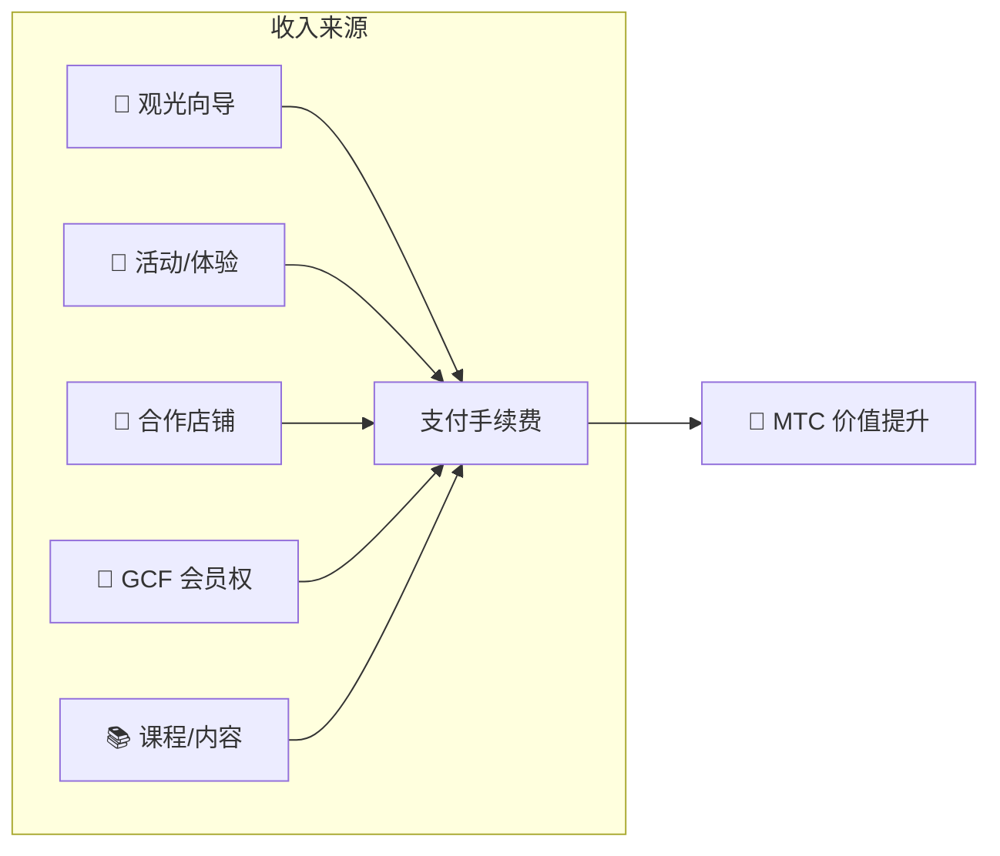

# 💰 代币经济——MTC 的经济设计

> **信任,被刻进了代码。**
> MTC 的经济设计并非建立在某个人的承诺之上,而是由数学与区块链所担保。


> **"力量无法单方面改变现状的经济机制"——这就是 MTC 的代币经济。**

Matsuri Coin(MTC)的经济设计,建立在一个信念之上:
**即使运营方自己也无法改写的规则,才是给投资者最可靠的安心**。

供给量永久固定。既不可增发,也无法冻结资金。业务增长会在数学层面反映到价格上——
这不是"承诺",而是刻在区块链上的**事实**。

本页将完全透明地公开 MTC 的全部经济机制。

---

## 代币规格

为了保障投资者的安全,我们已**永久放弃** Solana 上的"Mint 权限"与"Freeze 权限"。
增发永远不可能,资金冻结亦不可能。**这是完全的免信任设计**。

| 项目 | 详情 |
| :--- | :--- |
| **代币名称** | Matsuri Coin |
| **代码** | MTC |
| **链** | Solana |
| **Mint 地址** | `DRENpzmRWM4TwECrCPCfS1k5VBPmanhQg9bcCWP8EZXF` [Solscan →](https://solscan.io/token/DRENpzmRWM4TwECrCPCfS1k5VBPmanhQg9bcCWP8EZXF) |
| **总供应量** | **9 亿枚**(900,000,000 MTC)固定 |
| **Mint 权限** | 🚫 已放弃([可在链上验证](https://solscan.io/token/DRENpzmRWM4TwECrCPCfS1k5VBPmanhQg9bcCWP8EZXF)) |
| **Freeze 权限** | 🚫 已放弃([可在链上验证](https://solscan.io/token/DRENpzmRWM4TwECrCPCfS1k5VBPmanhQg9bcCWP8EZXF)) |
| **锁仓管理** | Streamflow Finance(已验证) |

:::info 这为何重要
放弃 Mint 权限,意味着"运营方无法随意增发代币、稀释你的份额";放弃 Freeze 权限,则意味着"你的钱包不会被任何人冻结"。这,正是免信任(trustless)的根基。
:::

---

## 代币分配

900M MTC 的分配如下。

<div className="mtc-alloc">
  <div className="mtc-alloc__donut" role="img" aria-label="MTC 分配: 挖矿池 61%, 生态运营 39%">
    <div className="mtc-alloc__hole">
      <span className="mtc-alloc__total">900M</span>
      <span className="mtc-alloc__unit">MTC</span>
    </div>
  </div>
  <div className="mtc-alloc__legend">
    <div className="mtc-alloc__row mtc-alloc__row--mining">
      <span className="mtc-alloc__dot"></span>
      <span className="mtc-alloc__pct">61%</span>
      <span className="mtc-alloc__amount">⛏️ 550M MTC</span>
    </div>
    <div className="mtc-alloc__row mtc-alloc__row--ecosystem">
      <span className="mtc-alloc__dot"></span>
      <span className="mtc-alloc__pct">39%</span>
      <span className="mtc-alloc__amount">🌐 350M MTC</span>
    </div>
  </div>
</div>

| 类别 | 比例 | 枚数 | 用途 |
| :--- | :---: | :--- | :--- |
| **⛏️ 挖矿池** | **61%** | 5 亿 5,000 万枚 | 面向贡献者的奖励池。2027 年 6 月解锁,每两年一次减半释放。按贡献分数分配 |
| **🌐 生态运营** | **39%** | 3 亿 5,000 万枚 | 市场营销、GCF 分发、运营费用、流动性池(LP)获取、研发费用、广告费、活动举办费等 |

:::note 挖矿池的释放制度
550M MTC 不会一次性释放。按照每两年一次的减半时间表,**根据贡献分数分阶段分配**。释放与分配规则将在 2026 年下半年陆续通过智能合约实现,并可在链上核验。
:::

:::note 关于生态运营额度
39% 的运营额度是支持生态成长所需的多用途资金。具体用途包括市场营销、面向 GCF 会员的初期分发、Raydium 流动性池注入、开发团队薪酬、广告宣传、文化体验活动举办费用等。使用的透明度将在 DAO 迁移后成为社区治理的对象。
:::

---

## 收益结构

支撑 MTC 价值的,是**来自真实业务的收入**。不是投机,而是现实的经济活动,为代币的价值做背书。



| 收入来源 | 内容 |
| :--- | :--- |
| **🏯 体验/向导** | 观光向导、文化体验活动的支付手续费 |
| **🤝 GCF 会员权** | 会员费 |
| **📚 内容** | 课程学习费、媒体订阅 |
| **🏪 市集** | 合作店铺的交易手续费(逐步扩展) |

:::tip 由实需支撑的成长
入境游客越多,外汇流入越多,生态规模越大。MTC 的价值并不由投机决定,而是由**体验日本文化的人数**决定。
:::

---

## 当前业务实绩

MTC 的经济圈尚在初期,但真实活动已经开始。

| 指标 | 实绩 |
| :--- | :--- |
| **活动举办次数** | 50 次以上(测试运营) |
| **GCF Platinum 会员** | 已招募 20 人(50 人中) |
| **GCF Gold 会员** | 即将开始招募 |
| **Web 平台** | 运行中。以测试方式招募用户运行中 |
| **iOS 应用** | 开发完成,计划 2026 年 4 月发布 |

:::note 坦率地说
我们还没有"大获成功"的业绩。50 场活动加测试运营——这就是当下的现实。但是,产品在跑、社区在场,我们正处于准备全面扩张的阶段。
:::

---

## 回购协议

我们不会"赚到了就塞进运营方口袋"。
我们的方针是,将业务收入的一定比例用于从市场回购 MTC。

| 收入来源 | 回馈比例 | 操作 |
| :--- | :---: | :--- |
| **Matsuri 本部营收**(向导、活动) | **20%** | 从市场**回购**并追加至流动性池 |
| **GCF 会员权**(会员费) | **25%** | 从市场**回购** |

:::info 回购的当前状态
回购协议将随着业务收入的规模化**即将启动运行**。初期将在链下(手动)执行,2026 年下半年之后逐步迁移为由智能合约自动执行。链上化之后,回购的执行历史将在区块链上对任何人透明可验。
:::

回购不是"未来某天才做"的承诺,而是作为协议被编写进代码的规则。业务每增加一笔营收,MTC 就会被自动从市场上吸走——这正是投资者得到的**结构性安心**。

---

## 价格决定逻辑

MTC 的价格提升机制,并非依靠乐观预期,而是基于 **AMM(自动做市商)的数学公式**。

```
价格 = 流动性(SOL) ÷ 供给量(MTC)
```

| 步骤 | 发生了什么 | 结果 |
| :---: | :--- | :--- |
| **①** | 业务收入(SOL)注入池中 | **分子变大** |
| **②** | 用该资金从市场回购 MTC 并销毁 | **分母变小** |
| **③** | 分子↑ × 分母↓ | **稀缺性提升的条件被满足** |

:::info 这是机制说明,并非价格保证
该公式描述的是"在业务收入持续、回购得以执行的前提下,供需平衡向稀缺性方向移动"的结构性设计。实际价格受市场供需、外部环境、流动性等诸多因素影响。
:::

---

## 减半时间表

2027 年 6 月 1 日解锁的**5 亿 5,000 万枚(约占总供应 61%)** MTC 并不会被抛售到市场,而是作为**贡献者奖励池**保留。

我们采用的是比比特币四年周期更快的**每两年一次减半**。
每两年释放量减半,理论上可以让奖励持续数十年。

| 期间 | 释放比例 | 释放枚数 | 累计释放率 |
| :--- | :---: | :--- | :---: |
| **第 1 期** 2027 – 2029 | **50%** | 约 2.75 亿枚 | 50% |
| **第 2 期** 2029 – 2031 | **25%** | 约 1.37 亿枚 | 75% |
| **第 3 期** 2031 – 2033 | **12.5%** | 约 6,800 万枚 | 87.5% |
| **第 4 期** 2033 – 2035 | **6.25%** | 约 3,400 万枚 | 93.75% |
| **第 5 期起** | 持续减半 | 逐步递减 | → 渐近 100% |

<small>*※ 数学上永远无法到达 100%,释放量将无限趋近于零。这与比特币同理。*</small>

:::tip 越早开始贡献,能获得的 MTC 越多
得益于减半机制,第 1 期(2027–2029 年)的释放量最大,随着周期推进,每次释放的枚数会逐步减少。也就是说,**越早开始积累贡献分数的人,获得的 MTC 越多**。

会计入贡献分数的活动举例:
- 活动的创建与集客业绩
- 人气向导课程的运营
- 优秀向导的引荐与培养
- J-Times 内容的阅读量与分享数
- 圣地巡礼的签到次数

奖励不由"到场顺序",而由**"贡献多少"**决定。
:::

---

:::note 下一页
理解了 MTC 的经济设计后,接下来一起看看**如何作为合作伙伴加入**。
**[GCF 会员 →](/docs/gcf)**
:::
