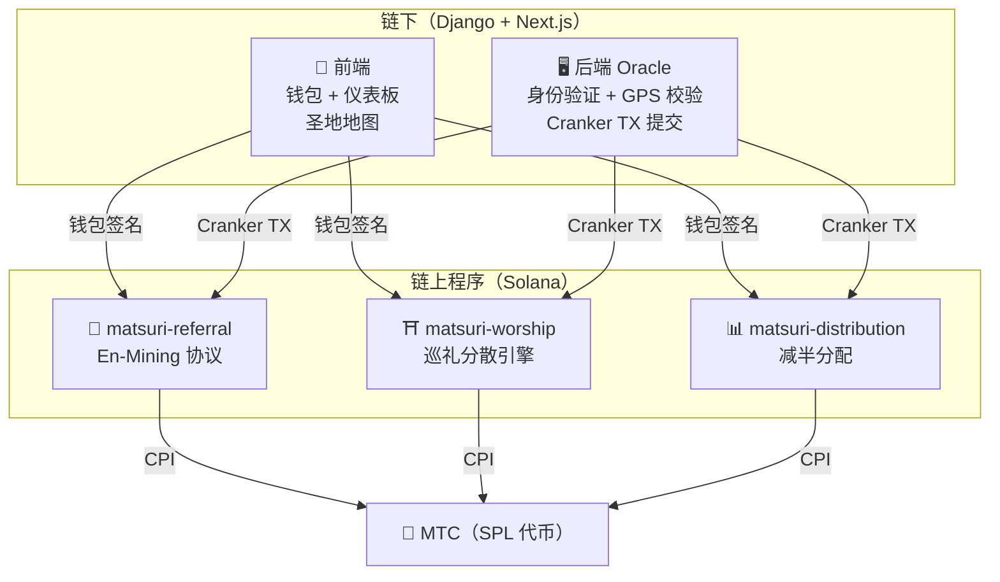
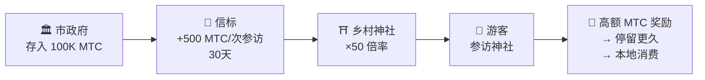
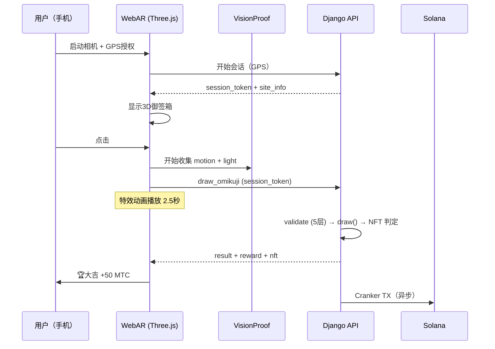

# ⚡ 智能合约 — 开源架构

> **无需信任的设计。**
> 奖励逻辑、推荐树、减半时间表 — 一切都在**链上**执行，任何人都可以审计。
> 源代码：[GitHub](https://github.com/matsuri-protocol/contracts)

---

## 概述

Matsuri 在 Solana 上部署了 **三个 Anchor（Rust）程序**，分别负责生态系统的各个支柱：



---

## 1. 📣 En-Mining（縁マイニング）协议

**目的：** 同时奖励「广度（推荐网络）」和「深度（经济影响）」的混合增长引擎。不仅仅是联盟营销 — 而是一个完整的挖矿协议，现实世界的经济活动在链上生成价值。

### 评分公式

```
S_final = S_raw × M_toku × B_title

where:
  S_raw   = 0.30 × 推荐人数 + 0.70 × (交易量 / 10^9)
  M_toku  = f(质押的 MTC) ∈ [1.0×, 10.0×]
  B_title = 1.0 + min(排名赛季数 × 0.05, 0.50)
```

| 组成部分 | 权重 | 目的 |
| :--- | :---: | :--- |
| **广度**（推荐人数） | 30% | 网络覆盖 — 你带来了多少人 |
| **深度**（结算量） | 70% | 经济影响 — 真实购买，而非仅注册 |
| **Toku 倍率** | ×1–10 | 锁定 MTC 以提升挖矿能力 |
| **头衔加成** | +5%/赛季 | 对持续优秀表现者的永久奖励 |

### Toku（徳）质押等级

| 质押 MTC | 倍率 | 等级 |
| :--- | :---: | :--- |
| 0 | 1.0× | — |
| 1,000+ | 1.5× | 青铜 |
| 10,000+ | 3.0× | 白银 |
| 100,000+ | 5.0× | 黄金 |
| 1,000,000+ | 10.0× | 钻石 |

### En no Banzuke（赛季排行榜）

每个赛季（纪元），顶尖表现者将被排名。福利：
- 前 10% 获得 **传道者** 头衔（永久 SBT 标记）
- 每个排名赛季授予 **+5% 挖矿提升**（累积，上限：50%）

### 反女巫攻击防御（3层）

| 层级 | 机制 | 位置 |
| :--- | :--- | :--- |
| **身份门控** | X/Twitter OAuth + SMS | 链下（Django） |
| **链上门控** | 只有 `is_verified = true` 的配置文件才能获得收益 | 智能合约 |
| **深度权重** | 70% 的分数 = 真实支付 → 机器人什么也赚不到 | 评分引擎 |

---

## 2. ⛩️ 巡礼分散引擎（Worship Routing Engine）

**目的：** 全球首个 **利用代币经济学解决过度旅游的 ReFi 协议。** 参拜圣地 → 获得 MTC。但关键在于：*越少人参访的地方，奖励呈指数级增长。*

:::tip 核心洞察
这是「反向 Uber 潮汐定价」— 拥挤的景点会被惩罚，前沿景点会被奖励。游客会自发前往人少的景点，因为 **利润更高。**
:::

### 6层奖励公式

```
R_final = R_pioneer × M_dynamic × M_regional × M_streak × M_omikuji

where:
  R_pioneer  = daily_pool / visit_order     （调和 1/n 衰减）
  M_dynamic  = 管理员控制 ∈ [0.1×, 50×]
  M_regional = tier_table[tier] ∈ {1×, 2×, 5×, 10×}
  M_streak   = 1.0 + min(days × 0.02, 0.50)
  M_omikuji  = 抽签结果 ∈ {1.0, 1.2, 1.5, 3.0}
```

### 第1层：先驱者奖金

调和衰减 — 引导游客分散的数学：

| 参访顺序 | 相比第1位的奖励 | 实际示例（1000 MTC 池） |
| :---: | :---: | :--- |
| 第1位 | 100% | 1,000 MTC |
| 第5位 | 20% | 200 MTC |
| 第10位 | 10% | 100 MTC |
| 第100位 | 1% | 10 MTC |

> **第一位访客 = 第100位访客的100倍奖励。** 这创造了在非高峰时段参访的强大激励。

### 第2层：动态倍率（分散拥堵）

通过 GCF 管理面板实时控制：

| 场景 | 倍率 | 效果 |
| :--- | :---: | :--- |
| **过度旅游**（浅草高峰） | 0.1× | 90% 奖励惩罚 |
| **正常** | 1.0× | 标准 |
| **少人参访** | 10× | 10倍奖励提升 |
| **前沿推广** | 50× | 最大激励 |

### 第3层：区域等级

| 等级 | 标签 | 倍率 | 示例 |
| :---: | :--- | :---: | :--- |
| 0 | 🏙️ 大型 | 1× | 浅草寺、清水寺、伏见稻荷 |
| 1 | 🌆 中型 | 2× | 地方一宫、县厅所在地的大社 |
| 2 | 🏞️ 乡村 | 5× | 乡间历史悠久的古寺 |
| 3 | ⛰️ 秘境 | 10× | 深山灵场、离岛圣所 |

### 第4层：连续奖金

每连续一天 +2%，上限 +50%。奖励持续参访者。

### 第5层：🎲 御签协议

| 结果 | 概率 | 倍率 |
| :--- | :---: | :---: |
| 🏆 **大吉** | 5% | 3.0× |
| ✨ **吉** | 15% | 1.5× |
| 🌸 **小吉** | 30% | 1.2× |
| 🍃 **末吉** | 35% | 1.0× |
| 💀 **凶** | 15% | 1.0× |

### 第6层：赞助信标（B2B/B2G）

市政府、铁路公司和旅游局可以 **存入 MTC** 在特定景点创建限时高奖励区域。



> **B2B 收入模式：** 赞助商支付 MTC 引导游客。MTC 购买压力 → 代币价值上升。三方共赢。

---

## 3. 📊 减半分配

**目的：** 5.5亿 MTC 挖矿池通过 **2年减半周期** 分配数十年 — 比比特币的4年周期更快。

### 减半时间表

```
总池：550,000,000 MTC

纪元 0 (2027–2029):  275,000,000 MTC  (50%)
纪元 1 (2029–2031):  137,500,000 MTC  (25%)
纪元 2 (2031–2033):   68,750,000 MTC  (12.5%)
纪元 3 (2033–2035):   34,375,000 MTC  (6.25%)
        ...              ...
∑ → 550,000,000 MTC（渐近总和）
```

### 个人奖励公式

```
your_reward = epoch_budget × (your_score / total_score)
```

所有算术使用 **128位中间计算** — 数学上不可能溢出。

### 绩效评分来源

| 活动 | 评分权重 |
| :--- | :--- |
| **导游服务次数** | 高 |
| **活动门票销售** | 高 |
| **推荐网络活动** | 中 |
| **参拜挖矿访问** | 中 |
| **媒体参与** | 低 |

:::info 无许可纪元推进
`advance_epoch` 指令 **任何人** 都可以调用 — 无需管理员。系统时钟决定纪元何时转换，即使团队消失也能保证无信任运行。
:::

---

## 4. 🎴 AR 挖矿 — WebAR 御签挖矿

**目的：** 仅用智能手机浏览器就能在现实空间中呈现 AR 御签，挖取 MTC。**无需下载 App。** 神道精神性与尖端技术融合的全球首个 WebAR×区块链基础设施。

### 架构



### Optimistic UI（零等待）

| 步骤 | 时间 | 处理 |
|---------|------|------|
| 点击 → 特效开始 | 0ms | 前端即时播放动画 |
| API draw_omikuji | ~50ms | Django 抽签 + NFT 判定 |
| 特效完成 | 2500ms | 结果已确定 → 显示 |
| Solana TX | ~400ms | 后台发送 |

### 御签概率设置（GCF 管理员）

基点 (10000 = 100%) 以0.01%为单位精密控制。

| 等级 | 默认值 | 奖励倍率 | NFT |
|------|-----------|---------|-----|
| 🏆 大吉 | 5.00% (500bp) | ×3.0 | ✅ |
| ✨ 吉 | 15.00% (1500bp) | ×1.5 | 可选 |
| 🌸 小吉 | 30.00% (3000bp) | ×1.2 | — |
| 🍃 末吉 | 35.00% (3500bp) | ×1.0 | — |
| 💀 凶 | 15.00% (1500bp) | ×1.0 | — |

### ZK-Proof of Vision（5层验证）

多层排除GPS伪造和重放攻击。为保护隐私，不发送相机图像数据。

| Layer | 验证内容 | 分值 |
|-------|---------|------|
| Temporal | 会话时间 5-120秒 | /20 |
| Motion | 陀螺仪方差 0.005-0.5（手持自然度） | /20 |
| Light | 环境光×时段一致性 | /20 |
| HMAC | proof_hash 签名验证 | /20 |
| Fingerprint | 设备唯一性 | /20 |
| **合计** | **PASS 阈值** | **60/100** |

### 奖励计算公式

```
Reward = Base(10 MTC) × SiteMultiplier × OmikujiMult × TierMult

TierMult = { 大型: 1.0, 中型: 2.0, 乡村: 5.0, 秘境: 10.0 }
```

---

## 数学模块（开源核心）

两个程序都将所有评分/奖励数学分离为 **纯净、可审计的 `math.rs` 模块**：

- **零副作用** — 无 I/O、无分配、无外部调用
- **文档化公式** — rustdoc 中的 LaTeX 风格标注
- **溢出分析** — 有证明边界的 u128 中间值
- **全面测试** — 边界案例、边界条件、比率验证

```rust
// 示例：先驱者奖金（来自 worship/math.rs）
#[inline]
pub fn pioneer_reward(daily_pool: u64, visit_order: u32) -> u64 {
    if visit_order == 0 { return 0; }
    (daily_pool as u128 / visit_order as u128) as u64
}
```

---

## 安全模型（开源）

这些合约是 **完全开源的。** 安全依赖于数学保证，而非隐秘性。

| 原则 | 实现 |
| :--- | :--- |
| **PDA 专用保管库** | 代币保管库由 PDA（程序派生地址）控制 — 人类密钥无法提取 |
| **检查算术** | 所有计算使用 `checked_*` 运算 — 溢出不可能 |
| **权限分离** | 管理员（多签）≠ Cranker（有限操作）≠ 用户（自我托管） |
| **紧急暂停** | 管理员可立即暂停所有程序；无法窃取资金 |
| **不可变代币经济学** | 减半因子、总池、纪元持续时间一旦设定无法更改 |
| **纯数学模块** | 评分/奖励逻辑分离为可审计、可测试的数学库 |
| **Vision Proof** | 不传输相机数据的5层防伪检测（隐私保护） |

---

**[◀ 返回路线图](/docs/roadmap)** ｜ **[查看源代码](https://github.com/matsuri-protocol/contracts)**
