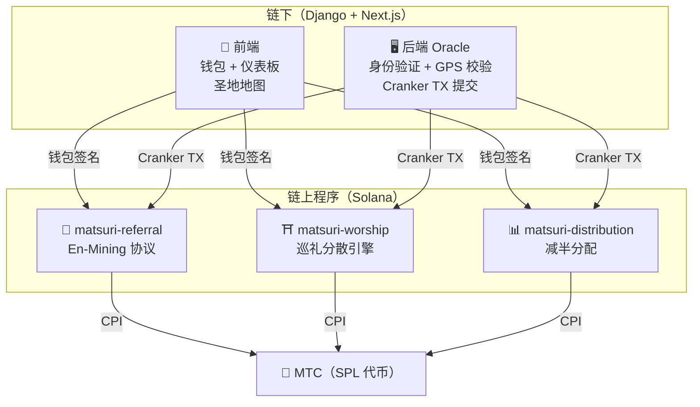
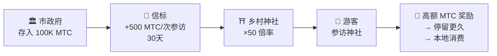
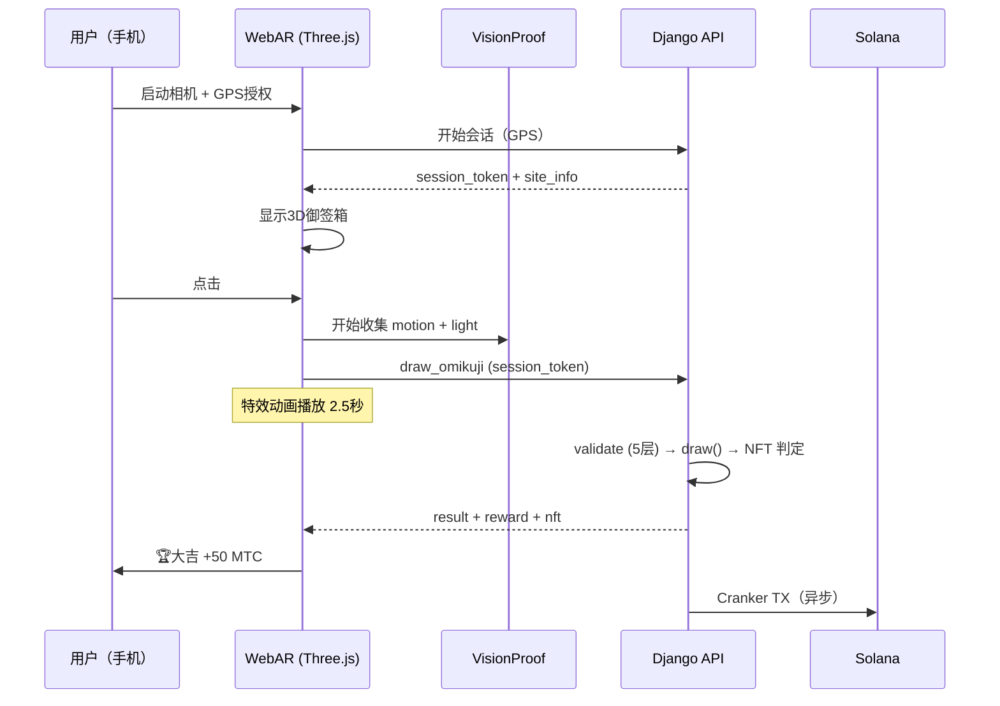

# ⚡ 智能合约 — 开源架构

> **无需信任的设计。**
> 奖励逻辑、推荐树、减半时间表 — 一切都在**链上**执行，任何人都可以审计。
> 源代码：[GitHub](https://github.com/Cootakahashi/matsuri-contracts)

---

## 概述

Matsuri 在 Solana 上部署了 **三个 Anchor（Rust）程序**，分别负责生态系统的各个支柱：



---

## 1. 📣 En-Mining（縁マイニング）协议

**目的：** 同时奖励「广度（推荐网络）」和「深度（经济影响）」的混合增长引擎。不仅仅是联盟营销 — 而是一个完整的挖矿协议，现实世界的经济活动在链上生成价值。

### 评分设计

贡献分数基于两个加权组成部分：

| 组成部分 | 权重 | 目的 |
| :--- | :---: | :--- |
| **广度**（推荐人数） | 30% | 网络覆盖 — 你带来了多少人 |
| **深度**（结算量） | 70% | 经济影响 — 真实购买，而非仅注册 |

分数随时间累积，在每个减半纪元转换为MTC。计划中的额外加成机制：

| 加成 | 描述 | 状态 |
| :--- | :--- | :---: |
| **Toku（徳）质押** | 锁定MTC以提升贡献分数（最高约50%加成）。层级和确切倍率将基于减半池释放计划进行校准 | ⬜ 系数待定 |
| **赛季排名** | 每个纪元的顶尖表现者获得**传道者**头衔（永久SBT）和分数加成。确切百分比将通过治理决定 | ⬜ 系数待定 |

:::info 渐进式参数设计
加成系数（质押层级、排名奖励）被有意设计为可调整。它们将基于真实生态系统数据——总活跃用户数、减半池释放率和价格稳定目标——进行确定，然后锁定到智能合约中。这种方法确保**公平分配**，而不会过度承诺固定回报。
:::

### 反女巫攻击防御（3层）

| 层级 | 机制 | 位置 |
| :--- | :--- | :--- |
| **身份门控** | X/Twitter OAuth + SMS | 链下（Django） |
| **链上门控** | 只有 `is_verified = true` 的配置文件才能获得收益 | 智能合约 |
| **深度权重** | 70% 的分数 = 真实支付 → 机器人什么也赚不到 | 评分引擎 |

---

## 2. ⛩️ 巡礼分散引擎（Worship Routing Engine）

**目的：** 全球首个 **利用代币经济学解决过度旅游的 ReFi 协议。** 参拜圣地 → 获得 MTC。但关键在于：*越少人参访的地方，奖励呈指数级增长。*

:::tip 核心洞察
这是「反向 Uber 潮汐定价」— 拥挤的景点会被惩罚，前沿景点会被奖励。游客会自发前往人少的景点，因为 **利润更高。**
:::

### 奖励设计原则

每次访问的贡献分数由多个因素决定：

| 因素 | 原则 | 效果 |
| :--- | :--- | :--- |
| **圣地热度** | 访客越少的圣地分数越高 | 引导游客远离过度拥挤的区域 |
| **访问时间** | 当日较早的访客分数更高 | 鼓励非高峰时段访问 |
| **区域等级** | 乡村和前沿圣地排名最高 | 推动地方振兴 |
| **访问频率** | 定期访客累积奖励分数 | 奖励持续参与 |
| **御签运势** | 每次签到的随机奖励抽签 | 趣味游戏化元素 |
| **赞助加成** | 地方政府可提升特定圣地 | B2B/B2G收入模式 |

:::info 系数可调整
每个因素的确切倍率（例如乡村圣地比大型圣地多赚多少）将基于**减半池计划**和真实使用数据进行**校准**，然后逐步锁定到智能合约中。设计原则是固定的——系数随生态系统演进。
:::

### 赞助信标（B2B/B2G）

市政府、铁路公司和旅游局可以 **存入 MTC** 在特定景点创建限时高奖励区域。



> **B2B 收入模式：** 赞助商支付 MTC 引导游客。MTC 购买压力 → 代币价值上升。三方共赢。

---

## 3. 📊 减半分配

**目的：** 5.5亿 MTC 挖矿池通过 **2年减半周期** 分配数十年 — 比比特币的4年周期更快。

### 减半时间表

```
总池：550,000,000 MTC

纪元 0 (2027–2029):  275,000,000 MTC  (50%)
纪元 1 (2029–2031):  137,500,000 MTC  (25%)
纪元 2 (2031–2033):   68,750,000 MTC  (12.5%)
纪元 3 (2033–2035):   34,375,000 MTC  (6.25%)
        ...              ...
∑ → 550,000,000 MTC（渐近总和）
```

### 个人奖励公式

```
your_reward = epoch_budget × (your_score / total_score)
```

所有算术使用 **128位中间计算** — 数学上不可能溢出。

### 绩效评分来源

| 活动 | 评分权重 |
| :--- | :--- |
| **导游服务次数** | 高 |
| **活动门票销售** | 高 |
| **推荐网络活动** | 中 |
| **参拜挖矿访问** | 中 |
| **媒体参与** | 低 |

:::info 无许可纪元推进
`advance_epoch` 指令 **任何人** 都可以调用 — 无需管理员。系统时钟决定纪元何时转换，即使团队消失也能保证无信任运行。
:::

---

## 4. 🎴 AR 挖矿 — WebAR 御签挖矿

**目的：** 仅用智能手机浏览器就能在现实空间中呈现 AR 御签，挖取 MTC。**无需下载 App。** 神道精神性与尖端技术融合的全球首个 WebAR×区块链基础设施。

### 架构



### Optimistic UI（零等待）

| 步骤 | 时间 | 处理 |
|---------|------|------|
| 点击 → 特效开始 | 0ms | 前端即时播放动画 |
| API draw_omikuji | ~50ms | Django 抽签 + NFT 判定 |
| 特效完成 | 2500ms | 结果已确定 → 显示 |
| Solana TX | ~400ms | 后台发送 |

### 御签概率设置（GCF 管理员）

基点 (10000 = 100%) 以0.01%为单位精密控制。可从GCF管理面板调整。

| 等级 | 稀有度 | 奖励 | NFT |
|------|-----------|---------|-----|
| 🏆 大吉 | 稀有 | 最高奖励 | ✅ |
| ✨ 吉 | 非常见 | 高奖励 | 可选 |
| 🌸 小吉 | 常见 | 小额奖励 | — |
| 🍃 末吉 | 常见 | 参与记录 | — |
| 💀 凶 | 非常见 | 参与记录 | — |

概率和奖励系数将基于生态系统规模和减半释放量逐步确定，并实施到智能合约中。

### ZK-Proof of Vision（5层验证）

多层排除GPS伪造和重放攻击。为保护隐私，不发送相机图像数据。

| Layer | 验证内容 | 分值 |
|-------|---------|------|
| Temporal | 会话时间 5-120秒 | /20 |
| Motion | 陀螺仪方差 0.005-0.5（手持自然度） | /20 |
| Light | 环境光×时段一致性 | /20 |
| HMAC | proof_hash 签名验证 | /20 |
| Fingerprint | 设备唯一性 | /20 |
| **合计** | **PASS 阈值** | **60/100** |

### 奖励设计

奖励基于圣地类型、御签结果、区域等级等多个因素作为**贡献分数**记录。具体系数将根据减半释放计划和生态系统增长逐步确定，并实施到智能合约中。

---

## 数学模块（开源核心）

所有程序将评分/奖励数学分离为 **纯净、可审计的 `math.rs` 模块**：

- **零副作用** — 无 I/O、无分配、无外部调用
- **文档化公式** — rustdoc 中的 LaTeX 风格标注
- **溢出分析** — 有证明边界的 u128 中间值
- **全面测试** — 边界案例、边界条件、比率验证
- **可调整系数** — 奖励参数设计为可通过治理更新，允许随生态系统增长进行渐进式校准

---

## 安全模型（开源）

这些合约是 **完全开源的。** 安全依赖于数学保证，而非隐秘性。

| 原则 | 实现 |
| :--- | :--- |
| **PDA 专用保管库** | 代币保管库由 PDA（程序派生地址）控制 — 人类密钥无法提取 |
| **检查算术** | 所有计算使用 `checked_*` 运算 — 溢出不可能 |
| **权限分离** | 管理员（多签）≠ Cranker（有限操作）≠ 用户（自我托管） |
| **紧急暂停** | 管理员可立即暂停所有程序；无法窃取资金 |
| **不可变代币经济学** | 减半因子、总池、纪元持续时间一旦设定无法更改 |
| **纯数学模块** | 评分/奖励逻辑分离为可审计、可测试的数学库 |
| **Vision Proof** | 不传输相机数据的5层防伪检测（隐私保护） |

---

**[◀ 返回路线图](/docs/roadmap)** ｜ **[查看源代码](https://github.com/Cootakahashi/matsuri-contracts)**
