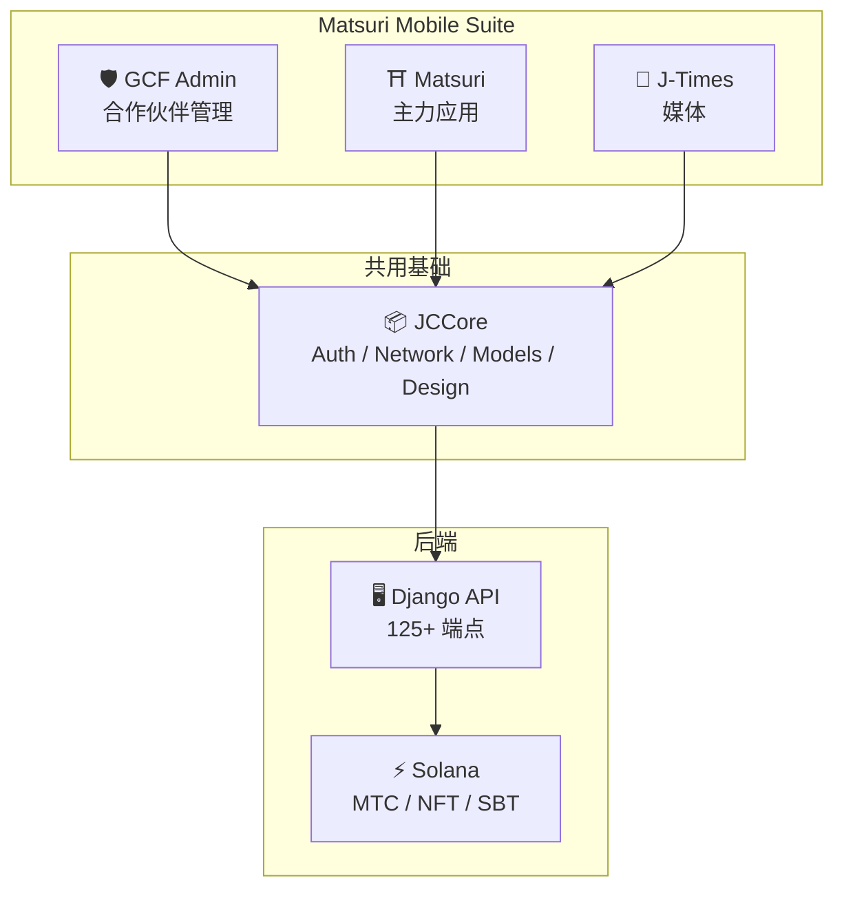
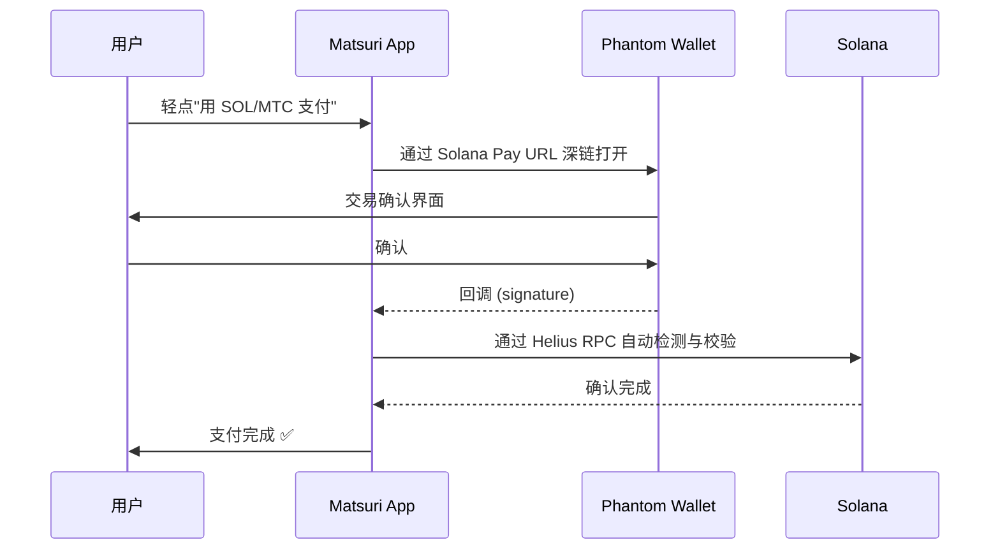
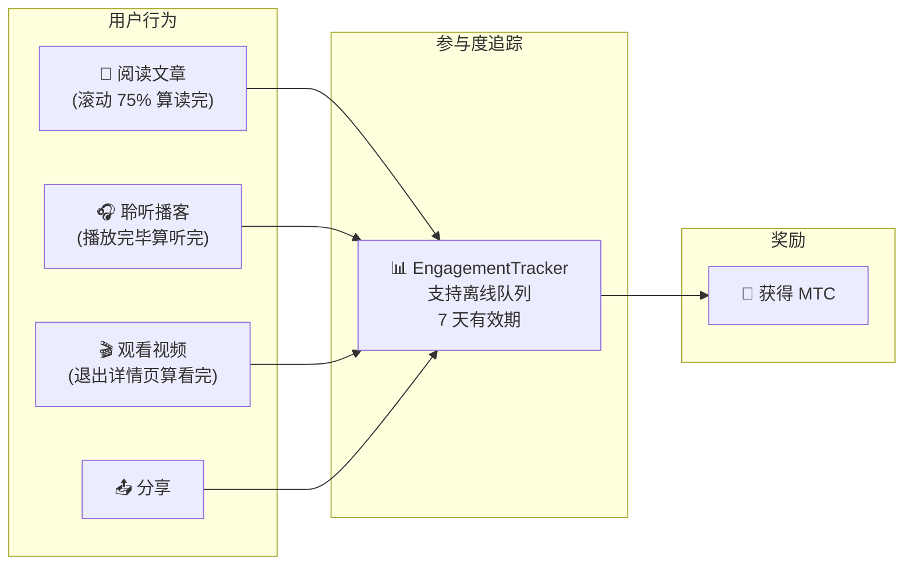
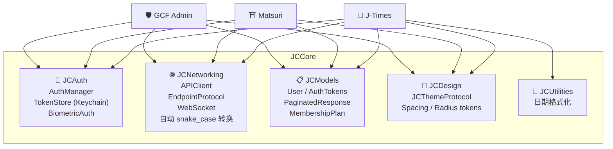
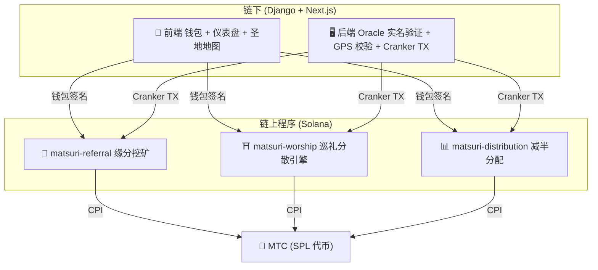
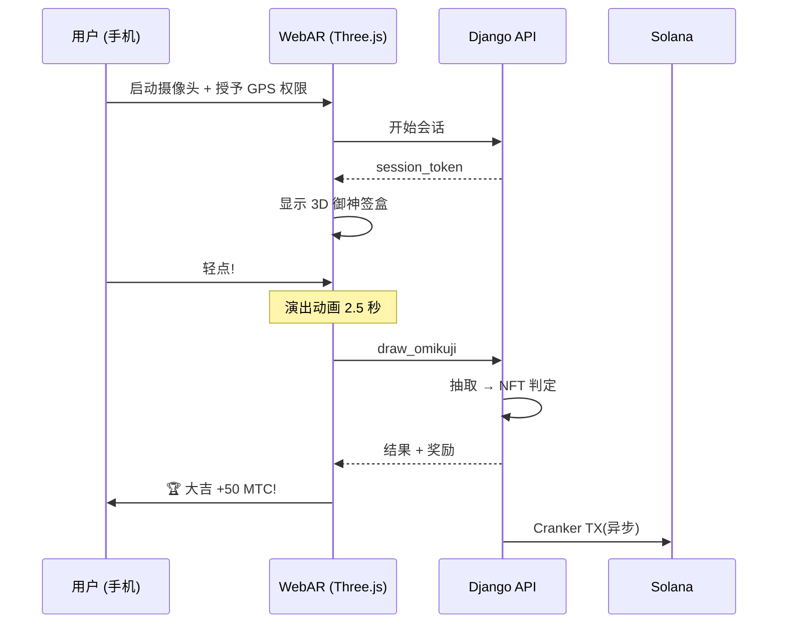

import useBaseUrl from '@docusaurus/useBaseUrl';

# 🔧 产品与技术——运行中的产品,证明一切

> **运行中的产品,就是最好的证明。**
> 我们的志向不止于言语。Web 平台已经上线,iOS 应用也进入最后阶段。

Web 应用与管理仪表盘**已在正式运行**。三款原生 iOS 应用已完成开发,计划于 2026 年 4 月发布。Solana 上的智能合约也已开源发布——我们不用构想,而以**运行中的代码与即将上线的产品**说话。

---

## 应用一览

| 应用 | 用途 | 状态 | 支持语言 |
| :--- | :--- | :---: | :--- |
| **GCF Admin** | 合作伙伴管理与运营工具 | ✅ 已发布 | 🇯🇵🇬🇧🇨🇳🇹🇭🇳🇴 |
| **Matsuri** | 面向普通用户的主力应用 | 🔜 2026 年 4 月发布 | 🇯🇵🇬🇧🇨🇳🇹🇭🇳🇴 |
| **J-Times** | 文化媒体与学习 | 🔜 2026 年 4 月发布 | 🇯🇵🇬🇧 |

---

## 1. 🛡️ GCF Admin — 合作伙伴管理应用

:::info 状态: App Store 已发布 (v1.0)
面向 GCF (Global Community Friends) 会员的业务管理应用。将 Web 管理后台的全部功能集成到移动端。
:::

  

  
  
  

### 应用能做什么

| 类别 | 功能 |
| :--- | :--- |
| **📊 仪表盘** | KPI 卡片、营收图表、快捷操作 |
| **👥 会员管理** | 列表、详情、编辑、等级管理 |
| **💰 收益管理** | 分成追踪、MTC 提现管理、Payout 管理 |
| **📝 内容管理** | 活动、文章、播客、视频的创建、编辑、发布 |
| **🎫 向导席位** | 向导席位管理、收益追踪 |
| **🖼️ NFT 仪表盘** | Founder's Collection、链上核对、NFT 转账 |
| **⛩️ 圣地管理** | 景点 CRUD、信标设置 |
| **🎲 AR 挖矿设置** | 御神签概率表、奖励参数管理 |
| **📊 分析** | 错误报告、使用情况分析 |
| **🔗 推荐** | 自定义 QR 码生成、推荐计划管理 |

### 技术规格

| 项目 | 详情 |
| :--- | :--- |
| **架构** | Clean Architecture + MVVM + `@Observable` (iOS 17) |
| **语言 / SDK** | Swift 6.0 / Xcode 16+ / iOS 17.0+ |
| **API 对接** | 125 个以上端点 |
| **测试** | 226 项测试 / 45 个测试类 |
| **本地化** | 5 种语言 (日英中泰挪) / 957+ 翻译键 |
| **Swift Concurrency** | Strict Concurrency 合规 / 零构建告警 |

### QR 码集成

GCF Admin 支持生成带 Matsuri 标识的自定义 QR 码,适用于活动邀请、推荐链接、支付请求等多种场景。

---

## 2. ⛩️ Matsuri — 主力应用

:::info 状态: 计划 2026 年 4 月下旬发布 (v3.0)
面向普通用户的主力应用。活动预订、支付、Web3 钱包、AR 挖矿——一切在一个应用中完成。
:::

  
  
  

### 应用能做什么

| 类别 | 功能 |
| :--- | :--- |
| **🎪 活动预订** | 搜索、预订、Stripe 支付、门票 QR 管理 |
| **💳 四种支付方式** | 信用卡 / 已保存卡片 / MTC 余额 / 加密资产 (SOL/MTC) |
| **👛 Web3 钱包** | MTC 余额显示、收发、交易历史 |
| **🖼️ NFT 图库** | 持有 NFT/SBT 列表、链上核对 |
| **🗺️ 圣地地图** | 神社寺庙的地图显示、签到 |
| **🎲 AR 挖矿** | WebAR 御神签体验、获得 MTC |
| **💬 聊天** | 带上下文菜单的消息功能 |
| **⭐ 心愿单** | 收藏活动与体验 |
| **🔍 高级搜索** | 支持语音搜索 |
| **🤝 推荐** | 加入推荐计划、奖励追踪 |
| **📊 GCF 仪表盘** | 面向 GCF 会员的简易管理界面 |

### Phantom Wallet 集成 — 零输入加密支付

>**用户无需复制粘贴地址。** Phantom Wallet 自动启动,用户只需确认,支付即完成。交易签名由 Helius RPC 自动检测。

### 技术规格

| 项目 | 详情 |
| :--- | :--- |
| **架构** | Clean Architecture + MVVM + Swift Concurrency |
| **语言 / SDK** | Swift 6.0 / Xcode 16+ / iOS 17.0+ |
| **支付** | Stripe PaymentSheet + MTC 余额 + Phantom (Solana Pay) |
| **API 对接** | 72 个端点 / 16 个类别 |
| **测试** | 230 项以上 (Model, ViewModel, Network, Security, DeepLink, E2E) |
| **本地化** | 5 种语言 (日英中泰挪) / 406 翻译键 |
| **ViewModel 数量** | 25 (完全 MVVM — View 不直接调用 API) |
| **认证** | Apple Sign In / Google Sign In (PKCE) |

---

## 3. 📰 J-Times — 文化媒体应用

:::info 状态: 计划 2026 年 4 月下旬发布
传递日本文化深层内涵的媒体平台。阅读文章、聆听播客、观看视频——每一项行为都能获得 MTC。
:::

  

  
  

### 应用能做什么

| 类别 | 功能 |
| :--- | :--- |
| **📖 文章** | 视差主图、首字下沉、阅读进度条、富内容 (Markdown, 表格, 引用) |
| **🎧 播客** | 系列浏览、波形播放器、睡眠定时、AirPlay、锁屏控制 |
| **🎬 视频** | 自适应网格/列表视图、短视频 (TikTok 式、双击) |
| **🔍 搜索** | 多维筛选、热门标签、语音搜索 |
| **🧭 发现** | 精选轮播、编辑推荐、本周热门 |
| **📚 图书馆** | 收藏、历史 (按日期)、下载、播放列表 |
| **🎵 音频播放器** | 迷你播放器 (支持滑动手势)、完整播放器 (波形、歌词、循环) |
| **👤 会员** | 三档 (Free / Premium / Pro) 的功能对比、购买恢复 |

### Media Mining — 阅读、聆听、观看皆为挖矿

>**离线也能记录。** 即使在深山神社没有信号的地方阅读文章,联网后参与记录也会自动提交,MTC 会被自动发放。

### 设计系统 — 日本美学"四柱"

J-Times 采用将日本传统美学落到现代 UI 的独家设计系统。

| 柱 | 概念 | UI 应用 |
| :--- | :--- | :--- |
| **墨 (Sumi)** | 温润的中性灰 | 背景色、文字层级 |
| **朱 (Shu)** | 日本的赤 (#C53030) | 强调色、重要操作 |
| **间 (Ma)** | 4pt 栅格的留白 | 间距、呼吸感 |
| **纸 (Kami)** | 细微纹理、玻璃拟态 | 卡面、层次感 |

### 技术规格

| 项目 | 详情 |
| :--- | :--- |
| **架构** | Clean Architecture + MVVM + Swift Concurrency |
| **语言 / SDK** | Swift 6.0 / Xcode 16+ / iOS 17.0+ |
| **外部依赖** | **零**— 仅使用 Apple 原生框架 |
| **API 对接** | 40 个以上端点 |
| **测试** | 371 项测试 / 20 个文件 |
| **本地化** | 2 种语言 (日英) / 310+ 翻译键 |
| **离线支持** | ContentCache (50MB) + ImageDiskCache (200MB) + 下载管理器 |
| **认证** | Apple Sign In / Google Sign In (PKCE) |

---

## 共用基础: JCCore 库

三款应用共享的 Swift Package 库。

| 模块 | 作用 |
| :--- | :--- |
| **JCAuth** | 基于 Keychain 的令牌管理、生物识别 (Face ID / Touch ID) |
| **JCNetworking** | 类型安全的 API 客户端、WebSocket、JSON 的 snake_case 自动转换 |
| **JCModels** | 跨应用共享的数据模型 (User, AuthTokens 等) |
| **JCDesign** | 主题协议、设计 Token (间距、圆角) |
| **JCUtilities** | 日期与字符串工具 |

---

## 安全与隐私

| 项目 | 实现 |
| :--- | :--- |
| **认证 Token** | 以 iOS Keychain 加密存储 (TokenStore) |
| **生物识别** | Face ID / Touch ID 的双因素认证 |
| **API 通信** | HTTPS + Certificate Pinning |
| **钱包私钥** | 应用不保存私钥 — 交由 Phantom Wallet 管理 |
| **AR 挖矿** | 不向服务器发送摄像头图像 (VisionProof) |
| **离线数据** | SwiftData 加密 + 自动过期 |
| **Swift Concurrency** | 通过 Actor 隔离防止竞态 |

---

## 开发质量

### 移动应用:三款应用合计实现了**827 项以上自动化测试**。

| 应用 | 测试数 | 覆盖领域 |
| :--- | :---: | :--- |
| **GCF Admin** | 226 | Model, ViewModel, Repository, API, Localization, Navigation |
| **Matsuri** | 230+ | Model, ViewModel, Network, Security, DeepLink, Regression, Performance, E2E |
| **J-Times** | 371 | Model, ViewModel, API, Repository, Navigation, Localization, Security, Performance |

### 智能合约:测试覆盖率持续扩充中

Solana 上的 Rust 程序已从核心逻辑(math 模块)的单元测试入手,面向安全审计(2026 年 Q2~Q3)持续扩充测试覆盖率。

---

## 智能合约 — 开源设计

>**免信任(trustless)的设计理念。**
> 奖励计算、推荐树、减半时间表 —— 所有逻辑都在**链上**执行,任何人都可审计。
> 源代码: [GitHub](https://github.com/Cootakahashi/matsuri-contracts)

---

### Contributors

| 成员 | 角色 |
| :--- | :--- |
| **Ko Takahashi** | Founder / Lead Developer — 架构设计、智能合约、全栈开发 |

> 🌏**未来,GCF 会员以及来自世界各地的开发者社区也将参与共同开发。**
> Matsuri Protocol 作为"文化的基础设施"持续运行,以透明与共同所有为原则。

---

### 总体构成

Matsuri 在 Solana 上部署**三款 Anchor(Rust) 程序**,分别承担生态的各个支柱。

---

### 1. 📣 缘分挖矿(En-Mining)

**目的:** 同时奖励"广度(推荐网络)"与"深度(经济影响)"的混合型成长引擎。这不只是联盟营销,而是让真实世界的经济活动在链上生成价值的完整挖矿协议。

#### 计分设计

贡献分数由两个加权分量构成:

| 分量 | 权重 | 目的 |
| :--- | :---: | :--- |
| **广度**(推荐人数) | 30% | 网络触达范围 — 你带来了多少人 |
| **深度**(支付交易额) | 70% | 经济影响 — 不是单纯注册,而是真实购买 |

分数随时间累积,在每个减半周期兑换为 MTC。还将加入以下加成机制:

| 加成 | 说明 | 状态 |
| :--- | :--- | :---: |
| **Toku(徳)质押** | 锁定 MTC 以加成贡献分数(最多约 50% 加成)。档位与精确倍率将基于减半池的释放时间表进行调整 | ⬜ 系数待定 |
| **赛季排行榜** | 各周期的最佳表现者将获得**布道者(Evangelist)**称号(永久 SBT)和分数加成。具体比例由治理决定 | ⬜ 系数待定 |

:::info 渐进式参数设计
加成系数(质押档位、排行榜奖励)是刻意设计为可调的。它们将基于真实的生态数据——总活跃用户数、减半池释放率、价格稳定目标——而确定,并锁入智能合约。这一做法既避免过度承诺固定回报,也保证**公平的分配**。
:::

#### 反女巫防御(三层)

| 层 | 机制 | 位置 |
| :--- | :--- | :--- |
| **实名验证门槛** | X/Twitter OAuth + SMS | 链下(Django) |
| **链上门槛** | 仅 `is_verified = true` 的 profile 可获得奖励 | 智能合约 |
| **深度加权** | 分数 70% = 真实支付 → 机器人无法赚取 | 计分引擎 |

---

### 2. ⛩️ 巡礼分散引擎(Worship Routing Engine)

**目的:** 首个借由代币经济学解决过度旅游的**ReFi 协议**。造访圣地即可获得 MTC。但关键在于:*访客越少的地方,奖励指数级增长。*

:::tip 核心洞察
"反向 Uber 高峰定价"——拥挤的景点被惩罚,边远的景点被加成。游客会因为**更有回报**而主动走向访客稀少的地方。
:::

#### 奖励设计原则

每次参访的贡献分数由多个要素决定:

| 要素 | 原则 | 效果 |
| :--- | :--- | :--- |
| **景点热度** | 访客越少的景点分数越高 | 把游客从拥挤地带分散开 |
| **参访时机** | 当天越早参访分数越高 | 鼓励错峰参访 |
| **地区层级** | 地方、边远景点居于最高层 | 推动地方振兴 |
| **参访频率** | 常来访客累积额外分数 | 奖励持续的参与 |
| **御神签运势** | 每次签到随机奖励抽取 | 有趣的游戏化元素 |
| **赞助加成** | 地方政府可对特定景点加成 | B2B/B2G 收入模式 |

:::info 系数可调
每个要素的精确倍率(如地方景点比主要景点多赚多少)将基于**减半池时间表**与真实使用数据进行调整,并逐步锁入智能合约。设计原则固定——系数会随生态共同进化。
:::

---

### 3. 📊 减半分配(Halving Distribution)

**目的:** 借鉴比特币的减半时间表,让 MTC 的分配在每个周期自动减半。数学上有保证的稀缺性。

| 指令 | 说明 |
| :--- | :--- |
| `initialize` | 初始化分配池 |
| `register_miner` | 注册矿工 |
| `update_score` | 更新分数 |
| `advance_epoch` | 推进周期(执行减半) |
| `claim_distribution` | 领取分配奖励 |

---

### 4. 🎴 AR 挖矿 — WebAR 御神签体验

**目的:** 仅凭手机浏览器,就能让 AR 御神签出现在现实空间,挖取 MTC 的体验。**无需下载应用**。神道精神与尖端科技交融,构成全球首个 WebAR × 区块链基础设施。

#### 架构

#### 御神签概率设置(GCF 管理员)

以 Basis Points (10000 = 100%) 进行 0.01% 粒度的精准控制,可从 GCF 管理后台调整。

| 等级 | 稀有度 | 奖励 | NFT |
|------|-----------|---------|-----|
| 🏆 大吉 | 稀有 | 最高奖励 | ✅ |
| ✨ 吉 | 中度稀有 | 高奖励 | 可选 |
| 🌸 小吉 | 普通 | 小奖励 | — |
| 🍃 末吉 | 普通 | 参与记录 | — |
| 💀 凶 | 中度稀有 | 参与记录 | — |

概率与奖励系数会基于生态规模与减半释放量逐步确定,并写入智能合约。

#### ZK-Proof of Vision(五层安全)

多层防护,排除 GPS 伪造与重放攻击。**为保护隐私,摄像头图像不会发送至服务器。**

| Layer | 校验内容 | 分值 |
| :--- | :--- | :--- |
| Temporal | 会话时长 5-120 秒 | /20 |
| Motion | 陀螺仪的自然度(手持抖动检测) | /20 |
| Light | 环境光 × 时段的一致性 | /20 |
| HMAC | proof_hash 签名的校验 | /20 |
| Fingerprint | 设备唯一性 | /20 |
| **合计** | **60/100 以上为 PASS** | |

#### 奖励设计

奖励作为**贡献分数**记录,由景点类型、御神签结果、地区层级等多重要素共同决定。具体系数将随减半释放时间表与生态成长逐步确定,并写入智能合约。

---

### Pure Math Modules(可审计的核心逻辑)

所有程序都将计分与奖励计算分离进**纯粹且可审计的 `math.rs` 模块**:

- **零副作用** — 无 I/O、无内存分配、无外部调用
- **文档化的公式** — 在 rustdoc 中采用 LaTeX 风格标记
- **溢出分析** — 采用已证明边界的 u128 中间值
- **全面测试** — 边缘用例、边界条件、比值验证
- **可调系数** — 奖励参数被设计为可通过治理更新,以便随生态成长逐步调整

---

### 安全模型

本合约**完全开源**。安全性不靠不透明,而靠数学上的保证。

| 原则 | 实现 |
| :--- | :--- |
| **仅 PDA 保管库** | 代币保管库由 PDA(程序派生地址)控制 — 无法通过人类私钥提款 |
| **检查型运算** | 全部计算采用 `checked_*` 运算 — 不可能溢出 |
| **权限分离** | 管理员(多签) ≠ Cranker(受限操作) ≠ 用户(自主保管) |
| **紧急停止** | 仅在面临安全威胁时,管理员可暂停程序。但**无法转移或夺取资金**——停止是"守护用的盾",而非改写规则的手段 |
| **不可变的代币经济** | 减半率、总池、周期时长在初始化后不可更改 |
| **纯数学模块** | 奖励/计分逻辑被分离为可测试的数学库 |
| **Vision Proof** | 不发送摄像头数据的五层伪造检测(隐私保护) |

---

**[▶ 下一页:路线图与团队](/docs/roadmap)**｜**[◀ 上一页:代币经济](/docs/tokenomics)**
