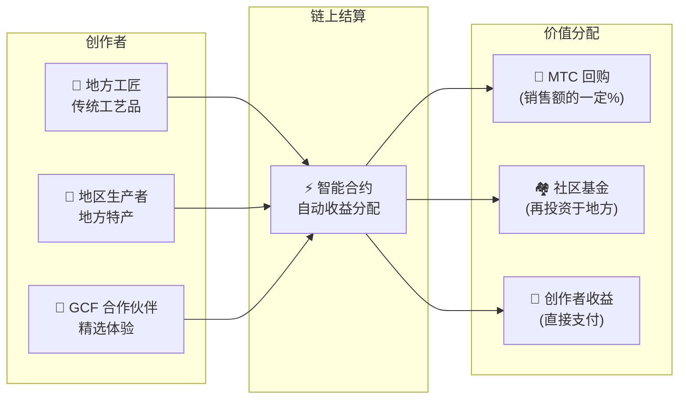

import useBaseUrl from '@docusaurus/useBaseUrl';

# 🗓️ 路线图与团队

>**致读到这里的您——愿景、经济设计、技术基础,一切都已就位。**
> 我们不是一个短期投机项目。
>**主要平台的开发已经完成**,接下来进入扩张阶段。

---

## 战略里程碑

### 🔥 阶段 1:觉醒(2026 年上半年 ── 当前)

**主题:构建基础,确立现金流**

Web 平台已上线。iOS 应用(Matsuri、J-Times)计划于 2026 年 4 月发布。由 CEO 直接统筹的金融体系聚焦于变现与初期流动性的保障。

| 状态 | 里程碑 | 详情 |
| :---: | :--- | :--- |
| ✅ | **Web 平台上线** | Matsuri Web 应用、GCF 管理仪表盘(Web 版)上线运行 |
| ✅ | **支付与增长** | MTC 支付功能与推荐空投功能实现完毕 |
| ✅ | **媒体启动** | J-Times(Web 与播客)分发基础搭建完毕 |
| ✅ | **Genesis** | 在 Solana 链上发行 MTC 代币 |
| ✅ | **流动性就位** | 在 Raydium 创建初期流动性池 |
| ⬜ | **激励启动** | 目标年化 20% 的流动性挖矿启动 |
| ⬜ | **链上支付** | Solana Pay 校验进入正式运营 |
| ⬜ | **VIP 会员招募** | GCF 初期 VIP 会员 20 名遴选完成 |

### 🚀 阶段 2:扩张(2026 年下半年)

**主题:真实世界资产与冒险挖矿**

充分利用已建好的 Web 应用,扩充物理据点与"巡礼"功能。

| 状态 | 里程碑 | 详情 |
| :---: | :--- | :--- |
| ⬜ | **新功能发布** | 冒险挖矿(巡礼)的实现与发布 |
| ⬜ | **海外拓展** | 在亚洲(泰国、台湾等)开拓合作据点并举办 VIP 活动 |
| ⬜ | **资产运营** | 构建不动产、股票、加密资产投资组合 |
| ⬜ | **达成目标** | 生态整体资产规模达到**10 亿日元** |

### 🌊 阶段 3:循环(2027 年起)

**主题:大规模普及、共创经济、去中心化**

全面开放、链上市集、完整生态系统的运行阶段。

| 状态 | 里程碑 | 详情 |
| :---: | :--- | :--- |
| ⬜ | **全球开放** | Matsuri App 面向全球正式发布 |
| ⬜ | **大解禁(2027/6/1)** | 创始人锁仓解除 + 挖矿池(5.5 亿枚)启动 + 减半周期开启 |
| ⬜ | **共创市集** | 地方特产店铺 + GCF 合作伙伴商店 ── 配套 MTC 自动回购的链上结算 |
| ⬜ | **众筹(配 NFT 权益)** | 用户在 Solana 上出资文化项目。支持者获得代表所有权、分成与治理权的 NFT |
| ⬜ | **链上支付** | 市集所有交易均由智能合约结算 ── 销售额的固定比例自动转入 MTC 回购池 |
| ⬜ | **达成目标** | 生态整体资产规模达到**100 亿日元(约 $65M)** |
| ⬜ | **迈向 DAO** | 将部分决策权转交给 GCF 社区 |

#### 🏪 共创市集构想

"文化 OS"的终极形态 ── **文化的创造者与文化的爱好者直接交易**的、无剥削型中介的去中心化市集。

| 功能 | 说明 | 状态 |
| :--- | :--- | :---: |
| **🏺 地方特产店铺** | 工匠与地方生产者直接面向全球客户销售。以 MTC 支付可享 5〜10% 折扣 | ⬜ 构想中 |
| **🎫 众筹 + NFT 权益** | 出资文化项目(神社修复、祭典重兴、工匠工坊)。获得代表贡献的 NFT,可能附带分成与治理权 | ⬜ 构想中 |
| **⚡ 链上支付** | 市集所有交易均以 Solana 智能合约结算。收益自动分配:支付给创作者 + 社区基金 + MTC 回购 ── 无需人工对账 | ⬜ 构想中 |
| **🗳️ 支持者治理** | NFT 持有者可对所投项目的资源分配投票 ── 这不是单纯的捐助,而是真正意义上的共创 | ⬜ 构想中 |

:::info 为何重要
今天,游客是在平台这个"房东"的店铺里交房租买纪念品。而到了明天,**京都乡间的工匠可以直接把作品卖给哥本哈根的粉丝**,其销售额的一部分自动增强 MTC 经济。这才是飞轮最成熟的形态。
:::

---

## 👤 团队

  

### Ko Takahashi ── 创始人 / CEO 兼首席架构师

| 项目 | 详情 |
| :--- | :--- |
| **角色** | 项目整体统筹。平台设计、智能合约、全栈开发 |
| **愿景** | "输出文化、输入财富"——文化 OS 的倡议者 |
| **态度** | 亲自写代码、亲自站在现场(黄金街)——"Skin in the game"(真金白银投入)的践行者 |

  

### Jon Anders Jensen ── 董事 / GCF 与活动运营

| 项目 | 详情 |
| :--- | :--- |
| **角色** | GCF 运营负责。活动与游览的运营设计与现场运营 |
| **优势** | 以国际化视野与 GCF 会员之间的信任为轴,支撑生态中"人"的循环 |

  

### Ryunosuke Honda ── 董事 / 地区文化大使

| 项目 | 详情 |
| :--- | :--- |
| **角色** | 把日本各地文化与社区与 Matsuri 生态相连接的桥梁 |
| **优势** | 发掘地方文化资源,将其放上 Matsuri 平台,实现"Deep Japan"的体验 |

### 🌏 GCF 社区 ── 遍布世界的开发成员

Matsuri Protocol 并非仅由创始团队打造。
**来自世界各地的 GCF 会员**通过测试、反馈、翻译、地区拓展,共同贡献于协议的进化。

| 领域 | 体系 |
| :--- | :--- |
| **💼 全球金融** | 与亚洲私人投资者网络联动 |
| **⚙️ 工程** | 跨区域分布式的区块链与移动应用工程师团队 |
| **🏮 运营** | 与新宿黄金街及主要观光地本地社区的稳固通路 |
| **🌐 社区** | 以日本、挪威、泰国、台湾等为主的多国籍 GCF 会员 |

:::tip 大家共同建造的文化基础设施
只要加入 GCF,你就是 Matsuri Protocol 的共同开发者。
"写代码"并不是贡献的唯一方式。介绍一个地方圣地、翻译文档、策划一场活动——
这些都在让这个协议扩散到世界的每一个角落。
:::

---

## 🏛️ 治理(DAO)

Matsuri Protocol 将从中心化,逐步向**去中心化自治组织(DAO)**迁移。
GCF 会员(Platinum / Gold)未来将对以下重要事项拥有**投票权**:

| 投票事项 | 内容 |
| :--- | :--- |
| **💰 资金分配** | 将业务收入投向哪些新业务或市场活动 |
| **⚙️ 协议更新** | 应用手续费率、挖矿奖励率的微调 |
| **⛩️ 文化认证** | 哪些祭典与神社被认定为"官方巡礼地",是否予以资金支持 |

:::info 参与这场革命
我们不仅仅在做一个应用,
我们在打造一个**无国界的文化经济圈**。
:::

---

**[◀ 上一页:产品与技术](/docs/product-tech)**｜**[⛩️ 返回白皮书首页](/docs/intro)**
